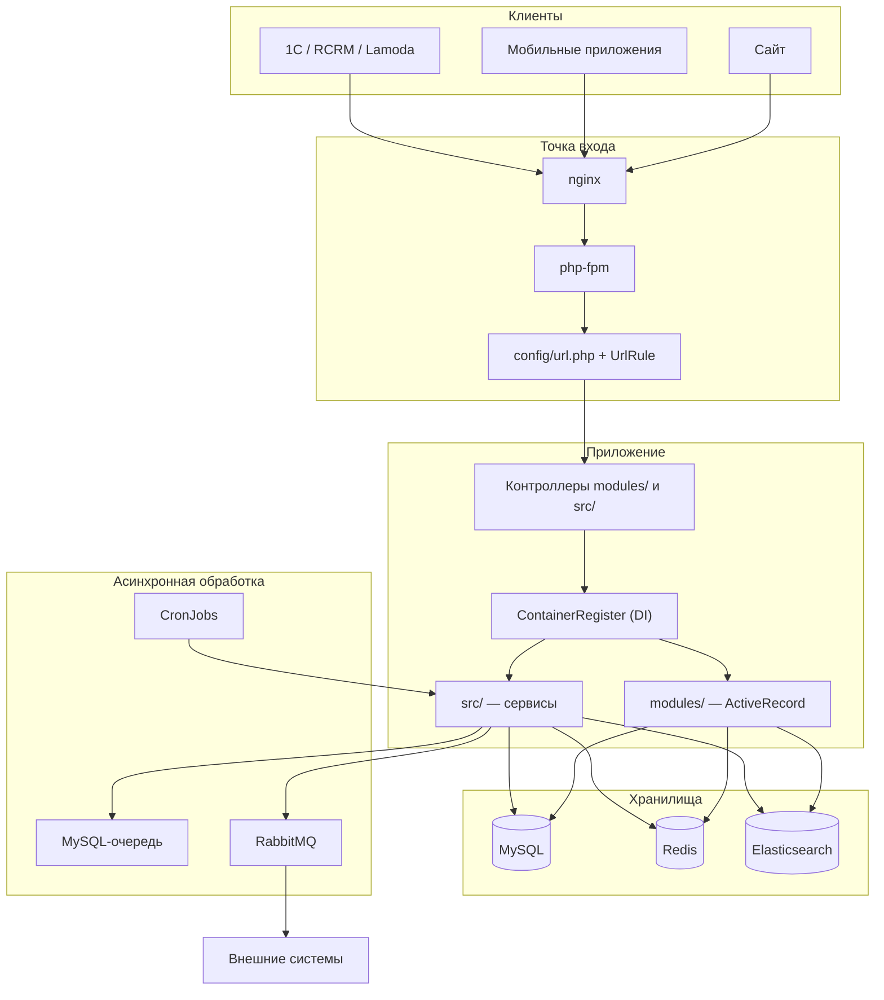

# Общая картина

## Что это за система

Интернет-магазин 12 STOREEZ. Монолит на PHP 8.2 / Yii2 с фронтендом на Vue 2, работает в Kubernetes.
Обслуживает три типа клиентов: сайт, мобильные приложения (iOS/Android) и партнёрские интеграции
(1С, RetailCRM, Lamoda, Mercaux).

Технологический стек:

| Слой | Технологии |
|---|---|
| Бэкенд | PHP 8.2, Yii2 2.0.55 |
| Фронтенд | Vue 2, Webpack 5, SCSS |
| БД | MariaDB/MySQL (префикс таблиц `cms_`), отдельная БД для логов |
| Кэш | Redis (два кластера) |
| Очереди | MySQL-очередь + RabbitMQ |
| Поиск | Elasticsearch |
| Внешние вызовы | HTTP REST, SOAP (1С), gRPC (микросервисы) |

## Два стека в одном репозитории

Главная особенность проекта: **бэкенд состоит из двух параллельных стеков**, живущих на одной БД.

| | `modules/` | `src/` |
|---|---|---|
| Namespace | `modules\` | `Application\` |
| Стиль | Yii2 MVC, «толстые» ActiveRecord | Слои Service / Repository / Dto / Enum |
| Что содержит | Модели данных, CMS-админка, views, легаси-кроны | Новый чекаут, mobile API, платежи, outbox, интеграции |
| Объём | 64 каталога | 43 домен-модуля в `src/Modules/` + 11 инфраструктурных каталогов рядом |

Разделение **не по слоям, а по времени написания**. Практическое правило:

- **данные и админка** — в `modules/`;
- **новые клиентские флоу и интеграции** — в `src/`.

Важная оговорка: многие «современные» пункты в этом описании — это не отдельные каталоги
`modules/<имя>/`, а **Yii ID модулей**, зарегистрированные в `config/modules.php` и указывающие
на классы из `src/Modules/`. Например `productV2`, `carts`, `mobile-v2` физически лежат
только в `src/`, отдельных каталогов `modules/productV2/` и т.п. не существует. Подробнее —
[02-backend.md](02-backend.md), раздел «Дублирование модулей».

Важно понимать, что это не «легаси и новый код», а два работающих стека с взаимными зависимостями.
`src/` активно использует модели из `modules/`, а `modules/` использует инфраструктуру из `src/`
(Redis, очереди). Подробнее — [09-pitfalls.md](09-pitfalls.md), раздел про инвертированные зависимости.

Единственная точка связывания — DI-контейнер `di/ContainerRegister.php`, который регистрирует
классы обоих стеков. См. [02-backend.md](02-backend.md).

## Точки входа

| Файл | Назначение |
|---|---|
| `www/index.php` | Веб: `vendor/autoload.php` → `config/config.php` (только в `$params`) → `vendor/yiisoft/yii2/Yii.php` → `config/web.php` → `yii\web\Application` |
| `yii` | Консоль: `vendor/autoload.php` → `Yii.php` → `config/console.php` → `yii\console\Application` |
| `Yii.php` | Файл фреймворка Yii2 (не проектный класс), подключается обоими входами до чтения конфигов |

Каталог `themes/basic/` — отдельный слой PHP-представлений (180+ файлов: layouts, views модулей,
асеты), через который проходит связка с фронтендом. Подробнее — [06-frontend.md](06-frontend.md).

## Конфигурация

Конфиги собираются каскадом: `common.php` — общая база, `web.php` и `console.php` её расширяют.

| Файл | Содержимое |
|---|---|
| `config/config.php` | Чтение переменных окружения в массив `$params` |
| `config/common.php` | Компоненты для web и консоли: `db`, отдельное подключение `log_db`, `queue`, `mindbox`, `retailCrm`, службы доставки, `atol`, `sentry`, RBAC |
| `config/web.php` | Web-специфика: `request`, `user`, кэш, i18n, `urlManager`, обработчики `beforeRequest`/`afterRequest`, OAuth |
| `config/console.php` | 94 консольные команды через `controllerMap` |
| `config/modules.php` | Регистрация Yii-модулей из обоих стеков |
| `config/url.php` | Правила маршрутизации (336 строк) + кастомные `UrlRule` |
| `config/log.php` | Цели логирования: БД, stdout/stderr в JSON, файл |
| `config/events.php` | Обработчики событий приложения |
| `config/sphinx.php` | **Не используется в рантайме**, см. [09-pitfalls.md](09-pitfalls.md) |

Переменные окружения в проде приходят из Vault через секрет `web-monolith-secret-envs`,
локально — из `.env` (в git не хранится, пример — `.env.example`).

Redis сконфигурирован как два независимых логических кластера: основной
(`REDIS_CLUSTER_NODES`/`REDIS_HOST`) и отдельный для нового чекаута (`REDIS_NEW_CLUSTER_NODES`),
переключаемый по URI запроса. Подробнее — [07-infrastructure.md](07-infrastructure.md).

Отдельный слой вне `modules/` и `src/` — каталог `components/` (Yii-компоненты уровня
приложения: `SqlQueue`, `QueueController`, `rabbitmq/`) и сгенерированные gRPC-клиенты
в `modules/grpc/` (Mindbox, Feedbacks, Orders). Подробнее — [02-backend.md](02-backend.md).

## Схема запроса

## Как система работает асинхронно

Значительная часть логики выполняется вне веб-запроса:

- **MySQL-очередь** (таблица `default_queue`, **без префикса** `TABLE_PREFIX`) — 22 именованные
  очереди, воркеры `yii queue/listen <name>`.
- **RabbitMQ** — 45 констант очередей (40 уникальных имён, часть констант — маппинги на уже
  объявленные), отдельные деплойменты-консьюмеры.
- **Outbox/Inbox** — обмен с 1С, RetailCRM, Mindbox и платёжными провайдерами идёт через
  таблицы-outbox в MySQL, откуда кроны и воркеры отправляют сообщения в Rabbit.
- **CronJobs** — 109 расписаний в Helm: фиды, переиндексация, обработка outbox, уведомления.

Ключевой вывод: **рантайм-поведение прода описано в `.deploy/helm/values.yaml`**, а не в коде
приложения. Консольная команда может существовать без воркера, и наоборот.
См. [07-infrastructure.md](07-infrastructure.md).

## Что читать дальше

- Устройство бэкенда и DI — [02-backend.md](02-backend.md)
- Бизнес-домены и их флоу — [03-business-domains.md](03-business-domains.md)
- Подводные камни, которые стоит знать до первой правки — [09-pitfalls.md](09-pitfalls.md)
