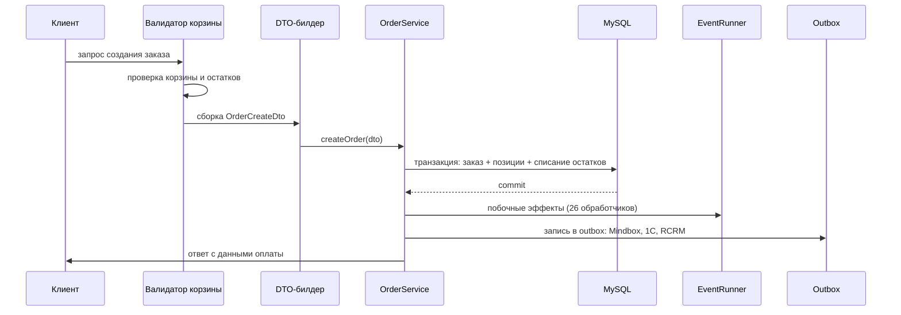

# Бизнес-домены

Для каждого домена указано, где лежит код, какие перечисления определяют поведение и как
распределена логика между стеками.

## Каталог и товары

### Где код

| Область | Путь |
|---|---|
| Модель товара | `modules/product/models/Product/Product.php`, `ProductAggregate.php` |
| Размеры | `modules/product/models/ProductSize.php`, `ProductSizeAggregate.php` |
| Теги товара | `modules/product/service/ProductTagsService.php` |
| Ранний доступ | `src/Modules/Product/Service/EarlyAccessConditionsService.php`, `EarlyAccessAvailabilityService.php` |
| Категории | `modules/catalog/models/Category.php`, `modules/product/repository/ProductCategoryRepository.php` |
| Остатки (легаси) | `modules/catalog/models/Stock.php`, `ItemStock.php`, `modules/product/service/CachedStocksService.php` |
| Остатки (новые) | `src/Modules/Product/Models/ProductStock.php`, `Repository/ProductStockRepository.php`, `src/Modules/Stock/` |
| Цены и скидки | `modules/processing/service/ProcessingService.php`, `modules/discounts/` |
| Агрегация каталога | `src/Modules/Product/Service/CatalogAggregator.php` |
| Индексация | `src/Search/Elastic/Service/ElasticCatalogIndexerService.php` |

### Модель данных товара

Важная особенность: **товар в одном цвете — это отдельная строка в `products`**. Справочник
цветов (`dictionary_colors`) есть, но отдельной таблицы «цветовой вариант товара» нет — каждый
цвет модели хранится полноценной строкой `products` со ссылкой `color_id → dictionary_colors`.
Цветовые варианты одной модели связаны общими полями `group_guid` и `super_model_guid`.

Это влияет на аналитику, фиды и подсчёт «числа товаров»: одна модель в пяти цветах — это
пять записей каталога.

### Теги

Отдельного enum для всех тегов нет, логика собрана в `ProductTagsService`: ранний доступ,
предзаказ, sample sale, отсутствие в наличии, только в магазинах, процент скидки,
«Скоро» (по `Category::COMING_SOON_ID`), кастомный тег.

Признак «Скоро» хранится полем `products.is_coming_soon` и блокирует покупку, если товар
не идёт по флоу предзаказа.

Атрибуты товара — отдельная сущность с enum:

```php
// src/Modules/Product/Enum/ProductAttributeEnum.php
case SALE = 'sale';
case EARLY_ACCESS = 'early_access';
```

Логика SALE-режима подробно описана в [docs/sale/categories-sale.md](../sale/categories-sale.md).

### Доступность и остатки

`ProductStockRepository` рассчитывает несколько независимых пулов: `qty_site`, `qty_shops`,
`qty_cnc`, `qty_offline_shipment` и отдельный `qty_site_early_access` для раннего доступа.
Ранний доступ включается флагом `early_access_enabled`.

### Фиды

Экспорт запускается только из консоли, результат — XML/CSV файлы.

| Получатель | Реализация |
|---|---|
| Mindbox | `modules/feed/extractors/xml/MindboxFeedExtractor.php` |
| RetailCRM | `modules/feed/extractors/xml/CrmFeedExtractor.php` |
| Google Merchant, Google Ads | `GoogleFeedExtractor`, `MerchantFeedExtractor` |
| Yandex (Market, Direct, видео) | `modules/feed/extractors/` |
| VK, Criteo, Admitad, ретаргетинг | `modules/feed/extractors/` |
| 1С | `OdinAssFeedExtractor` |
| Garderobo, Dresscode, Tbank, Zosper | `src/Modules/Feed/Service/` |

Старые фиды — в `modules/feed/console/ExportNewController.php`, новые — в
`src/Modules/Feed/Controller/FeedExportController.php`.

## Корзина и чекаут

### Режимы корзины

Поведение корзины определяется режимом, под каждый режим есть свой сервис:

```php
// src/Modules/Cart/Enum/CartModeEnum.php
MODE_ORDER          = 'order'             // обычный заказ
MODE_PREORDER       = 'preorder'          // предзаказ
MODE_CNC_LIGHT      = 'cnclight'          // click & collect light
MODE_EXPRESS        = 'express_delivery'  // экспресс-доставка
MODE_EXPRESS_PICKUP = 'express_pickup'    // экспресс-самовывоз
MODE_RESERVATION    = 'reservation'       // резерв в магазине
```

Режим определяется `ModeHelper::getMode()`, сервис выбирается через
`src/Modules/Cart/Service/CartServiceFactory.php`.

### Где код

| Область | Путь |
|---|---|
| Модель корзины (общая) | `modules/cart/models/Cart.php` |
| Базовая логика | `src/Modules/Cart/Service/AbstractCartService.php` (~2600 строк) |
| Реализации режимов | `CartService/CartService.php`, `ExpressCartService.php`, `PreorderCartService.php`, `ShopCartService.php` — все в `src/Modules/Cart/Service/`; `ReservationCartService.php` — в другом модуле, `src/Modules/Reservation/Service/`, импортируется в `CartServiceFactory` |
| Web API | `src/Modules/Cart/Controllers/CartApiController.php`, `CartDeliveryController.php`, `CartPaymentController.php` |
| Mobile API | `src/Modules/Mobile/Controllers/Cart*.php` |
| Страница нового чекаута | `src/Modules/Checkout/Controllers/CheckoutController.php` |
| Легаси-корзина | `modules/cart/controllers/CartController.php` |
| Бонусы | `modules/mindbox/services/MindboxBonusService.php` |
| Промокоды | `modules/processing/`, `modules/discounts/models/PromoCode.php` |
| Сертификаты | `modules/giftcards/service/GiftcardsService.php`, `src/Modules/Giftcard/` |
| Выбор оплаты | `src/Modules/Cart/Service/CartPaymentServiceFactory.php` |

### Флоу от добавления до чекаута

1. Определение режима — `ModeHelper` → `CartServiceFactory`.
2. Получение или создание корзины — `AbstractCartService::getCart()`, ключ по пользователю
   или сессии плюс тип корзины.
3. Добавление и изменение позиций — проверка остатков через `ProductStockService`,
   раннего доступа через `EarlyAccessAvailabilityService`, правила режима.
4. Доставка — `DeliveryVariantsService` и `CartDeliveryValidator`: город, служба, ПВЗ, интервалы.
5. Скидки — промокод через `ProcessingService`, бонусы через Mindbox, сертификаты через
   `GiftcardsService`.
6. Список способов оплаты — `CartPaymentTypeService::getPaymentFilters()` фильтрует по службе
   доставки, сумме заказа и платформе через 12 классов-фильтров (`src/Modules/Cart/Filter/Payment/`);
   `CartPaymentServiceFactory` выбирает не фильтры, а конкретный `CartPaymentService*` под режим
   корзины. Рядом в `src/Modules/Cart/Filter/Delivery/` — фильтры доставки; всего в каталоге
   `Filter/` 25 файлов, включая абстрактные классы и интерфейсы.

## Заказы

### Где код

| Область | Путь |
|---|---|
| Модель (современная) | `src/Modules/Order/Model/Order.php` |
| Модель (легаси) | `modules/orders/models/Order.php` |
| Создание | `src/Modules/Order/Services/CreateOrder/` — `AbstractCreateOrderService`, `CreateOrderServiceSite`, `CreateOrderServiceMobile`, `CreateReservationServiceMobile` |
| Сборка DTO | `src/Modules/Order/Builder/CreateOrderDtoBuilderSite.php`, `CreateOrderDtoBuilderMobile.php` |
| Валидация | `src/Modules/Order/Validators/CreateOrderCartSiteValidator.php`, `CreateOrderCartMobileValidator.php` |
| Основной сервис | `src/Modules/Order/Services/OrderService.php` |
| Побочные эффекты | `src/Modules/Order/AfterSaveEvent/` (26 классов) |
| Web-контроллер | `modules/orders/controllers/OrdersController.php` |
| Mobile-контроллер | `src/Modules/Mobile/Controllers/OrdersController.php` |
| Синхронизация с RCRM | `src/Modules/Rcrm/Service/RcrmOrderCreateService.php`, `RcrmOrderUpdateService.php` |
| Статусы для админки | `modules/statuses/` |

**Внимание:** таблицу заказов обслуживают два ActiveRecord-класса. Это источник расхождений,
см. [09-pitfalls.md](09-pitfalls.md).

### Перечисления

```php
// src/Modules/Order/Enum/StatusEnum.php — жизненный цикл заказа
RESERVED = 1, WAITING_PROCESSING = 3, PREPARING_PACKAGE = 4, WAITING_PAYMENT = 7,
AGREED_CLIENT = 8, PACKED = 11, ITEM_SENT = 14, AWAITING_PICKUP_IN_STORE = 16,
ORDER_COMPLETED = 17, ORDER_CANCELLED = 23, RESERVE_TIMED_OUT = 24, PREORDER = 35,
PREORDER_NEW = 60, PREORDER_PAYED = 61, CC_WAITING_FOR_PAYMENT = 70
ORDER_WAIT_PAYMENT_STATUSES = [7, 60, 70]

// PaymentStatusEnum — статус оплаты
SUCCESS = 1, NOT_PAID = 2, FAILURE = 3, CREDIT_APPROVED = 4

// OrderMethodEnum — канал создания
CART = 'shopping-cart', MOBILE = 'mobile', MOBILE_ANDROID = 'mobile-android',
PREORDER = 'preorder', MERCAUX = 'mercaux', LAMODA = 'lamoda',
BLOGGER = 'blogger', RETAIL = 'retailcrm'

// LastSourceEnum — кто последним менял заказ
CART, MOBILE, CMS, PAYMENT, YANDEX_SPLIT, YANDEX_PAY, YANDEX_SBP,
TBANK_DOLYAMI, ALPHA_PODELI, RETAIL, ONEC, AUTOCANCEL

// PaymentCategoryEnum — для правил BNPL
PRIMARY = 1, MODIFIED = 2, SURCHARGE = 3, TERMINAL = -1
```

### Флоу создания заказа



Различия между каналами:

- **Сайт** — `modules/orders/controllers/OrdersController`, подготовка DTO через
  `CartOrderCreateDtoPrepareService`, при онлайн-оплате редирект на `/order/payment/{hash}`.
- **Мобильные приложения** — `CreateOrderServiceMobile`, ответ формирует
  `OrderCreateResponseTransformer` и включает `payment.send` (токен YooKassa) либо `payment_url`.

Обе ветки вызывают один и тот же `OrderService::createOrder()`.

### Синхронизация с внешними системами

Исходящее направление — при создании заказа пишутся записи в outbox-таблицы, откуда воркеры
отправляют их в RabbitMQ. Входящее — вебхуки и сообщения от RCRM и 1С обрабатывают
`RcrmOrderCreateService` / `RcrmOrderUpdateService` и inbox-воркеры.

## Платежи

### Провайдеры

ID способов оплаты заданы в `src/Modules/Order/Enum/PaymentMethodEnum.php` (несмотря на
название, класс лежит в модуле Order, а не Payment).

| Провайдер | ID в `PaymentMethodEnum` | Где код |
|---|---|---|
| YooKassa (карта, сайт) | 1, 6, 16 | `modules/yandex/components/Yandex.php`, `controllers/PayController.php` |
| Tinkoff Dolyame | 13 | `modules/payment/components/Dolyame.php`, `controllers/TinkoffController.php` |
| Alpha Podeli | 14 | `src/Modules/Payment/Components/Podeli.php` (клиент), `modules/payment/controllers/AlphaPodeliController.php` (приём уведомлений — легаси-модуль) |
| Yandex Split | 17 | `src/Integration/Payment/YandexSplit/` |
| Yandex Pay | 19 | `src/Integration/Payment/YandexPay/` |
| Yandex SBP | 20 | `src/Integration/Payment/YandexSbp/` |
| Наличные, курьер, офлайн | 2–5, 7, 8 | без онлайн-провайдера |
| PayPal | 9 | легаси, в справочнике |
| Подарочный сертификат | 15 | `GiftcardsService` |
| Оплата при получении (резерв) | 18 | флоу резерва (`RESERVATION_POST_PAYMENT`) |
| Click & Collect Light | 12 | самовывоз из магазина |

Групповые константы в `PaymentMethodEnum`: `BNPL_PAYMENT_METHODS`, `EXPRESS_PAYMENT_METHODS`,
`DIRECT_ONLINE_PAYMENT_METHODS`, `ALL_ONLINE_PAYMENT_METHODS`, `PAYMENT_URL_AVAILABILITY_METHODS`.

ATOL — не платёжный провайдер, а фискализация чеков: `src/Modules/Receipt/Service/AtolService.php`,
`Client/AtolClient.php`, легаси `modules/atol/`.

### Паттерн outbox для платежей

Каждый провайдер имеет одинаковый набор компонентов:

1. таблица outbox-транзакций в MySQL;
2. таблица уведомлений;
3. обработчик транзакций (`*TransactionHandler`);
4. outbox-сервис (`*OutboxService`);
5. консольный контроллер уведомлений;
6. cron и consumer в Helm-values.

Центральный оркестратор — `src/Modules/Payment/Service/Outbox/OutboxTransactionService.php`,
выбор провайдера — `src/Modules/Payment/Factory/PaymentProviderFactory.php`.
Действия описаны `PaymentSystemOutboxActionEnum`: `commit`, `cancel`, `refund`.

При отмене заказа срабатывают события `SendCancelToDolyameEvent`, `SendCancelToPodeliEvent`,
`SendCancelToSplitEvent`, `SendCancelToYandexPayEvent`, `SendCancelToYandexSbpEvent` —
они лежат в модуле Order, а не Payment.

### Приём уведомлений

| Провайдер | Точка приёма |
|---|---|
| YooKassa | `modules/yandex/controllers/PayController.php` |
| Dolyame | `modules/payment/controllers/TinkoffController.php` |
| Alpha Podeli | `modules/payment/controllers/AlphaPodeliController.php` |
| Yandex (общий вебхук) | `src/Integration/Payment/Yandex/Controller/NotificationController.php` |
| Yandex Split / Pay / SBP | консольные `NotificationController` в соответствующих каталогах |

Современные Yandex-провайдеры работают через клиентов биллингового микросервиса
(`BillingMsClient`), а не напрямую.

## Доставка

| Область | Путь |
|---|---|
| Модели | `modules/delivery/models/` — `DeliveryType`, `DeliveryTk`, `DeliveryGroup`, `DeliveryCity`, `PickupPoint`, `BoxberryPoint` |
| Расчёт вариантов | `src/Modules/Delivery/Service/DeliveryVariantsService.php`, `DeliveryVariantBuilder.php` |
| Гео | `src/Modules/Delivery/Service/GeoService.php`, `LocationService.php` |
| Адреса | `modules/users/models/Address.php` |
| Самовывоз | `src/Modules/Delivery/Helper/PickupHelper.php` |
| Интервалы | через микросервис BFB (`MonolithBfbMsClient`) |

```php
// src/Modules/Delivery/Enum/OrderTypeEnum.php
ORDER = 0, CNC = 1, PREORDER = 2
```

Экспресс-доставка ограничена списком городов в `src/Modules/Cart/Enum/ExpressDeliveryEnum.php`
(лежит в модуле Cart, а не Delivery) и лимитом позиций.

**Дублирование:** существуют два класса `PaymentTypeService` — в `modules/delivery/service/`
и в `src/Modules/Delivery/Service/` — и используются они одновременно.

## Пользователи и аутентификация

| Область | Путь |
|---|---|
| Модель пользователя | `modules/users/models/User.php` |
| JWT | `src/Auth/Service/JwtService.php`, `AuthMethod/JwtHttpBearerAuthMethod.php` |
| Сервис авторизации | `src/Modules/Auth/Service/AuthService.php` |
| Мобильные сессии | `modules/mobile/models/UserMobileSession.php`, `src/Modules/Mobile/Services/MobileSessionService.php` |
| Легаси-токены API | `modules/api2/auth/HttpBearerAuth.php` |
| Бонусы | `modules/bonuses/models/Bonus.php`, `modules/mindbox/services/MindboxBonusService.php` |
| Подписки | `modules/subscription/`, `src/Modules/Subscription/` |

Три независимых схемы аутентификации:

- **сайт** — сессия Yii + cookie;
- **API клиентов** — JWT на ES256, access + refresh, refresh хранится в БД;
- **мобильные приложения** — заголовки `x-access-token` (ключ приложения) и `x-session-token`.

Бонусы — источник истины Mindbox, локальные таблицы используются для отображения.

Подробнее об аутентификации API — [05-api.md](05-api.md).

## Контент и CMS

| Область | Путь |
|---|---|
| Ядро CMS | `modules/cms/` — параметры, i18n, админка, логи |
| Параметры-флаги | `modules/cms/models/Parameter.php`, обёртка `src/Modules/Cms/Model/Parameter.php` |
| Контентные страницы | `modules/content/` — `ContentController`, `AboutController`, `ShowroomsController` |
| Лендинги (легаси) | `modules/home/` — `LandingPageController` + PHP-шаблоны |
| Главная (современная) | `src/Modules/Mainpage/` |
| Баннеры и блоки | `modules/blocks/` |
| Лукбук | `modules/lookbook/`, `src/Modules/Lookbook/` |
| Блог, новости, вакансии, уход | соответствующие модули |

## Рекомендации и персонализация

| Стратегия | Реализация |
|---|---|
| Оркестратор | `src/Modules/Product/Service/RecommendationsService.php` |
| По категории | `Recommendations/CategoryRecommendationsService.php` |
| Просмотренные | `Recommendations/LastViewRecommendationsService.php` |
| Mindbox | `Recommendations/MindboxRecommendationsService.php`, `MindboxRecommendationsForProductService.php` |
| Новинки | `Recommendations/NewProductRecommendationsService.php` |
| Страница «Спасибо» | `RecommendationsService::getThankYouPageRecommendations()` |
| Поиск и подсказки | `modules/diginetica/services/DigineticaService.php` |
| Подбор образов | `src/Modules/Feed/Service/GarderoboFeedService.php` + виджет на фронте |

Выбор стратегии зависит от параметров-флагов (`recomendations_for_cart_category`,
`IS_AVAILABLE_THANKYOU_RECOMMENDATIONS_*`).

## Параметры и фича-флаги

Механизм включения функциональности без деплоя.

| Компонент | Путь |
|---|---|
| Перечисление алиасов | `src/Modules/Common/Enum/Parameters.php` — 47 констант |
| Категории | `src/Modules/Common/Enum/ParameterCategoryEnum.php` — `cart`, `catalog`, `home`, `integrations`, `menu`, `orders`, `processing` |
| Хранение | таблица `parameters`, модель `modules/cms/models/Parameter.php` |
| Админка | `ParameterBackendController` с валидацией по JSON-схеме |

Как работает:

1. флаг лежит в БД с полями `alias`, `value`, `value_type`, `category_id` и опциональной
   JSON-схемой;
2. код читает значение через `Parameter::valueOf($alias)`;
3. часто существуют платформенные варианты одного флага с суффиксами `_WEB`, `_IOS`, `_ANDROID`.

Новые флаги добавляются миграциями через трейт `ParameterManager` (методы вида
`addBooleanParameter`).

Заметные флаги:

| Флаг | Что включает |
|---|---|
| `express_delivery` | Экспресс-доставку |
| `early_access_enabled` | Ранний доступ к товарам |
| `sale_is_active`, `sale_timeframe` | Период распродажи |
| `promocode_apply_to_sale_products`, `promocode_max_percent` | Правила промокодов |
| `giftcards_allow_service*` | Работу с сертификатами |
| `new_checkout_client_payment_preselection` | Предвыбор способа оплаты |
| `min_order_sum_to_limit_online_payment` | Ограничение онлайн-оплаты по сумме |
| `max_minutes_wait_payment` | Таймаут ожидания оплаты |
| `is_dresscode_enabled` (константа `DRESSCODE_ENABLED`) | Интеграцию Dresscode |
| `web_notifications_enabled` | Веб-уведомления |
| `yandex_pay_sbp_surcharge_enabled` | Надбавку Yandex Pay SBP |

Мобильные параметры дополнительно описаны в `src/Modules/Mobile/Enum/AndroidParametersEnum.php`
и перечислениях `MobileV2`.

**Важно:** количество чтений (`valueOf` вызывается 233 раза в 111 файлах) заметно больше
числа объявленных констант — часть флагов читается строковым алиасом мимо enum.
См. [09-pitfalls.md](09-pitfalls.md).

## Другие домены (кратко)

Список выше не исчерпывает бизнес-логику проекта. Ещё несколько доменов со своим объёмом кода,
не разобранных подробно в этом документе:

| Домен | Где код | Объём | Что делает |
|---|---|---|---|
| Отзывы (Feedback) | `modules/feedback/` (легаси, включает `console/controllers/dto/forms/repository`), `src/Modules/Feedback/` | 70 + 13 файлов | Сбор и модерация отзывов о заказе/товаре/магазине; синхронизация через `Feedbacks\MobileClient` (gRPC-стаб, см. [05-api.md](05-api.md)) |
| Синхронизация с 1С (OneC) | `src/Modules/OneC/` (Dto, Transformer, Enum, Controller, Configurator, Service, Client) | 35 файлов | Обмен номенклатурой, остатками, заказами и сертификатами по SOAP; см. [08-integrations.md](08-integrations.md) |
| A/B-тестирование | `modules/abTest/` (models, controllers, services, repositories) | 16 файлов | Управление вариантами экспериментов через админку, таблицы `ab_test`/`ab_test_variant` |
| Резерв в магазине (Reservation) | `src/Modules/Reservation/` (Dto, Model, Service, Validator, Repository) | 14 файлов | Отдельный домен для режима `MODE_RESERVATION`: `ReservationCartService`, `OrderReservationExpiration`, флоу оплаты при получении |
| Маркетинг | `modules/marketing/` (легаси), `src/Modules/Marketing/` | 10 + 4 файла | Промо-механики, вспомогательные экстракторы |
| Wishlist (современный) | `src/Modules/Wishlist/` | 3 файла | `WishlistService`, `WishlistController` — используется наравне с легаси `modules/wishlist/` |
