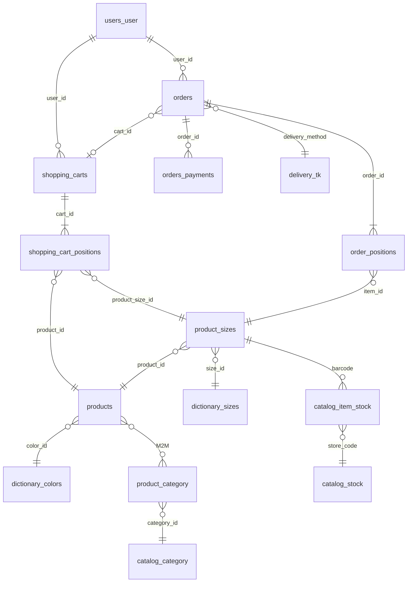

# База данных

## Общие сведения

MariaDB/MySQL, около 240 ActiveRecord-моделей с объявленным `tableName()`.

**Префикс таблиц** задаётся переменной `TABLE_PREFIX`, по умолчанию `cms_`. В моделях
используется запись `{{%orders}}`, что в рантайме превращается в `cms_orders`.

Логи пишутся в отдельное подключение `log_db` (переменные `LOG_DSN`, `LOG_USERNAME`,
`LOG_PASSWORD`), см. `config/common.php`.

Кэш схемы БД включён (`enableSchemaCache`, TTL 1 час — задаются в `config/common.php` и
действуют для web и консоли), но хранится не в Redis, а в файлах: компонент `cacheSchema`
типа `FileCache` в `@runtime/cache/dbSchema`. Сам компонент `cacheSchema` зарегистрирован
только в `config/web.php` — в чистом `config/console.php` (без web-расширения) его нет.

## Соглашения об именовании

- домены в именах таблиц идут после префикса: `catalog_*`, `orders_*`, `order_*`, `users_*`,
  `delivery_*`, `product_*`, `blog_*`;
- в моделях используется `{}`;
- таблица MySQL-очереди `default_queue` префикса не имеет в коде компонента — он подставляется
  из конфигурации.

### Имена, которые отличаются от ожидаемых

Частый источник ошибок при написании запросов:

| Ожидаемое имя | Фактическое |
|---|---|
| `cart` | `shopping_carts` |
| `cart_items` | `shopping_cart_positions` |
| `order_items` | `order_positions` |
| `product_colors` | нет такой таблицы; `products.color_id → dictionary_colors` |
| `order_positions.product_size_id` | `order_positions.item_id` |

## Ключевые таблицы по доменам

### Заказы и чекаут

| Таблица | Модель |
|---|---|
| `orders` | `modules/orders/models/Order.php` **и** `src/Modules/Order/Model/Order.php` |
| `order_positions` | `modules/orders/models/OrderPosition.php` |
| `orders_history` | `modules/orders/models/OrderHistory.php` |
| `order_positions_history` | `modules/orders/models/OrderPositionHistory.php` |
| `orders_payments` | `modules/payment/models/Payment.php` |
| `order_payment_links` | `src/Modules/Payment/Models/OrderPaymentLink.php` |
| `order_errors` | `modules/orders/models/OrderError.php` |
| `orders_exchange_log` | `modules/orders/models/OrdersExchangeLog.php` |
| `order_reservation_expiration` | `src/Modules/Reservation/Model/OrderReservationExpiration.php` |
| `offline_orders`, `offline_order_positions` | `src/Modules/Order/Model/OfflineOrder*.php` |
| `offline_order_retry_queue` | `src/Modules/Order/Model/OfflineOrderRetryQueue.php` |
| `shopping_carts` | `modules/cart/models/Cart.php` |
| `shopping_cart_positions` | `modules/shopping/models/ShoppingCartPosition.php` |
| `checkout_user_settings` | `src/Modules/Cart/Model/CheckoutUserSettings.php` |
| `wishlist_items` | `modules/wishlist/models/WishlistItem.php` |

### Товары и каталог

| Таблица | Модель |
|---|---|
| `products` | `modules/product/models/Product/Product.php` |
| `product_sizes` | `modules/product/models/ProductSize.php` |
| `product_category` | `modules/product/models/ProductCategory.php` (составной ключ) |
| `dictionary_colors` | `modules/product/models/Colors/DictionaryColor.php` |
| `dictionary_sizes` | `modules/product/models/DictionarySize.php` |
| `catalog_category` | `modules/catalog/models/Category.php` |
| `catalog_category_tree_items` | `src/Modules/Product/Models/CategoryTreeItem.php` (Nested Sets) |
| `catalog_stock` | `modules/catalog/models/Stock.php` — склады и магазины |
| `catalog_item_stock` | `modules/catalog/models/ItemStock.php` — остаток по штрихкоду и магазину |
| `product_stocks` | `src/Modules/Product/Models/ProductStock.php` |
| `product_attributes` | `src/Modules/Product/Models/ProductAttribute.php` |
| `product_order_kate`, `product_order_sonya` | веса мерчандайзинговой сортировки |

### Пользователи

| Таблица | Модель |
|---|---|
| `users_user` | `modules/users/models/User.php` |
| `users_address` | `modules/users/models/Address.php` |
| `users_auth` | `modules/users/models/Auth.php` |
| `users_geo` | `src/Modules/Delivery/Model/UserGeo.php` |
| `users_mobile_sessions` | `modules/mobile/models/UserMobileSession.php` |
| `jwt_refresh_token` | `src/Auth/Model/JwtRefreshToken.php` |
| `user_import_files` | `src/Modules/User/Models/UserImportFile.php` |

### Платежи и чеки

| Таблица | Назначение |
|---|---|
| `orders_payments` | Платежи по заказу |
| `payment_types`, `payment_statuses` | Справочники |
| `receipts`, `order_receipts` | Фискальные чеки |
| `order_receipts_to_send`, `*_outbox` | Асинхронная отправка чеков |
| `dolyame_payment_transaction_outbox` | Outbox Dolyame |
| `podeli_payment_transaction_outbox` | Outbox Podeli |
| `split_payment_transaction_outbox` | Outbox Yandex Split |
| `yandex_pay_payment_transaction_outbox` | Outbox Yandex Pay |
| `yandex_sbp_payment_transaction_outbox` | Outbox Yandex SBP |
| `notification_podeli`, `notification_yandex_split`, `notification_yandex_pay`, `notification_yandex_sbp` | Входящие уведомления провайдеров |

### Доставка и гео

| Таблица | Назначение |
|---|---|
| `delivery_tk` | Транспортные компании |
| `delivery_types`, `delivery_city`, `delivery_ipgeo` | Справочники доставки |
| `geo_city` | Города (`src/Modules/Delivery/Model/GeoCity.php`) |
| `pickup_points`, `boxberry_point`, `accord_point` | Пункты выдачи |
| `return_method`, `return_details_config` | Конфигурация возвратов |

### CMS и флаги

| Таблица | Назначение |
|---|---|
| `parameters`, `parameters_content`, `parameter_categories` | Фича-флаги и настройки |
| `mainpages`, `mainpage_blocks`, `mainpage_block_elements` | Главная страница |
| `ab_test`, `ab_test_variant` | A/B-тесты |
| `events_toggle` | Переключатели аналитических событий |
| `notifications` | In-app уведомления пользователей |

### Интеграционные outbox и inbox

| Направление | Таблицы |
|---|---|
| RetailCRM | `rcrm_create_transaction_outbox/inbox`, `rcrm_update_transaction_outbox/inbox` |
| 1С | `onec_create_transaction_outbox`, `onec_update_transaction_outbox/inbox` |
| Mindbox | `mindbox_create_transaction_outbox`, `mindbox_update_transaction_outbox` |
| Lamoda | `lamoda_orders_outbox` |
| Фиды | `feed_counters` |

## Связи ключевых сущностей

### Корзина

```
shopping_carts
  ├─ user_id → users_user.id
  └─ hasMany shopping_cart_positions (cart_id)
       ├─ product_id → products.id
       └─ product_size_id → product_sizes.id
```

Позиции корзины загружаются через `getPositionsRelation()` с `joinWith('productRelation')` —
без N+1.

### Заказ

```
orders
  ├─ user_id         → users_user.id (relation getUser())
  ├─ cart_id         → shopping_carts.id (поле есть, но relation getCart() в моделях Order нет —
  │                     связь только через прямой запрос по cart_id)
  ├─ address_id      → users_address.id (relation getAddress())
  ├─ delivery_method → delivery_tk.id (relation getDeliveryMethod())
  ├─ hasMany order_positions (order_id)
  │    ├─ item_id  → product_sizes.id      ← не product_size_id!
  │    ├─ товар получается через размер
  │    ├─ stock_id → catalog_stock.id
  │    └─ status   → order_position_statuses
  ├─ hasMany orders_payments (order_id)
  └─ hasOne  order_statuses (по internal_id)
```

### Товар

```
products
  ├─ color_id          → dictionary_colors.id
  ├─ main_category_id  → catalog_category.id
  ├─ категории          → JSON-поле + связь M2M через product_category
  ├─ hasMany product_sizes (product_id)
  │    ├─ size_id → dictionary_sizes.id
  │    ├─ hasMany catalog_item_stock (по barcode)
  │    └─ hasOne  product_stocks (по barcode)
  └─ цветовые варианты — отдельные строки products с общим group_guid / super_model_guid
```

### ER-диаграмма коммерческого ядра



## Служебные и легаси-таблицы

| Таблица | Назначение | Примечание |
|---|---|---|
| `default_queue` | MySQL-очередь заданий | Колонки `queue`, `run_at`, `payload`, `ukey`. Имя **жёстко захардкожено** в `components/SqlQueue.php` (`SqlQueueName::DEFAULT . '_queue'`) — `TABLE_PREFIX` к нему не применяется, в отличие от моделей ActiveRecord |
| `slave_queue` | Стейджинг синхронизации заказов | `modules/cms/models/SlaveQueue.php` |
| `log`, `frontend_logs` | Логи приложения и фронтенда | Отдельное подключение `log_db` |
| `product_order_kate`, `product_order_sonya` | Веса сортировки каталога | Пересобираются через временные таблицы |
| `product_size_stocks_temp` | Стейджинг импорта остатков | TRUNCATE + массовая загрузка |
| `catalog_item_quantity_buffer` | Буфер остатков под заказы | |
| `catalog_item_stocks_quantity_buffer` | Буфер синхронизации остатков | `src/Modules/Stock/Model/ItemStockQuantityBuffer.php` |
| `low_stock_alert_state` | Однократные алерты о низком остатке | |
| `complete_messages`, `popmechanic_contacts` | Маркетинговые артефакты | |

Остаток товара получается из трёх источников (`catalog_item_stock`, `product_stocks`, буферы)
и согласован не мгновенно, а по мере обработки очередей.

## Миграции

196 файлов, диапазон: `m250403_150841_5479_add_is_express_to_cart.php` (апрель 2025) —
`m260817_093503_add_index_item_stock_store_quantity_catalog_item_stock_table.php` (август 2026).
**92 миграции (47%) написаны в 2026 году.**

### Соглашение об именовании

```
m{ГГММДД}_{ЧЧММСС}[_{номер задачи}]_{описание_через_подчёркивания}.php
```

Примеры:

- `m260602_100002_add_idx_orders_cart_id.php` — суффикс времени используется для упорядочивания
  связанных миграций одного дня;
- `m250403_150841_5479_add_is_express_to_cart.php` — с номером задачи;
- `m260210_091507_ab_test_ecomdev_887.php` — со ссылкой на задачу в описании.

Флаги-параметры добавляются через трейт `ParameterManager` (`addBooleanParameter` и аналоги).

### Распределение по доменам

Классификация приблизительная — часть миграций затрагивает несколько доменов сразу
(например, добавление параметра, влияющего и на корзину, и на доставку) и отнесена к
основному контексту по смыслу имени файла. Строка «Прочее» — разница между суммой явно
классифицированных строк и общим числом миграций (196 / 92), а не отдельная категория.

| Домен | Всего | Из них 2026 |
|---|---|---|
| Заказы, корзина, чекаут | 47 | 27 |
| Доставка, гео, ФИАС | 34 | 8 |
| Параметры CMS, мобильные, A/B | 33 | 19 |
| Товары, каталог, остатки | 30 | 18 |
| Платежи, сертификаты, BNPL | 29 | 15 |
| Пользователи, адреса | 8 | 3 |
| Прочее / на стыке доменов | 15 | 2 |
| **Итого** | **196** | **92** |

### Что разрабатывалось в 2026 году

По кластерам миграций видно направление работ:

1. **Резерв в магазине** (март–апрель) — `m260323_181900_1106_add_reservation_delivery_type.php`,
   `m260407_090042_create_reservation_parameters.php`,
   `m260417_150054_1339_add_order_reservation_expiration_table.php`.
2. **Новый чекаут и предвыбор оплаты** (март–июнь) —
   `m260330_143915_add_payment_method_preselection_parameter.php`,
   `m260331_083825_add_new_checkout_abc_enum_parameter.php`,
   `m260617_113742_add_preselected_payment_feature_parameter.php`.
3. **Yandex Pay и Yandex SBP** (май–июль) — `m260512_121100_add_new_yandex_pay_payment_type.php`,
   `m260520_121200_add_yandex_pay_fields_to_orders.php`,
   `m260625_170000_add_yandex_sbp_payment_method.php`,
   `m260701_130000_add_yandex_sbp_outbox_notification_and_parameters.php`.
4. **Ранний доступ** (июль) — `m260728_120000_add_early_access_parameter.php`,
   `m260728_130000_add_early_access_dates_to_products_table.php`,
   `m260729_140000_add_qty_site_early_access_to_product_stocks_table.php`.
5. **In-app уведомления** (июль) — `m260713_111620_create_notifications_table.php`,
   `m260804_140914_add_parameter_web_notifications_enabled.php`.
6. **Индексы производительности** (июнь) — серия `m260602_100001`…`m260602_100004` на
   `orders.order_num`, `orders.cart_id`, `wishlist_items._created` (поле называется с
   ведущим подчёркиванием), `shopping_carts.updated_at`.
7. **Повторные попытки офлайн-заказов и флаги RCRM** (апрель–июль) —
   `m260420_122824_add_offline_order_retry_queue_table.php`,
   `m260730_065013_add_is_rcrm_modified_column_order.php`.

### Проверка парных миграций истории в CI

Скрипт `check-migrate-trigger.sh` запускается в CI и требует, чтобы миграция, меняющая
`{%orders}`, `{%order_positions}` или `{%products}`, шла в паре с миграцией соответствующей
таблицы истории (`{%orders_history}`, `{%order_positions_history}`, `{%product_history}`).

**У скрипта есть дефект** — он корректно работает только при одной изменённой миграции.
Подробности в [09-pitfalls.md](09-pitfalls.md). Правило при этом реальное: **изменяя основные
таблицы, добавляйте миграцию для таблицы истории.**

## Способы доступа к данным

| Слой | Где | Когда используется |
|---|---|---|
| ActiveRecord (легаси) | `modules/*/models/` | Корзина, заказ, товар — с бизнес-логикой в модели |
| ActiveRecord (современный) | `src/Modules/*/Model/` | Outbox, уведомления, резерв |
| Репозитории (~190) | `src/Modules/*/Repository/`, `modules/*/repository/` | Предпочтительно для нового кода |
| Сырой SQL | Репозитории, миграции, консольные команды | Массовый обмен остатками, пересборка сортировок, очистка outbox |

Примеры тяжёлых запросов:

| Файл | Что делает |
|---|---|
| `modules/api2/repository/ExchangeStockRepository.php` | Многотабличные JOIN, TRUNCATE временной таблицы, массовый INSERT |
| `modules/product/repository/ProductOrderSonyaRepository.php` | `CREATE TEMPORARY TABLE` и UPSERT в таблицу сортировки |
| `src/Modules/Order/Repository/MindboxOrderUpdateOutboxRepository.php` | Дедупликация через DELETE с self-JOIN |
| `modules/payment/repository/ReceiptRepository.php` | `INSERT … ON DUPLICATE KEY UPDATE` |
| `modules/catalog/repository/CatalogDataSource.php` | Загрузка дерева категорий с последующим кэшированием в Redis |

### Известные места с риском N+1

- `ProductSize::getSize()` вызывает `hasOne(...)->one()` внутри метода, а не через свойство-связь.
- `OrderPosition::beforeSave()` подгружает товар и размер на каждое сохранение.
- Фиды: в `YandexFeedService` оставлен комментарий о необходимости заранее загружать
  товары с `with('sizes')`.

## Поиск

Поиск работает на **Elasticsearch**: `src/Search/Elastic/`, индексатор
`ElasticCatalogIndexerService`, алиас индекса задаётся параметром `elastic_catalog_index`.

Переиндексация идёт через MySQL-очереди (`reindexproduct`, `reindexproductstocks`,
`reindexproductsizes`) и RabbitMQ.

Пакет `yiisoft/yii2-sphinx` и файл `config/sphinx.php` присутствуют, но **в рантайме не
используются** — компонент не зарегистрирован, импортов в коде нет.

## Redis

Доступ через `Application\Cache\Redis\Contract\RedisInterface` с обязательным указанием группы:
`$redis->byGroup(RedisGroupDictionary::GROUP_*)`. Групп 40.

Основные группы:

| Область | Группы |
|---|---|
| Каталог | `CatalogCategories`, `BlockCategories`, `FastProduct`, `ProductsMobileListv2`, `CategoryDefaultProductsList` |
| Остатки | `stocks`, `ProductStocksMobile` |
| Корзина и чекаут | `NewCheckout`, `OrderCreateAction`, `PaymentType` |
| Мобильные | `UserMobileSession`, `MobileCategories`, `MobileInfo`, `AppVersionsConfig` |
| Интеграции | `Integration`, `Mindbox`, `WebhookOnec`, `Elastic` |
| Прочее | `AbTests`, `Diginetica`, `SessionLocation`, `Auth`, `ActionPresent` |

Группы, исключённые из массового сброса (`getFlushExcludedGroups()`): `Logs`, `ExchangeErrors`,
`Auth`, `Integration`, `OrderCreateAction`, `WebhookOnec`, а также `RateLimiter`
(`RateLimiterConfigurator::REDIS_GROUP`).

Помимо этого Redis используется как бэкенд Yii-компонентов кэша (`cache`, `cacheMain`,
`cacheYiiT`). Формирование ключа имеет неочевидную особенность — см.
[07-infrastructure.md](07-infrastructure.md) и [09-pitfalls.md](09-pitfalls.md).

Хранение сессий:

- **корзина на сайте** — `shopping_carts.session_id` (не Redis);
- **мобильная авторизация** — таблица `users_mobile_sessions` с кэширующей обёрткой;
- **JWT** — таблица `jwt_refresh_token` плюс denylist в Redis с префиксом `jwt:deny:`.
