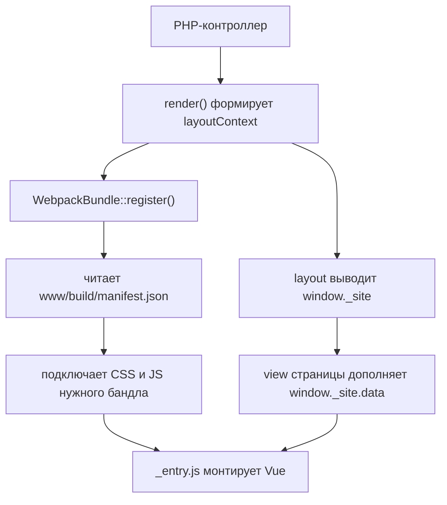

# Фронтенд

Каталог `frontend/`. Vue 2 + Webpack 5. Не SPA: каждой странице соответствует свой бандл,
общая «обвязка» подключается отдельно.

## Сборка

| Файл | Роль |
|---|---|
| `frontend/webpack.config.js` | Основной конфиг |
| `frontend/webpack.helpers.js` | Поиск entry points и генерация алиасов |
| `frontend/package.json` | Скрипты и зависимости |

### Автоматический поиск entry points

Точки входа не перечисляются вручную. `getEntries()` в `webpack.helpers.js`:

1. обходит подкаталоги `src/modules/`;
2. в каждом модуле рекурсивно ищет файлы `_entry.js` внутри `pages/`;
3. формирует имя бандла из пути, заменяя разделители на дефис.

Примеры:

| Файл | Имя бандла |
|---|---|
| `modules/catalog/pages/product/index/_entry.js` | `catalog-product-index` |
| `modules/catalog/pages/product/redesign/_entry.js` | `catalog-product-redesign` |
| `modules/cart/pages/redesign/_entry.js` | `cart-redesign` |
| `modules/base/pages/_entry.js` | `base` (бандл по умолчанию) |

Всего в проекте **95 файлов `_entry.js`**. Новый модуль со страницей подхватывается сборкой
без правок конфига.

### Алиасы

Генерируются автоматически из каталогов первого уровня в `src/` (`getAliases`):

| Алиас | Путь |
|---|---|
| `~` | `frontend/src/` |
| `Modules` | `frontend/src/modules/` |
| `Layouts` | `frontend/src/layouts/` |
| `Helpers` | `frontend/src/helpers/` |
| `Blocks` | `frontend/src/blocks/` |
| `Assets` | `frontend/src/assets/` |
| `Vendor` | `frontend/src/vendor/` |

`jquery` подключён как external и берётся из глобальной переменной `jQuery`.

### Вывод сборки

| Режим | Каталог |
|---|---|
| dev (`FRONTEND_APP_ENV` не равен `prod`) | `www/build/dev/` |
| prod | `www/build/<хэш>/` |

Структура: `<имя бандла>/scripts.js` и `<имя бандла>/styles.css`, общие чанки —
`chunks/vendor.js` и `chunks/layout-*.js`. Ассеты (`fonts/`, `icons/`, `images/`) копируются
из `src/assets/`. Манифест — `www/build/manifest.json`.

Каталог сборки полностью очищается перед каждым запуском.

### Скрипты

| Скрипт | Команда | Когда |
|---|---|---|
| `build-dev` | `NODE_ENV=development webpack` | Разовая сборка для разработки |
| `build-prod` | `NODE_ENV=production webpack` | Прод-сборка |
| `watch` | `NODE_ENV=development webpack --watch` | Разработка |
| `eslint-git` | линтер по diff | Перед коммитом |

**Важно:** `NODE_ENV`, который выставляют npm-скрипты, не влияет на режим самого webpack.
`webpack.config.js` определяет `mode` (минификация, source maps) исключительно по переменной
`FRONTEND_APP_ENV` из `.env`: `mode = FRONTEND_APP_ENV === 'prod' ? 'production' : 'development'`.
Если `.env` не содержит `FRONTEND_APP_ENV=prod`, сборка через `build-prod` всё равно соберётся
в dev-режиме несмотря на `NODE_ENV=production`.

Только переменные с префиксом `FRONTEND_*` пробрасываются в бандл через `DefinePlugin`.

### Глобальные SCSS

В каждый `.scss` файл через `sass-loader.additionalData` автоматически подставляются импорты:

```
Helpers/scss/deprecated/colors
Helpers/scss/deprecated/rem
Helpers/scss/deprecated/typography
Helpers/scss/mixins
Helpers/scss/deprecated/media-queries
Helpers/scss/deprecated/blocks
```

Переменные и миксины доступны без явного импорта. Обратная сторона — эти файлы нельзя удалить
без правки сборки, см. [09-pitfalls.md](09-pitfalls.md).

## Связка PHP и Vue

### Порядок загрузки



### Выбор бандла

`themes/basic/assets/WebpackBundle.php` сопоставляет `controllerId/actionId` с именем бандла
(например, `product/index` → `catalog/category`). Контроллер может задать бандл напрямую
через свойство `entryName`. Если бандла нет в манифесте, подключается `base` — только обвязка.

`modules/cms/controllers/FrontendController.php` при рендере формирует `layoutContext`
и определяет URL сборки.

### Контракт `window._site`

Данные с сервера передаются одним глобальным объектом. Формируется в
`modules/layout/service/BaseContextService.php`:

```php
[
  'data'        => [...],  // данные страницы и глобального UI
  'locales'     => [...],  // строки локализации
  'routing'     => [...],  // маршруты
  'settings'    => [...],  // версия сборки, Sentry, Flomni и прочее
  'experiments' => ['all' => [...], 'current' => [...]],
]
```

Объект выводится в layout (`themes/basic/views/layouts/base.php`), а конкретная страница
дополняет его:

```php
Object.assign(window._site.data, <?= json_encode($context) ?>);
Object.assign(window._site.settings, <?= json_encode($settings ?? []) ?>);
Object.assign(window._site.locales, <?= json_encode($locales) ?>);
```

На клиенте доступ идёт через `frontend/src/layouts/base/workspace/context.js`, который
разворачивает точечные ключи в объекты и предоставляет методы:

| Метод | Что возвращает |
|---|---|
| `getData(key)` | Данные страницы |
| `getLocale(key)` | Строку локализации |
| `getRoute(key)` | Маршрут |
| `getSetting(key)` | Настройку |
| `getExperiment(alias)` | Признак участия в эксперименте |
| `getExperimentVariant(alias)` | Вариант эксперимента |

В компонентах часть этих методов подмешивается миксином
`frontend/src/layouts/base/shared/mixins/context.js` — но не один в один: `getData` там
называется `getContext()`, а `getExperiment`/`getExperimentVariant` в этот миксин не входят
(экспериментами компоненты пользуются через прямой импорт `context` или отдельный миксин).
Миксин также добавляет вычисляемые свойства `context`, `locales`, `routing`, `settings` и
метод `getSidebar()`.

**Схемы и типизации у этого контракта нет.** Переименование ключа локали не ловится на сборке
и проявляется только в рантайме.

### Способы получения данных

| Способ | Где применяется |
|---|---|
| SSR через `_site.data` | Товар, категория, профиль, блоки главной |
| Дополнение в view страницы | Карточка товара, контекст новой корзины |
| Легаси-глобальные переменные | Старая корзина: `window.cartData`, `window.isGuest` |
| Запросы к API в рантайме | Сервисы в `layouts/base/workspace/` через `axiosService` |

### Обвязка страницы

`frontend/src/layouts/base/init.js` подключается почти во всех entry points и делает:

- инициализацию Sentry и глобальных стилей;
- монтирование хедера, футера, таб-бара, опросов, уведомлений (несколько корневых Vue-инстансов);
- подключение аналитики: dataLayer, Mindbox, Diginetica, ecommerce-слушатели;
- автозагрузку **всех** файлов из `src/blocks/**` через `import.meta.webpackContext`;
- наполнение Vuex данными экспериментов и гео.

Для минимальных страниц есть облегчённый вариант — `modules/empty/pages/_entry.js`.

## Модули

58 модулей в `frontend/src/modules/`. Крупнейшие:

| Модуль | Файлов | Есть страницы | Назначение |
|---|---|---|---|
| `ui-kit` | 301 | нет | Дизайн-система |
| `catalog` | 229 | да | Карточка товара, категория, поиск, фильтры |
| `cart` | 131 | да | Корзина и чекаут (старый и новый) |
| `orders` | 50 | да | Успешный заказ, оплата, возвраты |
| `landing` | 42 | да | Маркетинговые лендинги |
| `profile` | 41 | да | Профиль, заказы, бонусы, сертификаты |
| `base` | 37 | да | Общие хелперы, страница ошибки, бандл по умолчанию |
| `material` | 33 | да | Страницы о материалах |

Модули без страниц — библиотеки сервисов, подключаемые из обвязки: `captcha`, `diginetica`,
`marketing`, `smart-script`, `fitting`, `poll`, `video`, `dresscode`, `long-read`, `rates`,
`subscription`, `content`, `ui-kit`.

Партнёрские модули с отдельными лендингами: `dreamers`, `oskelly`, `cosmoscow`, `garderobo`.

## ui-kit

`frontend/src/modules/ui-kit/`, 301 файл.

| Раздел | Содержимое |
|---|---|
| `controls/` | Button, ButtonV2, Checkbox, Radio, Toggle, Tabs, Slider, Chip, Counter, Dots, Bullets, Close, IconButton, QuantityController |
| `typography/` | BodyText, BodyExtraText, HeadlineText, TitleText, LabelText, DisplayText, StrikeThroughText |
| `forms/` | TextField, TextAreaField, SearchField, ComplexField, FieldWrapper, RatingInput, директива маски |
| `popups/` | AlertPopup, ConfirmPopup, PopupTemplate, `PopupManager` |
| `navigation/` | Breadcrumbs |
| `icons/` | Более 100 SVG-компонентов; часть разложена по размерам (`18/`, `20/`, `24/`, `32/`, `40/`, `48/`, `64/`), часть — по смысловым каталогам (`account/`, `arrows/`, `payment-method/`, `social/` и др.), часть лежит прямо в корне `icons/` |
| `dropdown/` | Dropdown, DropdownList и части |
| `elements/` | AppBar, EmptyState, Rating, Countdown |
| `fixed/` | FixedElement, Tooltip и менеджеры |
| `media/` | VideoPlayer |
| `lists/`, `loaders/`, `qr/`, `debug/` | Вспомогательные |
| `shared/` | `PropsHelper`, константы, SCSS-переменные |

### Паттерн единого источника пропсов

Пропсы компонента описываются один раз в `<Компонент>/shared/props.js`. Каждый проп —
объект Vue-описания с опциональным ключом `storybook`.

```js
// компонент
import PropsHelper from 'Modules/ui-kit/shared/helpers/PropsHelper';
import * as props from './shared/props';

export default {
  props: PropsHelper.getVueProps(props),  // ключ storybook вырезается
};
```

Для историй используется `PropsHelper.getStorybookArgs(props)`. Файлов `shared/props.js`
в ui-kit — 15.

### Storybook

**На ветке `master` Storybook не настроен:** каталога `frontend/.storybook/` нет, в
`package.json` нет соответствующих скриптов, хотя `frontend/README.md` их упоминает.
Конфигурация и истории существуют в отдельной ветке разработки.

При этом в коде есть 20 файлов `.stories.js` и демо-страницы модуля `storybook`
(`storybook/popup`, `storybook/tooltip`) со своими бандлами.

## Состояние

### Глобальный Vuex

`frontend/src/layouts/base/workspace/store.js`:

| Модуль стора | Источник |
|---|---|
| `cart` | `Modules/cart/store/cart.js` |
| `checkout` | `Modules/cart/store/checkout.js` |
| `catalog` | `Layouts/base/store/catalog.js` |
| `product` | `Modules/catalog/stores/product.js` |
| `poll` | `Layouts/base/store/poll.js` |
| `site` | `Layouts/base/store/site.js` — брейкпоинты, пол, эксперименты, признак десктопа |
| `user` | `Layouts/base/store/user.js` — авторизация, гео |
| `userNotifications` | `Layouts/base/store/userNotifications.js` |

Инициализация Vue — `frontend/src/layouts/base/workspace/vue.js`.

Страница может регистрировать свой модуль динамически: главная добавляет `page` через
`store.registerModule('page', pageStore)`.

### Легаси-стор старой корзины

`frontend/src/modules/cart/ancient/store.js` — отдельный Vuex-стор, читающий `window.cartData`.
Используется только старой корзиной. Новый чекаут работает с глобальным стором.

### Синглтоны вне Vuex

Все в `frontend/src/layouts/base/workspace/`: `axios.js`, `axiosService.js`, `popupManager.js`,
`tooltipManager.js`, `dropdownManager.js`, `scrollBlocker.js`, `storage.js`, `globalLoader.js`,
`layoutEventManager.js`, `orderManager.js`, `notificationsManager.js`, а также доменные
сервисы `catalogService.js`, `cartService.js`, `userService.js`.

## Аналитика и внешние сервисы

### Подключаемые из PHP

| Сервис | Где подключается |
|---|---|
| Google Tag Manager, dataLayer | `themes/basic/views/layouts/parts/marketing/head.php` |
| Diginetica | там же |
| Яндекс.Метрика | там же |
| VK Retargeting | там же |
| Mindbox tracker | `themes/basic/views/layouts/parts/marketing/body_end.php` |
| Flomni (чат) | там же, настройки из `_site.settings` |
| Roistat | там же |

### Обёртки в JS

| Файл в `workspace/` | Обёртка над |
|---|---|
| `dataLayer.js` | `Modules/marketing/services/dataLayer/DataLayer` |
| `ecommerce.js` | `Modules/marketing/services/ecommerce/Ecommerce` |
| `gtag.js` | `Modules/marketing/services/gtag/Gtag` |
| `yandexMetrika.js` | `Modules/marketing/services/yandexMetrika/YandexMetrika` |
| `mindbox.js` | `Modules/marketing/services/mindbox/MindboxService` |
| `digineticaSearch.js`, `digineticaTracking.js`, `digineticaAnyQuery.js` | Diginetica |
| `garderoboService.js` | `Modules/garderobo/services/GarderoboService` |
| `smartScriptService.js` | AppsFlyer Smart Script |
| `flomniService.js`, `criteoService.js`, `gdeSlon.js`, `vkRetargetingService.js` | Соответствующие сервисы |

AdvCake — исключение: подключается не через PHP-layout и не через общую обвязку, а напрямую
в двух местах на клиенте — `modules/cart/ancient/marketing.js` (легаси-корзина) и
`modules/orders/pages/success/_entry.js` (страница успешного заказа), через глобальную
функцию `window.advcake_order()`.

Страницы дополнительно задают тип страницы: `dataLayer.setPageType()`,
`yandexMetrika.setPageType()`.

### Капча

Модуль `frontend/src/modules/captcha/`, синглтоны `workspace/captcha/yandexCaptcha.js` и
`googleCaptcha.js`, компонент `HybridCaptcha.vue`. Ключ Яндекс-капчи — из переменных
`FRONTEND_YANDEX_SMART_CAPTCHA_*`.

## Параллельный редизайн

Часть интерфейса существует в двух версиях одновременно.

### Карточка товара

| Версия | Бандл | Корневой компонент |
|---|---|---|
| Старая | `catalog-product-index` | `pages/product/index/ProductPage.vue` |
| Новая | `catalog-product-redesign` | `pages/product/redesign/ProductPage.vue` |

Выбор делает `modules/product/controllers/ProductController.php`:

- query-параметр `?redesign=12stz` — принудительно новая версия;
- A/B-тест `NOVADEV-5523`, вариант `NOVADEV-5523_1` — новая версия;
- параллельно работает эксперимент `NOVADEV-6049`.

Внутри новой версии разделение на десктоп и мобильную идёт по `state.site.isDesktop`.

### Корзина

| Версия | Бандл | Точка монтирования | Стор |
|---|---|---|---|
| Старая | `cart` | `#vue-app` | `cart/ancient/store` + `window.cartData` |
| Новая | `cart-redesign` | `#cart-content` | Глобальный стор |

Выбор в `CartController::actionIndex()`: для админов и при `?redesign=12stz`.

### Категория

Активна `CategoryPageNew.vue`. Старая `CategoryPage.vue` осталась в репозитории, но нигде
не импортируется.

### Прочие признаки

Двойные компоненты `SizesPopup` и `SizesPopupNew`, варианты слайдера `SMALL_REDESIGN` и
`BIG_REDESIGN`, CSS-классы `new-design`, `catalog-button__redesign`, `login--redesign`,
флаг `redesign: true` в блоках информации о товаре.

## Легаси

| Область | Что это |
|---|---|
| `blocks/` | 44 SCSS и 9 JS на jQuery — довьюшная вёрстка и поведение, грузится на каждой странице |
| `vendor/scripts/` | Сторонние библиотеки вне npm: jQuery и плагины, slick, masonry, featherlight, intlTelInput |
| `helpers/scss/deprecated/` | Устаревшие переменные и миксины, подставляются автоматически во все SCSS |
| `layouts/base/ancient/` | Старая система попапов (`window.basePopup`) рядом с `PopupManager` из ui-kit |
| `modules/cart/ancient/` | API, валидация и маркетинг старой корзины |

Дублирующиеся компоненты:

| Область | Дубли |
|---|---|
| Карточка товара | `components/Product/`, `components/ProductRedesign/`, `ProductContentMobile/` |
| Краткая информация | `Product/desktop/ProductShortInfo.vue` и `ProductShortInfo/ProductShortInfo.vue` |
| Попап размеров | `popups/SizesPopup/` и `popups/SizesPopupNew/` |
| Кнопки | `controls/Button/` и `controls/ButtonV2/` |
| Корзина | старый стек и `components/redesign/` |
| Категория | `CategoryPage.vue` (мёртвый) и `CategoryPageNew.vue` |

## Структура `frontend/src/`

```
frontend/src/
├── assets/       # шрифты, иконки, изображения (копируются в сборку)
├── blocks/       # легаси jQuery + SCSS, подключаются глобально
├── helpers/      # DOMHelper, SCSS-миксины, устаревшие глобальные стили
├── layouts/
│   ├── base/     # основная обвязка: init.js, workspace/, store/, components/
│   └── empty/    # минимальная обвязка
├── modules/      # 58 функциональных модулей
├── stories/      # заготовки Storybook
└── vendor/       # вендорные скрипты и стили
```
