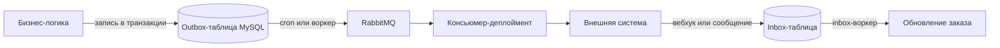

# Инфраструктура

## CI/CD

GitLab CI собирает образы через Kaniko, публикует в `hub.12stz.dev` и деплоит Helm-чартом
в Kubernetes. Конфиг — `.gitlab-ci.yml`.

### Стадии и условия запуска

| Стадия | Джобы | Когда |
|---|---|---|
| `build backend deps` | `build backend deps` | MR в develop/master или пуш в них, **только если менялся `composer.*`** |
| `build frontend` | `build frontend`, `build frontend prod` | При изменениях в `frontend/**`; прод-сборка по тегу `v*.*.*` |
| `build images` | `build images`, `build images prod` | Матрица: `nginx` и `backend` |
| `stat analyse` | `phpstan`, `phpstan_src`, `codesniffer`, `eslint` | На MR |
| `tests` | `tests`, `phpunit`, `openapi_coverage`, `ui-test`, `api-test` | На MR; UI и API тесты вручную |
| `deploy` | `deploy:dev|fix|mobiledev|sandbox|stg|prod` | Вручную |
| `rollback` | `rollback:*` | Вручную, требует `MIGRATION_COUNT` |

Глобальные переменные: `PROJECT_NAME=web-monolith`, `DOCKERHUB_URL=hub.12stz.dev`,
`HELM_NAMESPACE=web-$ENVIRONMENT`, `PHP_IMAGE_TAG=v1.0.13`,
`COVERAGE_MIN_PERSENTAGE=5`, `OPENAPI_COVERAGE_MIN_PERSENTAGE=50`.

### Собираемые образы

| Джоба | Образ | Особенности |
|---|---|---|
| `build backend deps` | `.../backend-deps:${DEPS_COMMIT}` | Composer install с SSH-ключом из Vault |
| `build frontend` | `.../frontend:${FRONTEND_IMAGE_TAG}` | `.env` берётся из Vault, тег — хэш последнего коммита в `frontend/` |
| `build images` | `.../nginx:${CI_COMMIT_SHA}`, `.../backend:${CI_COMMIT_SHA}` | Матрица компонентов |
| `build images prod` | То же с `${CI_COMMIT_TAG}` | Раннер `k2-prod` |

Базовые образы: `php8.2-monolith:v1.0.13`, `nginx:1.25.4-alpine`, `node:18.17.1-alpine`.
Отдельно собирается `postfix:v1.0.0`.

Dockerfile-ы — в `.deploy/docker/`. `Dockerfile-frontend` кроме `npm run build-prod` также
получает `.env` из Vault (`vault kv get ... > ./.env`) прямо на этапе сборки образа,
устанавливает зависимости (`npm install`) и удаляет `.env` после сборки (`rm ./.env`) — то
есть секреты фронтенда на короткое время оказываются в build-контексте образа.

### Контроль качества

| Проверка | Порог или правило |
|---|---|
| `phpstan` | `phpstan.neon`, уровень 2, весь проект |
| `phpstan_src` | `phpstan_6lvl_src.neon`, уровень 6, при изменениях в `src/**` |
| `codesniffer` | `phpcs --standard=./phpcs.xml` |
| `eslint` | Читает лимит из `frontend/eslint/config/max-warnings.txt` (660) в переменную `MAX_WARNINGS`, но фактическая команда — `npx eslint . --quiet --format json ...` — флаг `--max-warnings` не передаётся, а `--quiet` отбрасывает warning-уровень целиком, оставляя только ошибки; лимит де-факто не применяется |
| `phpunit` | Покрытие строк не ниже **5%** |
| `openapi_coverage` | Покрытие спецификациями не ниже **50%** |
| `tests` | `check-migrate-trigger.sh` — парные миграции таблиц истории |

### Окружения

| Джоба | Окружение | Тег образа | URL |
|---|---|---|---|
| `deploy:dev` | dev | `CI_COMMIT_SHA` | dev.12stz.tech |
| `deploy:fix` | fix | `CI_COMMIT_SHA` | fix.12stz.tech |
| `deploy:mobiledev` | mobiledev | `CI_COMMIT_SHA` | mobiledev.12stz.tech |
| `deploy:sandbox` | sandbox | `CI_COMMIT_SHA` | sandbox.12stz.tech |
| `deploy:stg` | stg | `CI_COMMIT_SHA` | staging.12stz.tech |
| `deploy:prod` | prod | `CI_COMMIT_TAG` | 12storeez.com |

Namespace — `web-{окружение}`. Команда деплоя:

```bash
helm upgrade web-monolith .deploy/helm --install --atomic --timeout 600s \
  -f .deploy/helm/${ENVIRONMENT}.values.yaml \
  --set nuc.defaultImageTag=${IMG_TAG} \
  --set nuc.configMaps.web-monolith-envs.data.BUILD_VERSION=${CI_COMMIT_REF_NAME}
```

### Миграции при деплое

Helm-хуки основного чарта:

| Хук | Команда |
|---|---|
| pre-upgrade | `yii migrate --interactive=0` |
| pre-upgrade | `yii migrate --migrationPath=@yii/rbac/migrations/` |
| pre-upgrade | `yii migrate --migrationPath=@yii/log/migrations/` |
| post-upgrade | `yii message config/i18n.php` |

### Откат

Джобы `rollback:*` используют отдельный чарт `.deploy/migrations/` и релиз
`web-monolith-rollback`:

```bash
helm upgrade web-monolith-rollback .deploy/migrations \
  --set nuc.migrationCount=${MIGRATION_COUNT} \
  --set nuc.defaultImageTag=${IMG_TAG}
```

Джоба выполняет `php ./yii migrate/down {{ $.Values.global.migrationCount }} --interactive=0`.
**Количество миграций задаётся вручную** переменной `MIGRATION_COUNT`, без неё джоба падает
ещё до `helm upgrade` (явная проверка `if [[ -z "${MIGRATION_COUNT}" ]]; then exit 1; fi`).

**Похоже на баг:** чарт `.deploy/migrations` — обёртка над сабчартом `nxs-universal-chart`
(алиас `nuc`, см. `Chart.yaml`), и шаблон читает значение из `global.migrationCount` —
то есть из `nuc.global.migrationCount` с точки зрения родительского чарта. CI же передаёт
`--set nuc.migrationCount=...` — на один уровень выше нужного. Значение по умолчанию
`global.migrationCount: 1` в `.deploy/migrations/values.yaml`, судя по всему, никогда не
переопределяется этим `--set`, и `migrate/down` всегда откатывает ровно 1 миграцию независимо
от `MIGRATION_COUNT`. Стоит перепроверить перед следующим использованием отката.

## Топология в Kubernetes

### Веб-поды

Деплоймент `web-monolith` — три контейнера в одном поде:

| Контейнер | Роль |
|---|---|
| `web-monolith-backend` | php-fpm, слушает `127.0.0.1:9000`, `pm.max_children=360` |
| `web-monolith-nginx` | Проксирование на fpm, JSON-логи доступа, `/metrics` только с разрешённых IP |
| `web-monolith-postfix` | Локальный SMTP на `127.0.0.1:25` и OpenDKIM |

Реплики: прод и stg — 3, остальные окружения — 1.

Дополнительно:

- `web-monolith-admin` — тот же набор контейнеров с конфигурацией под админку
  (`memory_limit=5G` в базовом `values.yaml`, но **50G** в `prod.values.yaml`), 1 реплика;
  для сравнения, у обычного `web-monolith-backend` — `memory_limit=3G` везде;
- `web-monolith-error-pages` — nginx-заглушка для 5xx.

Общее хранилище: PVC `pvc-web-monolith-sfs` (ReadWriteMany, 10 Гб), монтируется в
`www/images`, `www/uploads`, `www/export`.

Вход: Istio VirtualService и nginx Ingress → сервис `web-monolith-http:80`.
Health-check — `/api2/healthcheck/ping`.

### Воркеры и кроны

Всё описано в `.deploy/helm/values.yaml` с переопределениями в
`.deploy/helm/{env}.values.yaml`:

| Тип | Количество |
|---|---|
| Всего worker-деплойментов (без `web-monolith`, `web-monolith-admin`, `web-monolith-error-pages`) | 68 |
| Из них — воркеры MySQL-очереди (`yii queue/listen`) | 25 |
| Из них — консьюмеры RabbitMQ, ESB-консоли и прочие обработчики | 43 |
| CronJob-ов | 109 |

**Это важно:** реальное асинхронное поведение прода задаётся Helm-values, а не кодом
приложения. Консольная команда может существовать без воркера, и наоборот.

Основные воркеры MySQL-очереди:

| Деплоймент | Очередь | Реплик в проде |
|---|---|---|
| `web-monolith-queue` | `default` | 1 |
| `web-monolith-queue-analytics` | `analytics` | 3 |
| `web-monolith-queue-crm` | `crm` | 1 |
| `web-monolith-queue-crm-customer` | `crmcustomer` | 1 |
| `web-monolith-queue-crm-discount` | `crmdiscount` | 1 |
| `web-monolith-queue-crm-payment` | `crmpayment` | 1 |
| `web-monolith-queue-mindbox` | `mindbox` | 1 |
| `web-monolith-queue-receipts` | `receipts` | 1 |
| `web-monolith-queue-reindexproduct` | `reindexproduct` | 1 |
| `web-monolith-queue-reindexproductstocks` | `reindexproductstocks` | 1 |
| `web-monolith-queue-esbstocks` | `esbstocks` | 1 |
| `web-monolith-queue-giftcardsunlock` | `giftcardsunlock` | 1 |
| `web-monolith-queue-orderscounter` | `orderscounter` | 1 |

Консьюмеры RabbitMQ для обмена заказами (по 3 реплики в проде):

| Деплоймент | Команда |
|---|---|
| `web-monolith-queue-onec-outbox-rabbit-create` | `rabbit-outbox-transactions/create onec` |
| `web-monolith-queue-onec-outbox-rabbit-update` | `rabbit-outbox-transactions/update onec` |
| `web-monolith-queue-rcrm-outbox-rabbit-create` | `rabbit-outbox-transactions/create rcrm` |
| `web-monolith-queue-rcrm-outbox-rabbit-update` | `rabbit-outbox-transactions/update rcrm` |
| `web-monolith-queue-mindbox-outbox-rabbit-create` | `rabbit-outbox-transactions/create mindbox` |
| `web-monolith-queue-mindbox-outbox-rabbit-update` | `rabbit-outbox-transactions/update mindbox` |
| `web-monolith-queue-onec-inbox-rabbit-update` | `rabbit-inbox-transactions/update onec` |
| `web-monolith-queue-rcrm-inbox-rabbit-create` | `rabbit-inbox-transactions/create rcrm` |
| `web-monolith-queue-rcrm-inbox-rabbit-update` | `rabbit-inbox-transactions/update rcrm` |

Консьюмеры платёжного outbox:

| Деплоймент | Команда |
|---|---|
| `web-monolith-queue-dolyame-outbox-rabbit-request` | `rabbit-bnpl-outbox-transactions/request dolyame` |
| `web-monolith-queue-podeli-outbox-rabbit-request` | `... request podeli` |
| `web-monolith-queue-yandex-split-outbox-rabbit-request` | `... request split` |
| `web-monolith-queue-yandex-pay-outbox-rabbit-request` | `... request pay` |
| `web-monolith-queue-yandex-sbp-outbox-rabbit-request` | `... request yandex-sbp` |

Прочие консьюмеры: обработка изображений (`imageresize`, `image_s3_upload`), заказы Lamoda,
импорт VIC из RCRM, привязка отзывов, остатки магазинов, сообщения в Mattermost,
импорт пользователей, обмен номенклатурой, офлайн-заказы, отправка чеков в микросервис.

Группы CronJob-ов: экспорт фидов, обработка outbox и inbox, отправка платёжных уведомлений
(каждую минуту), переиндексация товаров, очистка (истёкшие JWT, старые SMS-логи, outbox),
загрузка WSDL 1С.

Файл `config/cron-web` описывает расписания времён bare-metal и в Kubernetes не применяется.

## Асинхронная обработка

### MySQL-очередь

| Параметр | Значение |
|---|---|
| Компонент | `components/SqlQueue.php` |
| Таблица | `default_queue` — имя жёстко захардкожено в `SqlQueue`, `TABLE_PREFIX` **не применяется** |
| Колонки | `queue`, `run_at`, `payload`, `ukey` |
| Имена очередей | `src/Queue/SqlQueueName.php` — 22 константы |
| Воркер | `php ./yii queue/listen <имя>` |

Идемпотентность обеспечивается уникальным `ukey`: при попытке вставить дубль ловится
`IntegrityException` с кодом 1062, и задание тихо пропускается. Задание удаляется при
извлечении — семантика «не более одного раза».

### RabbitMQ

| Параметр | Значение |
|---|---|
| Компонент | `components/rabbitmq/RabbitMQ.php` (php-amqplib) |
| Настройки | durable-очереди, QoS prefetch = 1 |
| Переменные | `RABBIT_HOST`, `RABBIT_PORT`, `RABBIT_USER`, `RABBIT_PASSWORD`, `RABBIT_VHOST` |
| Имена очередей | `src/Queue/RabbitMqQueueName.php` — 45 констант (40 уникальных строковых значений — часть констант ссылается на уже объявленные) |

Публикация номенклатуры идёт в exchange `nomenclature` с routing key
`nomenclature.delta.product.site`.

### Outbox и Inbox

Обмен с внешними системами построен на транзакционном outbox.



Порядок работы:

1. бизнес-логика в той же транзакции пишет запись в outbox-таблицу;
2. cron (`process-*-outbox-cron`) или воркер читает таблицу и публикует JSON в Rabbit
   через `OrderIntegrationOutboxFacade` / `OutboxTransactionService`;
3. консьюмер выполняет обработчик: SOAP-вызов 1С, REST RetailCRM, Mindbox, API платёжного
   провайдера;
4. при ошибке публикации запись остаётся, и её подхватит следующий проход крона.

Повторные попытки и идемпотентность:

- счётчик попыток на транзакцию хранится в Redis в группе `Integration` с TTL из
  `PaymentSystemDictionaryEnum::OUTBOX_CACHE_KEY_TTL`;
- максимум попыток берётся из параметров CMS (`outbox_*_max_retries`) либо из значений
  по умолчанию;
- при превышении лимита сообщение отклоняется без возврата в очередь;
- обработчики различают исключения: `OutboxTransactionRetryException` — не удалять запись
  из очереди (`nack()` для повтора), `OutboxTransactionSkipException` — удалить без логирования,
  `OutboxTransactionErrorException` — удалить и записать ошибку через `LogExtendedMessage`
  (отдельного канала уведомлений на этот случай нет, только структурированный лог).

Входящее направление устроено зеркально: `InboxTransactionStrategy` плюс воркеры
`rabbit-inbox-transactions/{create,update} {сервис}` и cron как резервный путь.

## Кэширование

### Кластеры Redis

| Кластер | Переменные | Используется |
|---|---|---|
| Основной | `REDIS_CLUSTER_NODES` либо `REDIS_HOST`/`REDIS_PORT`/`REDIS_PASSWORD`/`REDIS_DATABASE` | `RedisInterface`, компоненты `cache`, `cacheMain`, `cacheYiiT`, denylist JWT, счётчики outbox |
| Нового чекаута | `REDIS_NEW_CLUSTER_NODES` | `NewRedisInterface`, компонент `NewCache` |

Если переменная с узлами кластера заполнена — используется кластерное подключение,
иначе одиночное.

### Формирование ключа кэша

В `config/web.php` префикс ключа собирается из литерала и четырёх переменных составляющих
(итого 5 частей, склеенных без разделителя):

| Составляющая | Как определяется |
|---|---|
| Литерал `old_cache` | Константа |
| Номер сервера | По имени хоста |
| Английская версия | Хост содержит `en.` |
| Признак авторизации | Наличие cookie `_identity` |
| Мобильное устройство | Результат `Mobile_Detect->isMobile()` |

Итоговые префиксы: `cacheMain` — `p` + префикс, `cacheYiiT` (переводы i18n) — `t` + префикс.

Следствие: один логический ключ существует во множестве вариантов, у гостя и авторизованного
пользователя кэши разные. Подробнее — [09-pitfalls.md](09-pitfalls.md).

### Переключение кластера по URL

В `config/web.php` компонент `cache` подменяется на `NewCache` (кластер нового чекаута) по
функции `isNewCheckout()`, которая проверяет **URI запроса** — без обращения к каким-либо
флагам-параметрам. `NewCheckoutCacheConfigurator` (`src/Modules/Cart/Service/`) — отдельный
класс с единственным методом `isCacheEnabled(): bool`, читающим флаг
`NEW_CHECKOUT_CACHE_ENABLED`; он не участвует в подмене `Yii::$app->cache`, а служит
gate-проверкой для отдельного Redis-кэша чекаута в `CheckoutCacheService`. Это два независимых
механизма, которые легко перепутать.

### Кэш схемы БД

Компонент `cacheSchema` — `FileCache` в `@runtime/cache/dbSchema`, TTL 1 час. Redis для схемы
не используется. Регистрируется только в `config/web.php` — у «чистой» консоли (без веб-расширения
конфига) этого компонента нет.

### Инвалидация

Массовый сброс через консоль отключён — `CacheController` возвращает подсказку использовать
`RedisInterface`. Точечная инвалидация: `TagDependency::invalidate()` (отзывы, лукбуки),
`cacheYiiT->flush()` (после правки переводов в админке), `geoCache->flush()`,
`Cache::flush()` через Redis.

## Наблюдаемость

### Sentry

| Переменная | Назначение |
|---|---|
| `SENTRY_ENABLED` | Включение |
| `SENTRY_DSN` | Адрес проекта |
| `SENTRY_SAMPLE_RATE` | Доля отправляемых ошибок |
| `SENTRY_TRACES_SAMPLE_RATE`, `SENTRY_ENABLE_TRACING` | Трейсинг |
| `SENTRY_PROFILES_SAMPLE_RATE`, `SENTRY_ENABLE_PROFILER` | Профилирование |
| `SENTRY_DEBUG` | Отладка |

Инициализация — в `config/common.php`. Сервис — `src/Monitoring/Sentry/Service/SentryService.php`.
Не отправляются: `NotFoundHttpException`, `TooManyRequestsHttpException`,
`RequestValidatorException`. Тег релиза берётся из `BUILD_VERSION`, который задаётся при деплое.

### Метрики

`/metrics` → `metrics/metrics/index` (`MetricsController`), формат Prometheus text 0.0.4,
библиотека `prometheus/client_php`. Доступ ограничен на уровне nginx списком IP.
Сервис `web-monolith-metrics` отдаёт порты 8080 (nginx stub_status) и 9000.

### Логи

Настройка — `config/log.php`.

| Цель | Класс | Куда | Уровни |
|---|---|---|---|
| `errors` | `DbTargetExtended` | БД `log_db` | error, warning |
| `default` | `DbTargetExtended` | БД `log_db` | info, trace, profile |
| `stderr` | `LogJsonTarget` | `php://stderr` | error, warning (категория `GRAFANA_ERR`) |
| `stdout` | `LogJsonTarget` | `php://stdout` | info (категория `GRAFANA`) |
| `container` | `FileTarget` | `@runtime/logs/container.log` | Вызовы DI при `LOG_CONTAINER_CALLS` |

Логи фронтенда — не цель логирования, а таблица `frontend_logs` через модель `FrontendLog`.

### Обработка ошибок

Веб: `app\coreExtends\errorHandler\ExtendedErrorHandler`, действие `cms/frontend/error`.
При недоступности апстрима nginx отдаёт заглушку из `web-monolith-error-pages`.

## Конфигурация и секреты

### Vault в CI

| Этап | Что берётся |
|---|---|
| `build backend deps` | SSH-ключ `dev_ops/cicd/git_bot_ssh` для приватных Composer-репозиториев |
| `build frontend` | `.env` из `develop/backend/web/12storeez/frontend/{dev|prod}/envs` |
| Деплой и откат | OIDC-токен GitLab → `kube-login` |

### Vault в Kubernetes

Синхронизация через `nuc-vault-secret-operator`:

| Секрет | Путь в Vault | Содержимое |
|---|---|---|
| `web-monolith-secret-envs` | `backend/web/12storeez/{env}/envs` | Все чувствительные переменные; при изменении перезапускает деплоймент |
| `web-monolith-s3-envs` | `.../s3-envs` | Доступы к S3 |
| `web-monolith-dkim-key` | `.../dkim-key` | Ключ DKIM для Postfix |
| `web-monolith-registry-hub-auth` | `common/registry_hub_auth` | Доступ к registry |
| TLS | `dev_ops/certificates/{домен}` | Сертификаты |

### Порядок применения конфигурации

1. Секрет Vault → переменные окружения во всех подах.
2. ConfigMap `web-monolith-envs` → несекретные переменные (`APP_ENV`, `BUILD_VERSION`).
3. `config/config.php` читает переменные в массив `$params`.
4. `config/common.php` и `config/web.php` конфигурируют компоненты из `$params`.
5. Helm-values задают тюнинг nginx, php-fpm, postfix, число реплик и расписания кронов.

Локально используется файл `.env` (в git не хранится, пример — `.env.example`).
Для phpstan и phpcs есть `config/params_example.php`, для тестов — `.env.test`.

Переменные, которые есть в `config/config.php`, но отсутствуют в `.env.example`:
`REDIS_NEW_CLUSTER_NODES`, `BUILD_VERSION`.
