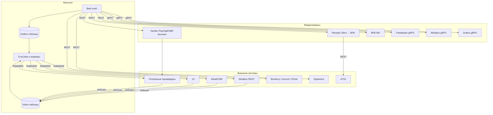

# Внешние интеграции

## Сводная таблица

| Система | Назначение | Протокол | Направление | Где код |
|---|---|---|---|---|
| **Mindbox** | CRM, лояльность, бонусы, рассылки, рекомендации | REST + gRPC | Двустороннее | `modules/mindbox/`, `src/Modules/Mindbox/`, `modules/grpc/Mindbox/` |
| **RetailCRM** | Заказы, клиенты, скидки, VIC-импорт | REST | Двустороннее | `modules/retailCrm/`, `src/Modules/Rcrm/` |
| **1С** | Номенклатура, остатки, заказы, сертификаты | SOAP + вебхуки | Двустороннее | `src/Modules/OneC/` (каталога `modules/onec/` не существует) |
| **Lamoda** | Маркетплейс-заказы | REST | Двустороннее | `modules/api2/controllers/OrdersController.php` (`actionCreateFromLamoda`), `modules/orders/services/LamodaOrderOutboxService.php`, `src/Modules/Order/Services/LamodaOrderService.php` (каталога `src/Modules/Lamoda/` не существует) |
| **Mercaux** | Офлайн-заказы в магазинах | REST | Входящее | `modules/api2/`, `OrderMethodEnum::MERCAUX` |
| **YooKassa** | Оплата картой | REST | Двустороннее | `modules/yandex/` |
| **Yandex Pay** | Оплата | REST через биллинг-МС | Двустороннее | `src/Integration/Payment/YandexPay/` |
| **Yandex Split** | Рассрочка | REST через биллинг-МС | Двустороннее | `src/Integration/Payment/YandexSplit/` |
| **Yandex SBP** | Оплата по СБП | REST через биллинг-МС | Двустороннее | `src/Integration/Payment/YandexSbp/` |
| **Tinkoff Dolyame** | Оплата долями | REST | Двустороннее | `modules/payment/components/Dolyame.php` |
| **Alpha Podeli** | Оплата долями | REST | Двустороннее | `src/Modules/Payment/Components/Podeli.php` |
| **ATOL** | Фискализация чеков | REST | Исходящее | `src/Modules/Receipt/`, `modules/atol/` |
| **LifePay** | Фискализация (легаси) | REST | Исходящее | `modules/lifepay/components/Lifepay.php` (компонент), `modules/orders/jobs/LifepayJob.php`, консоль `lifepay` |
| **Boxberry** | ПВЗ и доставка | REST | Двустороннее | `modules/delivery/`, консоль `boxberry` |
| **Accord Post** | ПВЗ и доставка | REST | Двустороннее | `modules/delivery/`, консоль `accord` |
| **DaData** | Подсказки адресов, ФИАС | REST | Исходящее | `components/Dadata.php` |
| **Яндекс.Геокодер** | Геокодирование (несмотря на название класса) | REST | Исходящее | `components/Geocode.php` (`APIURL` — `geocode-maps.yandex.ru`, а не Google) |
| **Google Geocode** | Резервное/альтернативное геокодирование | REST | Исходящее | `components/Google.php` (`maps.googleapis.com/maps/api/geocode/json`) |
| **IpGeoBase** | Гео по IP | Файловый парсинг | Входящее | консоль `ipgeobase-parse` |
| **Diginetica** | Поиск, подсказки, трекинг | REST + JS | Двустороннее | `modules/diginetica/`, `frontend/src/modules/diginetica/` |
| **Elasticsearch** | Поиск по каталогу | HTTP | Двустороннее | `src/Search/Elastic/` |
| **Flomni** | Онлайн-чат | JS-виджет | Клиентское | `themes/basic/views/layouts/parts/marketing/` |
| **Garderobo** | Подбор образов | REST + JS | Двустороннее | `src/Modules/Feed/Service/GarderoboFeedService.php` (сервер), `frontend/src/modules/garderobo/` + `frontend/src/layouts/base/workspace/garderoboService.js` (клиент) |
| **Dresscode** | Стилистические подборки (фид) | REST | Исходящее | `src/Modules/Feed/Service/DresscodeFeedService.php`, `Extractors/Xml/DresscodeFeedExtractor.php` (сервер; отдельного `src/Modules/Dresscode/` не существует), `frontend/src/modules/dresscode/services/DresscodeService.js` (клиент) |
| **AppsFlyer** | Мобильная атрибуция | JS Smart Script | Клиентское | `frontend/src/layouts/base/workspace/smartScriptService.js`, `frontend/src/modules/smart-script/services/SmartScriptService.js` |
| **Admitad, GdeSlon** | Партнёрские программы | REST + фиды | Исходящее | `components/Admitad.php`, `GdeSlon.php` |
| **Criteo, VK, Google, Яндекс** | Реклама и ретаргетинг | Фиды + JS | Исходящее | `modules/feed/extractors/` |
| **PopMechanic** | Сбор контактов | REST | Входящее | `PopmechanicController` |
| **Mattermost** | Оповещения команды | Через Notifications MS (не прямой webhook) | Исходящее | `src/Modules/Notifications/Console/NotificationsController.php` (`notifications-console/send-mattermost`) → `NotificationsClient->sendV2()` |
| **S3** | Хранение изображений | S3 API | Двустороннее | `src/Common/S3/Configurator.php`, загрузка — `src/Modules/Product/Console/ImageS3ExportController.php`, очередь `RabbitMqQueueName::IMAGE_S3_UPLOAD` |
| **Sentry** | Мониторинг ошибок | HTTPS | Исходящее | `src/Monitoring/Sentry/` |
| **Prometheus** | Метрики | Pull `/metrics` | Входящее | `src/Modules/Metrics/` |
| **SMS-коды авторизации** | Отправка через Mindbox, не отдельный SMS-провайдер | gRPC | Исходящее | `src/Modules/Auth/Client/MindboxClient.php` → `MindboxGrpcService::sendCode()` → `MobileClient->Code()` |
| **reCAPTCHA / Яндекс SmartCaptcha** | Защита форм | REST + JS | Двустороннее | `src/Integration/Captcha/`, `frontend/src/modules/captcha/` |
| **Huntflow** | HR, вакансии | REST | Исходящее | `components/Huntflow.php`, `config/common.php` |
| **5Post / ApiShip** | Доставка (провайдер) | REST | Двустороннее | `DELIVERY_PROVIDER=apiship_fivepost` в `.env.example`, `src/Modules/Delivery/Dictionary/ProviderNameDictionary.php::FIVEPOST` |
| **MaxMind** | Гео по IP (наравне с IpGeoBase) | Локальная БД GeoIP | — | `src/Modules/Geo/MaxMind/Service/MaxMindService.php`, используется в `src/Modules/Geo/Common/Service/GeoService.php` |
| **Notifications MS** | Отправка уведомлений (в т.ч. в Mattermost) | REST/HTTP | Исходящее | `src/Modules/Notifications/Client/NotificationsClient.php` |
| **Marshrut, SDT** | Доставка (легаси-провайдеры) | REST | Двустороннее | `modules/delivery/components/`, регистрация в `config/common.php` |
| **Giftcards MS** | Подарочные сертификаты | REST | Двустороннее | `modules/giftcards/`, `BFB_MS_GIFTCARDS_HOST` |
| **Yandex Tracker** | Внутренний трекер задач (используется в мобильном профиле) | REST | Исходящее | `src/Modules/YandexTracker/`, `src/Modules/Mobile/Controllers/ProfileController.php` |
| **PlatformCraft** | Внешний счётчик/сервис | — | — | `components/PlatformCraft.php`, регистрация в `config/web.php` и `config/console.php` |

## Внутренние микросервисы

Монолит обращается к ним как клиент. Не все связи — gRPC: часть клиентов ходит по REST через
общий хост `BFB_MS_HOST`, а не по отдельным gRPC-каналам, как можно было бы предположить по
аналогии с Mindbox/Feedbacks/Orders.

| Микросервис | Реальный клиент в DI | Протокол | Назначение |
|---|---|---|---|
| Yandex Pay / Split / SBP биллинг | `Application\Integration\Payment\Yandex*\Client\BillingMsClient` (три конфигуратора, не единый `BillingMsClient::class`-синглтон) | REST | Платежи Yandex Pay / Split / SBP |
| Чеки | `Application\Modules\Receipt\Client\ReceiptClient` (хост `BFB_MS_HOST`, не отдельный `ReceiptMsClient`) | REST | Фискальные чеки |
| BFB MS | `MonolithBfbMsClient` | REST | Интервалы доставки |
| Отзывы | `Feedbacks\MobileClient` (зарегистрирован, но по коду не вызывается — используется только в DI); портал отзывов ходит через отдельный HTTP `FeedbackClient` (`FEEDBACK_BASE_URL`), а не через `PortalFeedbackServiceClient` (тот — неиспользуемый gRPC-стаб) | gRPC / HTTP | Отзывы |
| Orders MS | `Orders\OfflineClient` | gRPC | Офлайн-заказы |
| Mindbox MS | `Mindbox\MobileClient`, `UserClient` | gRPC | Мобильная авторизация, лояльность |

**Важная деталь:** у gRPC-клиентов (`MobileClient`, `Feedbacks\MobileClient`, `OfflineClient`,
`UserClient`) в DI нет отдельных переменных на каждый сервис — все они настроены через один
общий `$params['GRPC_GEO_HOSTNAME']` (см. `di/ContainerRegister.php`), то есть в `.env.example`
это выглядит как единая секция `#> Microservices → Geo` (`GRPC_GEO_*`), а не набор
`MINDBOX_MS_*` / `ORDERS_MS_*` / `FEEDBACKS_MS_*`, как можно было бы ожидать.

Подробнее о методах — [05-api.md](05-api.md), раздел «gRPC».

## Особенности отдельных интеграций

### Mindbox

Самая глубоко встроенная система. Используется одновременно как:

- источник истины по бонусам — локальные таблицы только отображают состояние;
- поставщик рекомендаций (`MindboxRecommendationsService`);
- канал мобильной авторизации через gRPC — фактически используются только `Code` и `CheckCode`
  (`MindboxGrpcService.php`); `InitDevice` вызывается лишь внутри сгенерированного клиента
  `modules/grpc/Mindbox/MobileClient.php`, из прикладного кода — не напрямую;
- получатель фида товаров (`MindboxFeedExtractor`);
- трекер поведения на клиенте (JS-обёртка `frontend/src/layouts/base/workspace/mindbox.js`).

Заказы уходят в Mindbox через outbox: таблицы `mindbox_create_transaction_outbox` и
`mindbox_update_transaction_outbox`, консьюмеры `mindbox-outbox-rabbit-create/update`.

**Следствие:** недоступность Mindbox затрагивает и авторизацию в приложении, и отображение
бонусов, и блок рекомендаций — то есть далеко не только рассылки.

### 1С

Обмен по SOAP, WSDL загружается кроном `cron-onec-settings/download-wsdl`
(`CronOneCSettingsController::actionDownloadWsdl()`; отдельной команды `load-wsdl-cron` нет)
и кэшируется. Входящие вебхуки —
`/api/onec/webhooks/*` (баланс сертификата, статусы, офлайн-покупка, смена владельца).
Исходящее направление — outbox-таблицы `onec_create_transaction_outbox` и
`onec_update_transaction_outbox` плюс консьюмеры.

Настройки обмена хранятся в БД и обновляются командой `cron-onec-settings`.

### Платёжные провайдеры

Все построены по одному шаблону: outbox-таблица, таблица уведомлений, обработчик транзакций,
outbox-сервис, консольный обработчик уведомлений, cron и consumer в Helm. Детали — в
[03-business-domains.md](03-business-domains.md), раздел «Платежи».

Современные Yandex-провайдеры (Pay, Split, SBP) ходят не напрямую, а через биллинговый
микросервис. Dolyame и Podeli — напрямую в API провайдера.

### Diginetica

Работает на двух уровнях: серверном (`DigineticaService` — поиск и подсказки) и клиентском
(три JS-сервиса: поиск, трекинг, произвольные запросы). Отключение серверной части не
отключает клиентский трекинг.

## Переменные окружения

Полный список — в `.env.example` (корневой, для бэкенда) и `frontend/.env.example` (для
фронтенда). Ниже — группировка по назначению **с реальными именами**; предыдущая версия
документа во многих местах указывала предполагаемые по аналогии, а не фактические имена —
таких переменных в `.env.example` нет.

### Приложение и БД

```
APP_ENV, DEBUG_TOOLS, HOST, HOST_ADMIN, TABLE_PREFIX, BUILD_VERSION*
DSN, USERNAME, PASSWORD
LOG_DSN, LOG_USERNAME, LOG_PASSWORD
LOG_CONTAINER_CALLS
```
`*` — `BUILD_VERSION` читается в `config/config.php`, но в `.env.example` отсутствует
(подставляется отдельно при деплое через Helm/ConfigMap). Переменных `APP_DEBUG`, `APP_URL`
не существует.

### Redis

```
REDIS_HOST, REDIS_PORT, REDIS_PASSWORD, REDIS_DATABASE
REDIS_CLUSTER_NODES
REDIS_NEW_CLUSTER_NODES*
NEW_CHECKOUT_CACHE_ENABLED
```
`*` — используется в `config/config.php`, но тоже отсутствует в `.env.example`.

### Очереди и поиск

```
ELASTIC_HOST, ELASTIC_PORT, ELASTIC_USER, ELASTIC_PASSWORD, ELASTIC_ENABLED, ELASTIC_FORCE_USE_INDEX
```
Единой переменной `ELASTIC_HOSTS` нет. Имя индекса каталога (`elastic_catalog_index`) —
это не переменная окружения, а параметр CMS (`ElasticConfigurator::PARAMETER_INDEX_ALIAS`),
задаётся миграцией и хранится в БД.

### Аутентификация

```
JWT_PRIVATE_KEY, JWT_PUBLIC_KEY
MOBILE_API_KEY, MOBILE_DEVICE_ID_BAN_LIST
```

### Платежи

```
ALPHA_PODELI_API_KEY           # Alpha Podeli (не PODELI_*)
YANDEX_SPLIT_MERCHANT_ID       # Yandex Split (нет отдельной группы YANDEX_SPLIT_*)
YANDEX_PAY_SBP_ONLY_MERCHANT_ID
ATOLV3_*, ATOLV4_*             # фискализация (не ATOL_*; в проде используется ATOLV4_*)
AGGREGATE_BILLING_MS_URL       # биллинговый микросервис (не BILLING_MS_*)
USE_RECEIPT_MS                 # флаг микросервиса чеков; сам клиент ходит на BFB_MS_HOST
```
Переменных `DOLYAME_*` в `.env.example` нет вовсе. Групп `YANDEX_PAY_*` / `YANDEX_SBP_*` как
таковых тоже нет — только точечные ключи мерчантов.

### CRM и интеграции

```
RCRM_API_ADDRESS, RCRM_API_KEY   # RetailCRM (не RETAIL_CRM_*)
API1C_URL, API1C_LOGIN, API1C_PASSWORD   # 1С (не ONEC_*)
FLOMNI_CLIENT_KEY
HUNTFLOW_*
```
Групп `LAMODA_*` (есть только `IT_ORDERS_LAMODA_WARNING_CHANNEL_ID` — канал Mattermost),
`GARDEROBO_*`, `DRESSCODE_*` (в корневом `.env.example` нет; для Dresscode есть
`FRONTEND_DRESSCODE_API_KEY`/`FRONTEND_DRESSCODE_COMPANY_ID`, но во `frontend/.env.example`),
`MINDBOX_*` для gRPC-стабов не существует — gRPC-клиенты настроены через `GRPC_GEO_*`.

### Доставка и гео

Boxberry, Accord Post, DaData и геокодеры настроены **захардкоженными ключами** в
`config/common.php`, а не через переменные окружения — групп `BOXBERRY_*`, `ACCORD_*`,
`DADATA_*`, `GOOGLE_GEOCODE_*` в `.env.example` нет.

```
BFB_MS_HOST, BFB_MS_GIFTCARDS_HOST
DELIVERY_PROVIDER   # например, apiship_fivepost — для 5Post
```

### Мониторинг

```
SENTRY_ENABLED, SENTRY_DSN, SENTRY_SAMPLE_RATE
SENTRY_TRACES_SAMPLE_RATE, SENTRY_ENABLE_TRACING
SENTRY_PROFILES_SAMPLE_RATE, SENTRY_ENABLE_PROFILER, SENTRY_DEBUG
```

### S3 и почта

```
S3_KEY, S3_SECRET, S3_REGION, S3_ENDPOINT, S3_ENV_DIRECTORY
```
Переменной `S3_BUCKET` нет — имя бакета собирается иначе (через `S3_ENV_DIRECTORY` и
конфигурацию клиента). Отдельных `SMTP_*`/`DKIM_*` тоже нет: почта настроена
захардкоженным `Swift_SmtpTransport` (`host: 127.0.0.1`, `port: 25`) в `config/common.php`,
из переменных — только `FROM_EMAIL`, `USE_FILE_TRANSPORT`; DKIM монтируется в под отдельным
Vault-секретом (см. [07-infrastructure.md](07-infrastructure.md)).

### Фронтенд

Только переменные с префиксом `FRONTEND_*` попадают в бандл (`frontend/.env.example`):

```
FRONTEND_APP_ENV
FRONTEND_SENTRY_DSN
FRONTEND_YANDEX_SMART_CAPTCHA_*
FRONTEND_GOOGLE_RECAPTCHA_API_KEY, FRONTEND_GOOGLE_RECAPTCHA_SCRIPT_URL   # не FRONTEND_GOOGLE_CAPTCHA_*
FRONTEND_DRESSCODE_API_KEY, FRONTEND_DRESSCODE_COMPANY_ID
```

## Схема потоков данных


