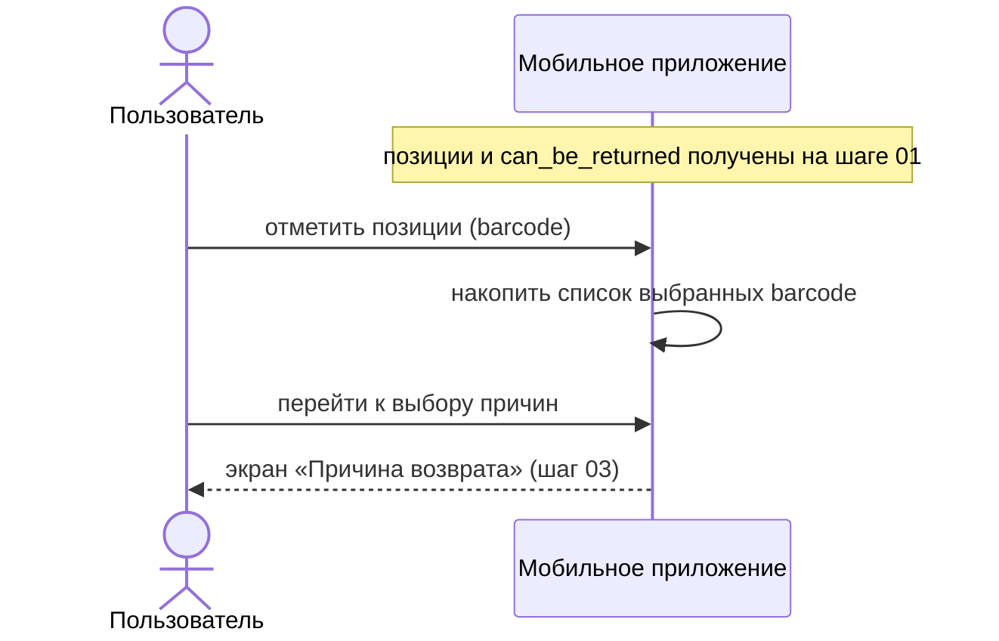

# Шаг 02 (mobile). Выбор изделий для возврата

**Канал:** Мобильное приложение · **Экран:** оформление возврата (клиентское приложение)
**Статус:** DRAFT · **Дата:** 07.09.2026
**Результат шага:** в приложении отмечены выбранные позиции (по `barcode`). Обращений к серверу и записи в базу нет.

> **Оговорка.** Исходного кода мобильного клиента в репозитории нет (только серверная часть и веб-фронтенд). Поведение экрана восстановлено по контракту API (запрос создания возврата, карточка заказа) и серверным проверкам. Пункты, не подтверждаемые серверной частью, помечены как допущение.

---

## 1. Пользовательский сценарий

### 1.1 Откуда пользователь приходит

С карточки заказа (шаг [01](01-load-order-card.md)), нажатие «Оформить возврат». Приложение открывает экран оформления возврата.

### 1.2 Что система отображает (по контракту)

Список позиций заказа, доступных для возврата — те, у которых в карточке `can_be_returned = true` (шаг 01). Позиции с `can_be_returned = false` (уже возвращённые, подарки, вне срока) не выбираются.

### 1.3 Действия пользователя

Отметить одну или несколько позиций для возврата.

### 1.4 Ограничения (подтверждаются серверной частью)

- Позиция в запросе создания возврата указывается **`barcode`** (не внутренним `id`).
- Позиция, уже находящаяся в статусе `9` («возврат») в `cms_order_positions`, повторно не возвращается — на шаге 07 сервер её отфильтрует.
- Управление возвращаемым количеством при `count > 1` контрактом не предусмотрено (`TECH-GAP-05`) — позиция возвращается целиком.

### 1.5 Что происходит после действия

Выбранные `barcode` хранятся в приложении. Дальше по каждой выбранной позиции пользователь укажет причину (шаг [03](03-select-return-reasons.md)); пара «`barcode` + код причины» уйдёт в запрос создания возврата (шаг [07](07-create-return.md)).

### 1.6 Ошибочные сценарии

- Если ни одна позиция не выбрана — переход дальше по процессу невозможен (сервер на пустой `items` вернёт ошибку на шаге 07).

---

## 2. Системная реализация

### 2.0 Диаграмма последовательности

Backend и БД на этом шаге не участвуют.

### 2.1 Источники данных

| Данные | Источник | Поля |
|---|---|---|
| Позиции, доступные для возврата | карточка заказа (`GET /mobile/orders/{order_id}`, шаг 01) | `barcode`, `can_be_returned`, `count`, `is_present` |

### 2.2 Как система собирает данные

На этом шаге сервер не вызывается. Отбор доступных позиций уже сделан на шаге 01 (`can_be_returned` по каждой позиции). Соответствие «`barcode` ↔ позиция заказа» сервер проверит только на шаге 07.

### 2.3 Обмен по API

Нет. Отдельного эндпоинта «зафиксировать выбранные позиции» в мобильном контракте нет.

### 2.4 Что использует приложение

`barcode` отмеченных позиций — накапливаются в локальном состоянии для формирования `items[]` на шаге 07.

### 2.5 Что передаётся на следующий шаг

Локальный список выбранных `barcode` → шаг 03 (выбор причин по каждой позиции).

### 2.6 Что сохраняется или меняется

Ничего.

### 2.7 Неуточнённые места

- Вид экрана выбора (предвыбор, ограничения по числу выбранных позиций, отдельный экран или совмещённый с причинами) — без клиента не проверить; на серверную обработку не влияет.

---

## 3. Соответствие TO-BE

По сути шаг совпадает с целевым: выбор изделий делается в приложении, в базу до подтверждения ничего не пишется. Единственное расхождение:

| Тема | TO-BE | AS-IS (mobile) |
|---|---|---|
| Возвращаемое количество | Управление количеством товара (кнопка «+», ограничение по доступному количеству) | Количества нет; позиция возвращается целиком, ключ — `barcode` |
