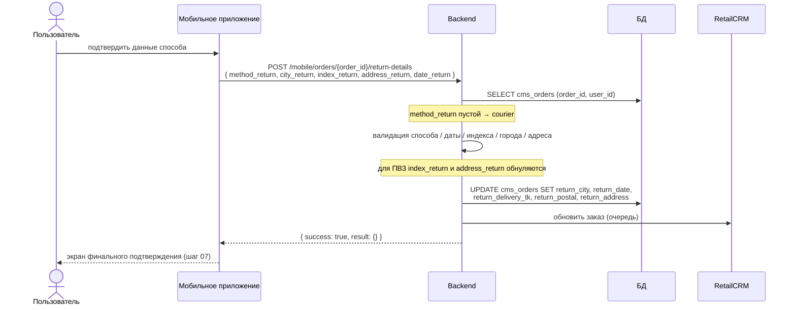

# Шаг 06 (mobile). Сохранение реквизитов возврата (способ, город, адрес, дата)

**Канал:** Мобильное приложение · **Эндпоинт:** `POST /mobile/orders/{order_id}/return-details`
**Статус:** DRAFT · **Дата:** 07.09.2026
**Результат шага:** в `cms_orders` записаны город, дата и код транспортной компании, а для курьера — индекс и адрес. Заказ отправлен в RetailCRM. Статусы возврата ещё не меняются.

---

## 1. Пользовательский сценарий

### 1.1 Откуда пользователь приходит

С экрана оформления возврата, заполнив способ, город и данные способа (для курьера — адрес, индекс, дата; для ПВЗ — дата).

### 1.2 Что система отображает

Форму данных способа (клиент). После успешного ответа приложение переходит к финальному подтверждению (шаг [07](07-create-return.md)).

### 1.3 Действие пользователя

Подтвердить данные способа — запрос `POST /mobile/orders/{order_id}/return-details`.

### 1.4 Ограничения (проверки на сервере)

Правила те же, что на сайте:
- способ не пустой и входит в набор `courier` / `sdek-pvz` / `5post`;
- **курьер:** дата входит в список доступных; индекс — ровно 6 цифр; город не пустой, не длиннее 255; адрес не пустой, не длиннее 1024;
- **ПВЗ:** у заказа заполнена дата завершения (`cms_orders.end_date`); дата входит в список доступных; город не пустой.

Совместимость: если тело запроса не содержит имя способа, сервер подставляет `courier`.

### 1.5 Что происходит после действия

- Для ПВЗ сервер **обнуляет** индекс и адрес — конкретная точка не сохраняется.
- Реквизиты возврата записываются в `cms_orders`, и заказ отправляется в RetailCRM.

### 1.6 Ошибочные сценарии

| Ситуация | Ответ |
|---|---|
| Пользователь не найден | ошибка «пользователь не найден» |
| Заказ не найден у пользователя | ошибка «заказ не найден» |
| Не удалось разобрать тело запроса | ошибка «неверный запрос» |
| Ошибки проверок | ошибка «неверный запрос» со списком ошибок по полям |

---

## 2. Системная реализация

### 2.0 Диаграмма последовательности



### 2.1 Источники данных

| Данные | Источник |
|---|---|
| Заказ | `cms_orders` (по `order_id` и `user_id`) |
| Доступные даты для проверки | расчёт по конфигурации возврата и `cms_orders.end_date` |
| Соответствие «способ → транспортная компания» | `courier` → `13`, `sdek-pvz` → `567`, `5post` → `55` |

### 2.2 Как система собирает данные

По запросу `POST /mobile/orders/{order_id}/return-details`:

1. Находит пользователя и заказ по `order_id` среди его заказов.
2. Читает тело: способ, город, индекс, адрес, дата. Если способ не передан — подставляет `courier`.
3. Проверяет данные по правилам из раздела 1.4.
4. Для ПВЗ обнуляет индекс и адрес.
5. **Записывает в `cms_orders`:**
   | Значение | Поле |
   |---|---|
   | город | `return_city` |
   | дата | `return_date` |
   | код транспортной компании по способу | `return_delivery_tk` |
   | индекс (если не пустой) | `return_postal` |
   | адрес (если не пустой) | `return_address` |
   | время изменения, источник «пользователь», версия | служебные поля |
   Заказ сохраняется без повторной валидации модели.
6. **Отправляет заказ в RetailCRM** (в очередь).
7. Ответ: `{ "success": true, "result": {} }`.

Карточка: [`api/mobile/delivery/post-return-details.md`](../../api/mobile/delivery/post-return-details.md).

### 2.3 Обмен по API

```http
POST /mobile/orders/{order_id}/return-details
Content-Type: application/json
Authorization: <мобильная сессия>

// Курьер:
{ "method_return": "courier", "city_return": "Москва", "address_return": "ул. ..., д. 1, кв. 5",
  "index_return": "125009", "date_return": "2026-09-10" }

// ПВЗ:
{ "method_return": "5post", "city_return": "Москва", "date_return": "2026-09-09" }
```

Ответ: `{ "success": true, "result": {} }` либо `{ "result": { "error_code": ..., "error_text": ..., "error_data": [...] } }`.

### 2.4 Что использует приложение

Успех → переход к финальному подтверждению (шаг 07). Ошибки — подсветка полей формы (клиент).

### 2.5 Что передаётся на следующий шаг

Явной передачи между этим шагом и шагом 07 нет — реквизиты возврата уже в `cms_orders`. В запрос создания возврата приложение отправляет только позиции и (для оплаты курьеру) банковские реквизиты.

### 2.6 Что сохраняется или меняется

| Что | Где |
|---|---|
| город, дата, код транспортной компании, индекс*, адрес* | `cms_orders` |
| обновление заказа в RetailCRM | очередь |

`* индекс / адрес` — не для ПВЗ (обнуляются сервером). Статус заказа и позиций **не меняется**.

### 2.7 Неуточнённые места

- Тот же вопрос по ветке «по названиям» без идентификатора города, что и на сайте (см. [`web/05`, раздел 2.7](../web/05-select-return-method.md)).
- Поле `cms_orders.return_interval` не заполняется.
- Порядок «сначала реквизиты возврата, потом создание возврата» — по контракту; атомарности между двумя запросами нет.

---

## 3. Отличия от TO-BE

| TO-BE (`UC-RET-04.1`–`UC-RET-04.3`) | AS-IS (mobile) |
|---|---|
| Курьер: предзаполнение адреса из заказа, выбор даты **и интервала** | Адрес вручную; только дата |
| ПВЗ: выбор конкретной точки, сохранение её идентификатора и адреса, сводка канала | Точка не выбирается; сохраняется город + дата + способ |
| ПВЗ / 5Post: дата **не выбирается** — срок передачи назначается после создания заявки + автоотмена | Показываются плитки дат (`available_dates_return`, `end_date + 14 дней`), дата сохраняется в `return_date` |
| Дата «Можно вернуть до» = `cms_orders.end_date` + 14 / 30 дней (F&F) — показывается клиенту | Не рассчитывается |
| Расширения «данные не сохранены» с повтором | Только коды ошибок ответа |
