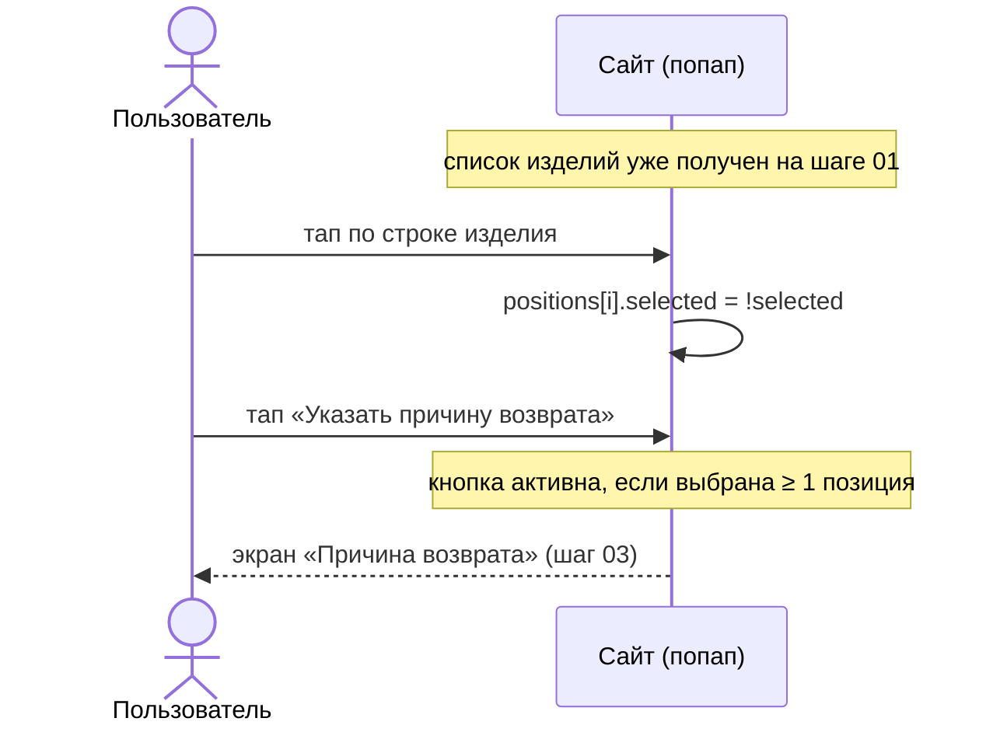

# Шаг 02 (web). Выбор изделий для возврата

**Канал:** Сайт · **Экран:** попап оформления возврата, первый экран «Выберите изделия»
**Статус:** DRAFT · **Дата:** 07.09.2026
**Результат шага:** на клиенте (в памяти попапа) отмечены выбранные позиции. В базу ничего не пишется — выбор фиксируется до нажатия «Подтвердить возврат».

---

## 1. Пользовательский сценарий

### 1.1 Откуда пользователь приходит

Сразу после открытия попапа (шаг [01](01-entry-and-load-return-form.md)). Это первый экран.

### 1.2 Что система отображает

- Заголовок «Выберите изделия»; при наличии выбранных — «Выберите изделия · N», где N — число выбранных.
- Статичная подсказка: «Если вам удобнее вернуть покупку в розничном магазине, оформлять здесь возврат не нужно — заявление примут наши консультанты.»
- Список изделий из ответа предыдущего шага. По каждому: фото, цена и цена до скидки, название, артикул, цвет, размер, чекбокс. Количество показывается текстом («N шт») только если больше 1.
- Кнопка внизу — «Указать причину возврата».

### 1.3 Какие данные доступны пользователю

Только позиции, прошедшие отбор на предыдущем шаге (статус «добавлена», не подарок). Остальные позиции заказа на экране не показываются.

### 1.4 Действия пользователя

- Нажатие на строку изделия переключает выбор этой позиции (выбрана / не выбрана).
- Нажатие «Указать причину возврата» — переход к шагу [03](03-select-return-reason.md).
- Крестик в шапке — закрыть попап.

### 1.5 Ограничения

- Кнопка «Указать причину возврата» неактивна, пока не выбрана ни одна позиция.
- Выбора количества нет — возвращается позиция целиком.
- Верхнего предела числа выбранных позиций нет.

### 1.6 Что происходит после действия

Список выбранных позиций фиксируется в памяти попапа и определяет: сколько раз повторится экран причины (шаг 03) — «Изделие 1 из M»; какие позиции уйдут в запрос создания возврата (шаг 08).

### 1.7 Ошибочные сценарии

- Если снять все галочки, кнопка снова становится неактивной, перехода нет.
- Обмена с сервером на этом экране нет, поэтому и ошибок валидации нет.

---

## 2. Системная реализация

### 2.0 Диаграмма последовательности

Backend и БД на этом шаге не участвуют.

### 2.1 Источники данных

Отдельных запросов нет. Используется массив позиций из ответа `GET /orders/refund/get-positions` (шаг 01); происхождение полей — таблица `cms_order_positions` плюс товарная связь.

### 2.2 Как система собирает данные

На этом шаге сервер не участвует.

### 2.3 Обмен по API

Нет. Экран работает на данных, полученных на шаге 01.

### 2.4 Что использует сайт

| Данные | Использование |
|---|---|
| список позиций (с добавленными полями «выбрана», «группа причины», «причина») | отрисовка списка, переключение выбора |
| `id` позиции | далее уйдёт в запрос создания возврата |
| количество позиции | отображается как «N шт», только если больше 1; в запросы не передаётся |
| набор выбранных позиций | счётчик в заголовке, число повторов экрана причины, содержимое запроса создания возврата |

### 2.5 Что передаётся на следующий шаг

Внутри попапа: признак «выбрана» у позиций формирует список выбранных. Запросов и сохранений нет.

### 2.6 Что сохраняется или меняется

Ничего (только локальное состояние формы).

### 2.7 Неуточнённые места

- При открытии экрана ничего не выбрано (предвыбора позиций нет).
- Поле «количество» в позиции есть, но в AS-IS-процессе возврата не используется — ни в выборе, ни в запросах.

---

## 3. Соответствие TO-BE

По сути шаг совпадает с целевым: выбор изделий делается на клиенте, в базу до подтверждения ничего не пишется (см. разд. 2.5–2.6). Единственное расхождение:

| Тема | TO-BE | AS-IS (web) |
|---|---|---|
| Возвращаемое количество | Управление количеством товара (кнопка «+», ограничение по доступному количеству) | Количества нет; позиция выбирается целиком чекбоксом. Открытые вопросы UC про «количество по умолчанию» неприменимы |
