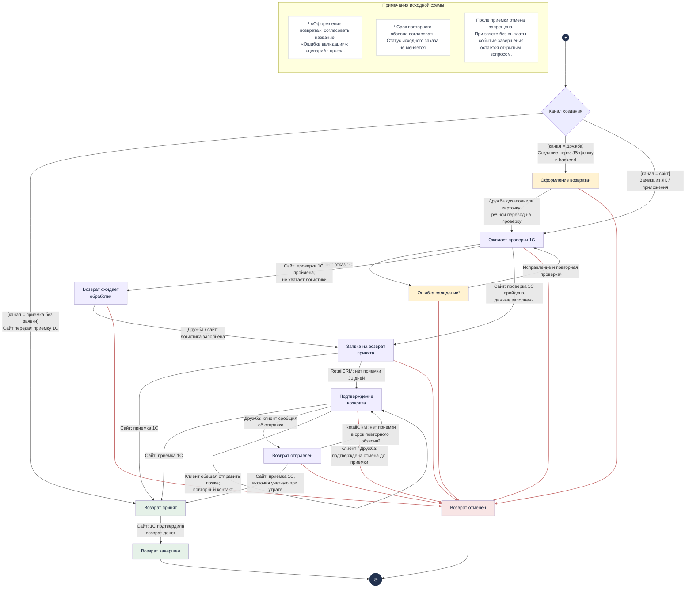

# 12Storeez — статусы возврата — полная схема (Mermaid)

Исходник: [12Storeez — статусы возврата — полная схема.pdf](<./12Storeez — статусы возврата — полная схема.pdf>)

```mermaid
flowchart TB
    START((●)) --> CHANNEL{"Канал создания"}

    CHANNEL -->|"[канал = приемка без заявки]<br/>Сайт передал приемку 1С"| RECEIVED["Возврат принят"]
    CHANNEL -->|"[канал = Дружба]<br/>Создание через JS-форму<br/>и backend"| DRAFT["Оформление возврата¹"]
    CHANNEL -->|"[канал = сайт]<br/>Заявка из ЛК / приложения"| CHECK["Ожидает проверки 1С"]

    DRAFT -->|"Дружба дозаполнила карточку;<br/>ручной перевод на проверку"| CHECK
    CHECK -->|"Сайт: отказ 1С"| ERROR["Ошибка валидации¹"]
    ERROR -->|"Исправление и повторная проверка¹"| CHECK
    CHECK -->|"Сайт: проверка 1С пройдена,<br/>не хватает логистики"| PROCESSING["Возврат ожидает<br/>обработки"]
    CHECK -->|"Сайт: проверка 1С пройдена,<br/>данные заполнены"| ACCEPTED["Заявка на возврат<br/>принята"]
    PROCESSING -->|"Дружба / сайт:<br/>логистика заполнена"| ACCEPTED

    ACCEPTED -->|"Сайт: приемка 1С"| RECEIVED
    ACCEPTED -->|"RetailCRM: нет приемки 30 дней"| CONFIRM["Подтверждение<br/>возврата"]
    CONFIRM -->|"Сайт: приемка 1С"| RECEIVED
    CONFIRM -->|"Дружба: клиент сообщил<br/>об отправке"| SENT["Возврат отправлен"]
    CONFIRM -->|"Клиент обещал отправить позже;<br/>повторный контакт"| CONFIRM
    SENT -->|"RetailCRM: нет приемки<br/>в срок повторного обзвона²"| CONFIRM
    SENT -->|"Сайт: приемка 1С,<br/>включая учетную при утрате"| RECEIVED

    DRAFT --> CANCEL["Возврат отменен"]
    CHECK --> CANCEL
    ERROR --> CANCEL
    PROCESSING --> CANCEL
    ACCEPTED --> CANCEL
    CONFIRM -->|"Клиент / Дружба:<br/>подтверждена отмена до приемки"| CANCEL
    SENT --> CANCEL

    RECEIVED -->|"Сайт: 1С подтвердила<br/>возврат денег"| COMPLETED["Возврат завершен"]
    COMPLETED --> FINISH(((◎)))
    CANCEL --> FINISH

    subgraph NOTES["Примечания исходной схемы"]
        direction TB
        NOTE_A["¹ «Оформление возврата»: согласовать название.<br/>«Ошибка валидации»: сценарий - проект."]
        NOTE_B["² Срок повторного обзвона согласовать.<br/>Статус исходного заказа не меняется."]
        NOTE_C["После приемки отмена запрещена.<br/>При зачете без выплаты событие завершения<br/>остается открытым вопросом."]
    end

    classDef purple fill:#f0edff,stroke:#a69bc8,color:#17223a
    classDef yellow fill:#fff2d1,stroke:#a69bc8,color:#17223a
    classDef green fill:#e5f1e8,stroke:#a69bc8,color:#17223a
    classDef red fill:#f8e5e5,stroke:#a69bc8,color:#17223a
    classDef note fill:#ffffff,stroke:#d2d5dc,color:#3b4557
    classDef terminal fill:#23324f,stroke:#23324f,color:#ffffff
    class DRAFT,ERROR yellow
    class CHECK,PROCESSING,ACCEPTED,CONFIRM,SENT purple
    class RECEIVED,COMPLETED green
    class CANCEL red
    class NOTE_A,NOTE_B,NOTE_C note
    class START,FINISH terminal
    linkStyle 17,18,19,20,21,22,23 stroke:#c66b6b,stroke-width:1.6px
```
