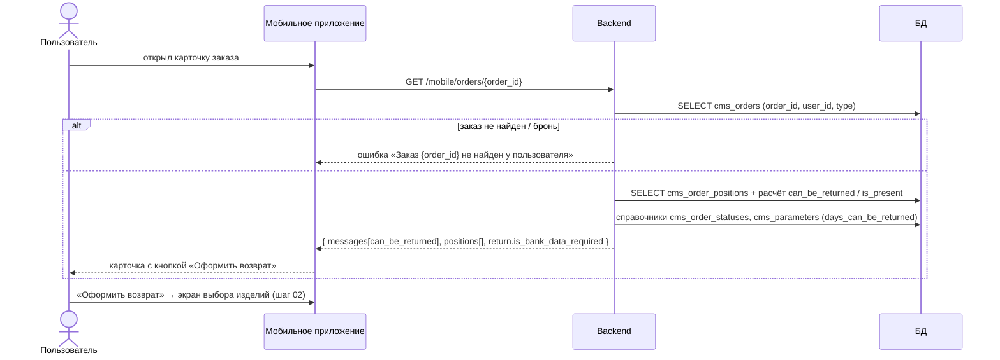

# Шаг 01 (mobile). Открытие карточки заказа и доступность возврата

**Канал:** Мобильное приложение (gateway `mobile.12stz.dev` → core)
**Статус:** DRAFT · **Дата:** 07.09.2026
**Результат шага:** приложение получило карточку заказа с позициями, признаками возможности возврата и действием «Оформить возврат». В базе ничего не меняется.

---

## 1. Пользовательский сценарий

### 1.1 Откуда пользователь приходит

Пользователь открывает раздел «Заказы» и карточку конкретного онлайн-заказа.

### 1.2 Что система отображает

Приложение показывает карточку заказа. Для процесса возврата в ней важны три вещи:

- **Действие «Оформить возврат».** Если возврат по заказу возможен, в карточке появляется блок-подсказка с текстом «Вы можете вернуть вещи в течение четырнадцати дней после получения заказа.» и кнопкой «Оформить возврат». Технически это элемент массива `messages` со значением `status = can_be_returned`.
- **Список позиций (`positions[]`).** По каждой позиции в JSON приходят: `id`, `barcode`, `article`, `model_id`, `count` (из колонки `cms_order_positions.quantity`), `discount_price` (из колонки `price`), `price` (из колонки `price_before_discount`), `is_present`, `can_be_returned`, `selected_color_id` (из колонки `color_id`), `item_id`, `is_cnc` (из колонки `is_click_and_collect`), `preview`. Название и размер — производные (методы модели), не отдельные колонки.
- **Признак «нужны банковские реквизиты».** Поле `return.is_bank_data_required`. `return.is_bank_data_required = true`, если заказ оплачивался курьеру (методы оплаты `cms_orders.payment_method` = `3` «наличные курьеру» или `5` «картой курьеру»); при онлайн-оплате `return.is_bank_data_required = false`.

### 1.3 От чего зависит доступность возврата

**Возврат по заказу в целом доступен, когда одновременно выполнено:**

1. **Заказ в подходящем статусе.** `cms_orders.status` входит в объединение двух наборов из справочника `cms_order_statuses`:
   - статусы группы «завершение» (`cms_order_statuses.group = 'complete'`): `17` «Заказ выполнен», `33` «Заказ выдан», `56` «Частичный выкуп»;
   - статусы с флагом `cms_order_statuses.is_returned = 1`: `17`, `31` «Возврат из ЛК», `33`, `56`, `84` «Возврат утерян».

   Итоговый набор: **`cms_orders.status ∈ {17, 31, 33, 56, 84}`**.

   «Уже в статусе возврата» здесь означает не «заказ в процессе возврата», а «статус помечен в справочнике флагом `is_returned = 1`». Этот флаг разрешает оформить заявку из уже «возвратных» статусов (например `31` — досоздать/повторить заявку, `84` — после утери). Набор приведён по выгрузке справочника от 28.07.2026 (`sources/technical/database/order-status-reference.md`); при изменении справочника набор меняется без правок кода.

2. **Срок не вышел.** Условие: **`cms_orders.end_date + cms_parameters.days_can_be_returned` (дней) ещё не наступило.** Значение — из строки таблицы `cms_parameters` с ключом `days_can_be_returned`.

3. **Есть возвращаемая позиция** (условие ниже).

**Позицию можно вернуть, когда одновременно:**

- срок возврата по заказу ещё не вышел (пункт 2 выше);
- **`cms_order_positions.status = 1`.** Поле `status` хранит числовой код; значение `1` — по справочнику `cms_order_position_statuses` это «Добавлен» (`code = new`), то есть позиция ещё не возвращена, не отменена, не заменена. Числовой статус позиции в JSON карточки не выводится — наружу отдаётся только вычисленный `can_be_returned`;
- **`cms_order_positions.is_present = 0`** (позиция не подарок).

По каждой позиции результат этой проверки система кладёт в поле `can_be_returned`.

### 1.4 Действие пользователя

Пользователь нажимает «Оформить возврат». Приложение открывает экран оформления возврата — начинается выбор изделий (шаг [02](02-select-return-items.md)). Единый справочник причин (`GET /mobile/v2/orders/return-reasons`) не зависит от выбора товаров и может подгружаться в любой момент (см. шаг [03](03-select-return-reasons.md)).

### 1.5 Ограничения

- Метод карточки заказа требует авторизованной мобильной сессии.
- **Если запрошенный заказ создан в режиме брони** (поле `cms_orders.type` = значение режима «бронь»), карточка одиночного заказа не отдаётся: метод отвечает ошибкой «Заказ {order_id} не найден у пользователя», как если бы такого заказа не было.

### 1.6 Ошибочные сценарии

- Если заказ не принадлежит пользователю, не найден или это бронь — вместо карточки возвращается ошибка с текстом «Заказ {order_id} не найден у пользователя».

---

## 2. Системная реализация

### 2.0 Диаграмма последовательности



### 2.1 Источники данных

| Что нужно для шага | Где хранится | Какие поля (имена колонок) |
|---|---|---|
| Сам заказ | `cms_orders` | `status`, `end_date`, `payment_method`, `user_id`, `type` |
| Позиции заказа | `cms_order_positions` | `id`, `status`, `barcode`, `article`, `model_id`, `quantity`, `price`, `price_before_discount`, `is_present`, `item_id`, `color_id`, `is_click_and_collect` |
| Срок возврата в днях | `cms_parameters` | строка с ключом `days_can_be_returned` |
| Расшифровка статусов заказа | `cms_order_statuses` | `internal_id`, `group`, `is_returned` |
| Расшифровка статусов позиции | `cms_order_position_statuses` | `internal_id`, `code` |

### 2.2 Как система собирает данные

Когда приложение запрашивает карточку одного заказа, система:

1. Находит заказ по `order_id` среди заказов текущего пользователя (`cms_orders.user_id`). Если заказ не найден или создан в режиме брони (`cms_orders.type`) — возвращает ошибку «не найден».
2. Собирает карточку и по каждому блоку вычисляет признаки:
   - **доступность возврата по заказу** — по правилам из раздела 1.3; при выполнении добавляет в `messages` элемент `can_be_returned` с кнопкой «Оформить возврат»;
   - **по каждой позиции** — `can_be_returned`, `is_present`, `count`, `barcode`;
   - **признак необходимости реквизитов** — `return.is_bank_data_required = true`, если `cms_orders.payment_method ∈ {3, 5}` (оплата курьеру), иначе `false`.

### 2.3 Обмен по API

**Запрос:** `GET /mobile/orders/{order_id}` с авторизацией мобильной сессии. В core-контуре тот же смысл имеет `GET /api/orders/{order_id}` (карточка: [`api/core/orders/get-order.md`](../../reference/api/core/orders/get-order.md)).

**Ответ** (сокращённо, значимые для возврата поля):

```json
{
  "success": true,
  "result": {
    "id": 500126952,
    "messages": [
      { "status": "can_be_returned",
        "message": "Вы можете вернуть вещи в течение четырнадцати дней после получения заказа.",
        "button": "Оформить возврат" }
    ],
    "positions": [
      { "id": 1, "barcode": 2110731899007, "article": "21107318", "model_id": 111031,
        "count": 1, "is_present": false, "can_be_returned": true,
        "discount_price": 5990, "price": 7990, "item_id": 148724, "preview": "https://..." }
    ],
    "return": { "is_bank_data_required": false }
  }
}
```

Соответствие ключей JSON и колонок: `count` ← `quantity`; `discount_price` ← `price`; `price` ← `price_before_discount` (в JSON поля цены «перевёрнуты» относительно названий колонок).

**Про `expiration_date` (подтверждено разработкой).** В ответе карточки заказа есть объект `expiration_date: { start, end }`, где `start` = `cms_orders.created_at` (дата создания заказа), `end` = `cms_orders.delivery_date` (дата доставки; может быть `null`). **Это окно «создан → доставлен», к сроку возврата отношения не имеет.** Отсчёт сроков возврата ведётся от отдельного поля `cms_orders.end_date` («точная дата выполнения заказа, подтверждена 1С») — оно в ответе **не отдаётся**, используется только на бэкенде (проверка `end_date + days_can_be_returned` для кнопки, окно `end_date + 14 дней` для дат ПВЗ). Отдельного поля «Можно вернуть до …» нет; доступные даты передачи клиент берёт из `available_dates_return[]` (`GET /mobile/orders/{order_id}/return-method-list`, шаг [05](05-select-return-method.md)).

### 2.4 Что из ответа использует приложение

| Поле ответа | Как используется дальше |
|---|---|
| элемент `messages` со `status = can_be_returned` | показать кнопку «Оформить возврат» |
| `positions[].can_be_returned` | какие позиции можно выбрать на шаге 03 |
| `positions[].barcode` | этим значением позиция будет указана в запросе создания возврата (шаг 07) |
| `positions[].count` | количество в заказе (см. «Неуточнённые места») |
| `return.is_bank_data_required` | нужно ли показывать форму банковских реквизитов (шаг [07](07-create-return.md)) |

### 2.5 Что передаётся на следующий шаг

Приложение держит у себя `order_id` и список позиций. Дальше по процессу: `order_id` уходит во все промежуточные запросы; `barcode` выбранных позиций и коды причин — в запрос создания возврата.

### 2.6 Что сохраняется или меняется

Ничего. Шаг только на чтение.

### 2.7 Неуточнённые места

- Передаётся ли количество при `count > 1` в запрос создания возврата — не подтверждено (`TECH-GAP-05`). В теле запроса есть только `barcode` и `reason_id`, поэтому позиция возвращается целиком.
- Текст подсказки жёстко говорит про «четырнадцать дней» независимо от фактического `days_can_be_returned` и типа клиента (для F&F срок больше).
- Точное значение поля `cms_orders.type` для режима «бронь» в этом описании не приводится (проверяется в коде сравнением с константой режима брони).
- Полный JSON карточки заказа в материалах проекта не сохранён.
- Набор «возвратных» статусов заказа приведён по выгрузке справочника от 28.07.2026 и мог измениться.

---

## 3. Соответствие TO-BE

Целевое требование `UC-RET-01` — экран открывается на уже доступных данных. **По сути выполнено:** позиции для возврата берутся из карточки заказа (`GET /mobile/orders/{order_id}`, шаг 01), без отдельного запроса за товарами. Справочник причин приходит отдельным запросом `GET /mobile/v2/orders/return-reasons` (в отличие от сайта, где он вложен во входной ответ) — это лишний round-trip, но справочник не зависит ни от заказа, ни от выбора и кэшируется.

### Расхождения

| Тема | TO-BE | AS-IS (mobile) |
|---|---|---|
| Возвращаемое количество | Система знает «доступное для возврата количество» каждого товара | Есть количество в заказе (`count`), но управление возвращаемым количеством в запросе создания не подтверждено |
| Условие входа | Заказ принадлежит пользователю + есть возвращаемое количество | `cms_orders.status ∈ {17, 31, 33, 56, 84}` + `cms_orders.end_date + cms_parameters.days_can_be_returned` не наступило + позиция `status = 1` и `is_present = 0` |
