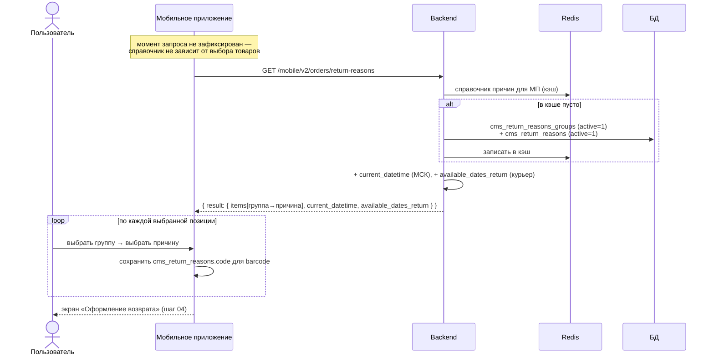

# Шаг 03 (mobile). Выбор причины возврата (загрузка справочника + выбор)

**Канал:** Мобильное приложение · **Эндпоинт справочника:** `GET /mobile/v2/orders/return-reasons`
**Статус:** DRAFT · **Дата:** 07.09.2026
**Результат шага:** приложение получило двухуровневый справочник «группа причин → причина»; по каждой выбранной позиции указан код причины. В базе ничего не меняется.

> **Оговорка.** Кода мобильного клиента в репозитории нет. Момент запроса справочника и вид экрана восстановлены по контракту API и серверной логике.

---

## 1. Пользовательский сценарий

### 1.1 Откуда пользователь приходит

С шага выбора изделий (шаг [02](02-select-return-items.md)).

### 1.2 Когда запрашивается справочник причин

Справочник `return-reasons` **не зависит** ни от заказа, ни от выбранных позиций — это единый кэшируемый список на всё приложение. Поэтому запрос `GET /mobile/v2/orders/return-reasons` может выполняться в любой момент: при открытии экрана возврата, до выбора изделий или после. Точный момент по коду сервера не определить (нет клиента). В процессе он помещён здесь, потому что справочник нужен именно для выбора причины.

### 1.3 Что система отображает

По ответу справочника:
- список **групп причин**; внутри каждой — **причины** с названием, кодом и описанием;
- (эти же данные несут `current_datetime` и список дат для курьера — используются позже, на шагах даты/способа).

Для каждой выбранной на шаге 02 позиции пользователь выбирает группу, затем причину этой группы.

### 1.4 Действия пользователя

- Для каждой отмеченной позиции: выбрать группу → выбрать причину (сохраняется её `code`).

### 1.5 Ограничения (подтверждаются серверной частью)

- Иерархия — два уровня: **группа причин → причина**. Те же два уровня в целевом сценарии названы «причина → подпричина» (AS-IS «группа» ≈ TO-BE «причина», AS-IS «причина» ≈ TO-BE «подпричина»). В БД — две таблицы: `cms_return_reasons_groups` (1-й уровень) и `cms_return_reasons` (2-й, связь `group_id`). Оба уровня приходят в одном ответе.
- На позицию сохраняется **только код 2-го уровня** (`cms_return_reasons.code`). Группа (1-й уровень) в запрос создания возврата и в `cms_order_positions.reason` не попадает.
- В теле запроса создания возврата поле `reason_id` — массив, но сервер берёт **первый** элемент.
- Причина должна существовать в `cms_return_reasons` по своему `code` — иначе на шаге 07 придёт ошибка «Причины возврата не найдены: …».

### 1.6 Что происходит после действия

По каждой выбранной позиции в приложении есть пара «`barcode` + `code` причины». Она уйдёт в запрос создания возврата (шаг [07](07-create-return.md)):

```json
{ "items": [ { "barcode": 2110731899007, "reason_id": ["300"] } ] }
```

### 1.7 Ошибочные сценарии

- Если активных групп/причин нет — справочник приходит пустым.
- Отдельного эндпоинта «сохранить причину по позиции» (аналога web-запроса `check-reason`) в мобильном контракте нет — выбор до шага 07 нигде не сохраняется.

---

## 2. Системная реализация

### 2.0 Диаграмма последовательности



### 2.1 Источники данных

| Что нужно | Где хранится | Поля |
|---|---|---|
| Группы причин | `cms_return_reasons_groups` (`active = 1`, сортировка по колонке `order`) | `title` |
| Причины | `cms_return_reasons` (`active = 1`, `group_id`, сортировка по колонке `_order`) | `title`, `code`, `description` |
| Кэш ответа | внутренний кэш (Redis), ключ «справочник причин для МП» | — |
| Доступные даты (курьер) | расчёт по конфигурации `cms_return_details_config` | — |
| Текущее серверное время | сервер, московское время | — |

### 2.2 Как система собирает данные

По запросу `GET /mobile/v2/orders/return-reasons`:

1. Пытается взять готовый справочник из кэша.
2. Если в кэше пусто — берёт из базы: все группы `cms_return_reasons_groups` с `active = 1` (те же, что и на сайте), внутри каждой — активные причины `cms_return_reasons`; по причине в ответ идут `title`, `code`, `description`. Результат кладёт в кэш.
3. Оборачивает справочник в `result.items`.
4. **Дополнительно к ответу** (после кэша, всегда актуальны):
   - `result.current_datetime` — московское время в формате «ГГГГ-ММ-ДД ЧЧ:ММ:СС»;
   - `result.available_dates_return` — список доступных дат для способа «Курьер» (расчёт как на шаге [05](05-select-return-method.md), с учётом мобильного флага способа `is_enabled_mobile`).

Аналог в core-контуре — `GET /api/orders/v2/return-reasons` ([`api/core/orders/get-return-reasons.md`](../../reference/api/core/orders/get-return-reasons.md); в официальном gateway-описании метод отсутствует).

Выбор причины по позиции сервер на этом шаге не принимает — соответствие «`code` ↔ причина» проверяется на шаге 07 (перебирает `code` из запроса по `cms_return_reasons`).

### 2.3 Обмен по API

**Запрос:** `GET /mobile/v2/orders/return-reasons` с авторизацией мобильной сессии.

**Ответ**

```json
{
  "success": true,
  "total": 3,
  "result": {
    "items": [
      { "title": "Не подошёл размер",
        "items": [
          { "title": "Маломерит", "code": "300", "description": "" },
          { "title": "Большемерит", "code": "301", "description": "" }
        ] }
    ],
    "current_datetime": "2026-09-07 15:40:00",
    "available_dates_return": ["2026-09-09", "2026-09-10", "2026-09-11"]
  }
}
```

Отличие от web-справочника: у группы **нет** поля `id`; у причины добавлено поле `description`.

### 2.4 Что из ответа использует приложение

| Поле | Как используется |
|---|---|
| `result.items[].title` | заголовок группы |
| `result.items[].items[].code` | этим значением причина уйдёт в `items[].reason_id` запроса создания возврата (шаг 07) |
| `result.items[].items[].title` / `description` | подписи причины |
| `result.available_dates_return` | даты для способа «Курьер» (используются на шагах 05–06) |
| `result.current_datetime` | синхронизация времени / отсечка 15:00 |

### 2.5 Что передаётся на следующий шаг

По каждой выбранной позиции: пара «`barcode` + `code` причины» — в тело запроса создания возврата (шаг 07). Идентификатор группы никуда не передаётся.

### 2.6 Что сохраняется или меняется

В базе — ничего (только запись в кэш справочника).

### 2.7 Неуточнённые места

- Момент запроса справочника (при открытии экрана возврата / до выбора изделий / после) — без клиента не определить; на серверную обработку не влияет.
- У группы в мобильном справочнике нет идентификатора — связь причины с группой на клиенте только по вложенности.
- Как сбрасывается кэш справочника при правке причин в админке — из этого метода не видно.
- Смысл массива `reason_id` (несколько причин на позицию) — фактически берётся только первый элемент.

---

## 3. Отличия от TO-BE

| TO-BE (`UC-RET-02`) | AS-IS (mobile) |
|---|---|
| Два уровня выбора названы «причина → подпричина»; на получении второго уровня стоит пометка «API: уточняется» | Те же два уровня, названы «группа причин → причина»; оба уровня приходят в одном ответе (причины вложены в группы), кэшируются; в БД — `cms_return_reasons_groups` и `cms_return_reasons` |
| Открытый вопрос: какие причины/подпричины доступны для какой категории товара | Привязки к категории нет — один и тот же плоский справочник для любой позиции |
| Расширение UC «Подпричины не получены» (повторный запрос второго уровня) | Неприменимо — оба уровня уже в первом ответе |
| Система связывает с товаром **и причину, и подпричину** | В `cms_order_positions.reason` сохраняется только код 2-го уровня (`cms_return_reasons.code`); группа не сохраняется |
