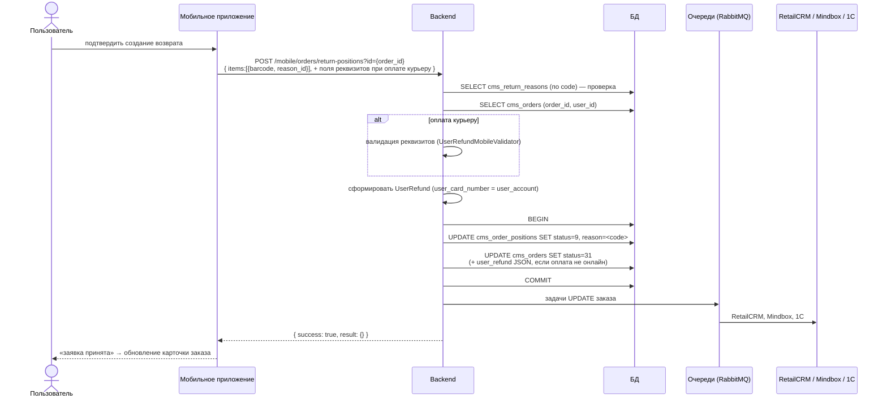

# Шаг 07 (mobile). Создание возврата

**Канал:** Мобильное приложение · **Эндпоинт:** `POST /mobile/orders/return-positions` (он же `POST /mobile/orders/{order_id}/return`)
**Статус:** DRAFT · **Дата:** 07.09.2026
**Результат шага:** возвращаемые позиции переведены в статус `9`; заказ переведён в статус `31`; при оплате курьеру реквизиты записаны в `cms_orders.user_refund`; заказ отправлен в RetailCRM, 1С и Mindbox. Терминальная точка процесса.

---

## 1. Пользовательский сценарий

### 1.1 Откуда пользователь приходит

С финального экрана подтверждения, после сохранения данных способа (шаг [06](06-confirm-return-details.md)). Если в карточке заказа `return.is_bank_data_required = true` (оплата курьеру) — заполнив банковские реквизиты.

### 1.2 Что система отображает

Экран подтверждения (клиент). После успешного ответа — сообщение о принятии заявки и обновление карточки заказа.

### 1.3 Действие пользователя

Подтвердить создание возврата — запрос `POST /mobile/orders/return-positions?id={order_id}` с телом: список позиций и (при необходимости) поля реквизитов.

### 1.4 Ограничения (проверки на сервере)

- Номер заказа обязателен, список позиций — массив.
- Все коды причин из запроса должны существовать в справочнике `cms_return_reasons` (иначе ошибка «Причины возврата не найдены: …»).
- Заказ принадлежит пользователю.
- Если заказ оплачивался курьеру (наличными или картой курьеру) — тело запроса проверяется как банковские реквизиты: все поля обязательны; БИК — 9 символов; ИНН банка — 10; номер карты — 16; номер счёта и карты — только цифры/дефис.
- Возвращаются только позиции, у которых штрихкод есть в запросе, найдена причина и текущий статус не «возврат» (`9`).

### 1.5 Что происходит после действия

1. Из тела запроса собирается запись реквизитов. **Особенность:** поле «номер карты» заполняется значением поля «номер счёта».
2. По каждой позиции готовится изменение: статус `9` («возврат»), причина — код из запроса.
3. Определяется новый статус заказа — `31` (внутреннее название «Возврат из ЛК», клиентское «Заявка на возврат принята», код `vozv-lk`).
4. Если оплата **не** онлайн (не онлайн-картой / СБП / Яндекс Пэй / Яндекс СБП / цифровым рублём) — JSON реквизитов кладётся в поле `cms_orders.user_refund`; иначе поле остаётся прежним.
5. В одной транзакции сохраняются позиции и заказ (статус, поле реквизитов, время изменения, источник «mobile», версия).
6. После транзакции — задачи в очереди на отправку обновлённого заказа в **RetailCRM, Mindbox и 1С**; запускаются служебные события (пересчёт счётчика заказов, обновление буфера остатков).
7. Сервер сверяет фактически возвращённые штрихкоды с запрошенными; если что-то не возвращено — ошибка «Позиции … не были найдены/возвращены».
8. Ответ: `{ "success": true, "result": {} }`.

### 1.6 Ошибочные сценарии

| Ситуация | Ответ |
|---|---|
| Нет номера заказа / список позиций не массив | ошибка «неверный запрос» |
| Причина не найдена | ошибка «Причины возврата не найдены: …» |
| Заказ не найден у пользователя | ошибка «заказ не найден» |
| Оплата курьеру, реквизиты невалидны | ошибка с текстом первой непройденной проверки |
| Сбой при подготовке изменений | ошибка «Не удалось получить позиции заказа …» |
| Часть штрихкодов не возвращена | ошибка «Позиции … не были найдены/возвращены: …» |

---

## 2. Системная реализация

### 2.0 Диаграмма последовательности



### 2.1 Источники данных

| Что нужно | Где хранится | Значения / поля |
|---|---|---|
| Причины | `cms_return_reasons` | код причины |
| Заказ и позиции | `cms_orders`, `cms_order_positions` | `status`, `barcode`, `user_id`, `payment_method`, `user_refund` |
| Реквизиты (вход) | тело запроса (не из таблицы `cms_users_refund`!) | поля банка/счёта/ФИО |
| Статус заказа при возврате | `31` | `cms_orders.status` |
| Статус возвращённой позиции | `9` | `cms_order_positions.status` |

### 2.2 Как система собирает данные

Логика описана в разделе 1.5. Ключевые отличия от web-реализации создания возврата:

| Аспект | web (`save-reason`) | mobile (`return-positions`) |
|---|---|---|
| Как указывается позиция | по `id` позиции | по `barcode` |
| Реквизиты | из таблицы `cms_users_refund` (сохранены отдельным запросом) | из тела запроса; в `cms_users_refund` **не сохраняются** |
| Как меняется статус | позиция помечается возвратом, статус заказа пересчитывается | заказ прямо переводится в статус `31` через общий метод обновления заказа |
| Интеграции | RetailCRM + Mindbox (+ Lamoda) | RetailCRM + Mindbox + **1С** |
| Признак «нужны реквизиты» | любая не-онлайн оплата | только оплата курьеру |
| Условие записи реквизитов в заказ | оплата не онлайн (без рассрочек) | оплата не онлайн (без рассрочек) |

Маршруты: прямой `POST /mobile/orders/return-positions` или `POST /mobile/orders/{order_id}/return` (номер из адреса). Карточки: [`api/mobile/orders/post-return-positions.md`](../../reference/api/mobile/orders/post-return-positions.md), [`api/core/orders/post-return.md`](../../reference/api/core/orders/post-return.md).

### 2.3 Обмен по API

```http
POST /mobile/orders/return-positions?id={order_id}
Content-Type: application/json
Authorization: <мобильная сессия>

{
  "items": [ { "barcode": 2110731899007, "reason_id": ["300"] } ],
  // только при оплате курьеру:
  "surname": "Иванова", "name": "Мария", "patronymic": "Петровна",
  "bank_bic": "044525225", "bank_inn": "7707083893", "bank_name": "Сбербанк",
  "user_account": "40817810099910004312", "user_card_number": "2202200112345678"
}
```

Ответ: `{ "success": true, "result": {} }`.

Наблюдённый в логах AS-IS вариант (core): `POST /api/orders/{order_id}/return`, тело `{ "items": [ { "barcode": 2110731899007, "reason_id": ["300"] } ] }`, ответ `{ "success": true }`, HTTP 201.

### 2.4 Что использует приложение

Успех → экран «заявка принята», обновление карточки заказа (в ней заказ уже в статусе возврата, у возвращённых позиций `can_be_returned = false`).

### 2.5 Что передаётся на следующий шаг

Это терминальный шаг. Клиентские идентификаторы СДЭК / 5Post (штрихкод, накладная, QR, PIN) в этом коде не формируются.

### 2.6 Что сохраняется или меняется

| Сущность | Изменение |
|---|---|
| `cms_order_positions` | `status = 9`, `reason = <код причины>` по каждой возвращаемой позиции |
| `cms_orders` | `status = 31`; `user_refund` (JSON) — если оплата не онлайн; время изменения, источник «mobile», версия |
| Очереди | задачи на обновление заказа в RetailCRM, Mindbox, 1С |
| Служебные события | пересчёт счётчика заказов, обновление буфера остатков |

Поля `cms_orders.return_money`, `return_store`, `return_interval`, `return_reason` (верхнего уровня), `return_status_wms`, `return_order_num` — **не заполняются**.

### 2.7 Неуточнённые места

- «Номер карты» в записи реквизитов заполняется значением «номер счёта» — отдельного номера карты в мобильном сценарии фактически нет (хотя валидатор требует поле «номер карты» длиной 16 в теле запроса).
- Реквизиты в таблице `cms_users_refund` при мобильном возврате не сохраняются (в отличие от сайта).
- Передача количества при количестве больше 1 — не подтверждена (`TECH-GAP-05`).
- Создание накладной / трек-номера / курьерского задания — вне этого кода (`TECH-GAP-04`); предположительно на стороне RetailCRM (**допущение**).
- Отдельной сущности и номера возврата нет (`TECH-GAP-03`).
- Транспорт очередей в RetailCRM / 1С / Mindbox — вне описания (`TECH-GAP-01`).

---

## 3. Отличия от TO-BE

| TO-BE (`UC-RET-05`, `UC-RET-04.6`) | AS-IS (mobile) |
|---|---|
| Экран сводки: товары, количества, причины, город, способ, сумма и баллы к возврату, способ возврата денег | Сумма и баллы к возврату не рассчитываются; отдельного серверного экрана сводки нет |
| Одна заявка с номером и статусом «Заявление на возврат создано» | Заказ переводится в статус `31`; отдельной заявки и номера нет |
| Повторные проверки при подтверждении (срок, количество, доступность способа/точки/интервала) | Проверяются только существование причин, принадлежность заказа и (для оплаты курьеру) формат реквизитов |
| Реквизиты: ФИО, БИК, лицевой счёт; карта/договор — по типу счёта | ФИО, БИК, ИНН банка, название банка, счёт, номер карты (16 цифр, но в базе = номер счёта); логики типа счёта нет |
| Запуск отдельного срока передачи возврата | Не реализовано |
| Карточка возврата с блоком «Возврат средств» и идентификаторами | Обновляется карточка заказа; идентификаторы не формируются |
