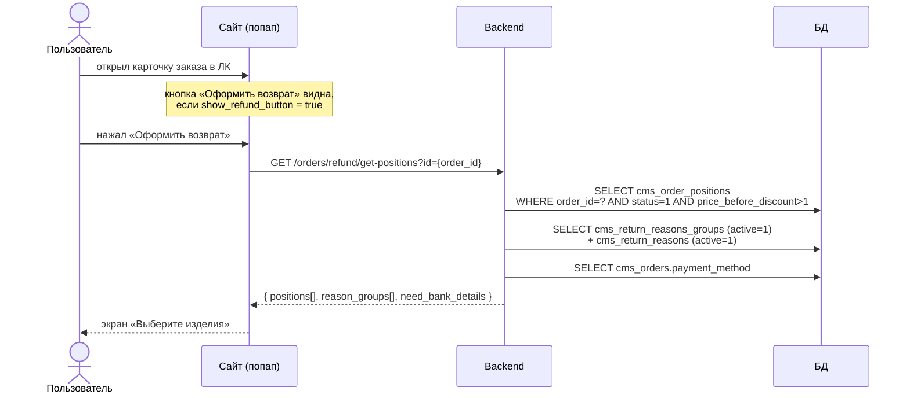

# Шаг 01 (web). Вход в форму возврата и загрузка данных

**Канал:** Сайт (личный кабинет)
**Статус:** DRAFT · **Дата:** 07.09.2026
**Результат шага:** открыт попап оформления возврата; в него загружены список возвращаемых позиций, справочник причин и признак необходимости банковских реквизитов. В базе ничего не меняется.

---

## 1. Пользовательский сценарий

### 1.1 Откуда пользователь приходит

Авторизованный пользователь открывает раздел «Заказы» в личном кабинете и разворачивает карточку онлайн-заказа.

### 1.2 Что система отображает

В карточке заказа показывается кнопка **«Оформить возврат»**. Она видна только если возврат по заказу возможен. Признак приходит с сервера в поле `show_refund_button` вместе с данными заказа.

### 1.3 От чего зависит доступность кнопки

`show_refund_button` = `true`, когда одновременно выполнено:

1. **Заказ в подходящем статусе.** `cms_orders.status` входит в объединение двух наборов из справочника `cms_order_statuses`:
   - статусы группы «завершение» (`cms_order_statuses.group = 'complete'`): `17` «Заказ выполнен», `33` «Заказ выдан», `56` «Частичный выкуп»;
   - статусы с флагом `cms_order_statuses.is_returned = 1`: `17`, `31` «Возврат из ЛК», `33`, `56`, `84` «Возврат утерян».

   Итоговый набор: **`cms_orders.status ∈ {17, 31, 33, 56, 84}`**. «Уже в статусе возврата» означает не «заказ в процессе возврата», а «статус помечен флагом `is_returned = 1` в справочнике» (флаг разрешает оформить заявку из уже «возвратных» статусов). Набор приведён по выгрузке справочника от 28.07.2026 (`sources/technical/database/order-status-reference.md`); при изменении справочника меняется без правок кода.

2. **Срок не вышел.** Условие: **`cms_orders.end_date + cms_parameters.days_can_be_returned` (дней) ещё не наступило** (значение — из строки `cms_parameters` с ключом `days_can_be_returned`).

3. **Есть возвращаемая позиция.** В заказе есть хотя бы одна строка `cms_order_positions`, у которой `status = 1` (по справочнику `cms_order_position_statuses` — «Добавлен», `code = new`) и `is_present = 0` (не подарок).

Если условие не выполнено — кнопки нет, и войти в процесс нельзя.

### 1.4 Действие пользователя

Пользователь нажимает «Оформить возврат». Сайт запрашивает данные формы и открывает попап.

### 1.5 Что происходит после действия

1. Сайт вызывает `GET /orders/refund/get-positions?id={order_id}`.
2. По ответу открывается попап оформления возврата. В него передаются: номер заказа, список возвращаемых позиций, справочник причин, признак «нужны банковские реквизиты».
3. Попап открывается на первом экране — «Выберите изделия» (шаг [02](02-select-return-items.md)).

### 1.6 Ограничения и ошибочные сценарии

- Запрос требует авторизации и метода GET.
- Если заказ не принадлежит пользователю или не найден — приходит ответ с `success = false` и сообщением «Заказ не найден», попап не открывается.
- Отдельного «нулевого» экрана нет: все данные подгружаются одним запросом по нажатию кнопки.
- Повторное нажатие во время открытия блокируется.

---

## 2. Системная реализация

### 2.0 Диаграмма последовательности



### 2.1 Источники данных

| Что нужно для шага | Где хранится | Какие поля (имена колонок) |
|---|---|---|
| Признак возможности возврата (`show_refund_button`) | вычисляется по `cms_orders.status`, `cms_orders.end_date`, `cms_order_positions.status`, `cms_order_positions.is_present`, `cms_parameters.days_can_be_returned` | — |
| Возвращаемые позиции | `cms_order_positions` (по `order_id`) | для отбора: `status`, `price_before_discount`; для карточки изделия: `id`, `model_title_ru`, `article`, `quantity`, `size_title_ru`, `color_hash`, `color_title_ru`, `color_has_circle`, `color_id`, `image_site_url`, `price`, `price_before_discount`, `is_present`. Колонка `barcode` в ответ web-запроса **не выводится** (в отличие от мобильного канала) |
| Товарная связь (ссылка на товар) | связанные товарные таблицы через позицию | `slug` товара и категории |
| Справочник причин | `cms_return_reasons_groups`, `cms_return_reasons` | группы: `id`, `title`, `active`, `order`; причины: `code`, `title`, `group_id`, `active`, `_order` |
| Признак банковских реквизитов | `cms_orders.payment_method` | сравнение со списком «всех онлайн-методов оплаты» |

### 2.2 Как система собирает данные

По запросу `GET /orders/refund/get-positions` система:

1. **Находит заказ** по `order_id` среди заказов текущего пользователя. Если не найдено — возвращает `success = false`, «Заказ не найден».
2. **Отбирает позиции для возврата** из `cms_order_positions` по этому заказу с условиями:
   - `status = 1` («добавлена»);
   - `price_before_discount > 1` — так отсекаются подарки (цена подарка — символическая).
   По каждой позиции формирует набор полей для отображения (название, артикул, цвет, размер, цены, картинка, ссылка на товар).
3. **Берёт справочник причин**: все группы из `cms_return_reasons_groups` с `active = 1`, отсортированные по полю `order`; внутри каждой — причины из `cms_return_reasons` с `active = 1`, отсортированные по полю `_order`. Для причины в ответ идут `code` и `title`.
4. **Вычисляет признак `need_bank_details`**: `true`, если тип оплаты заказа **не** входит в список всех онлайн-методов оплаты (онлайн-картой, СБП, Яндекс Пэй/СБП/цифровой рубль, а также рассрочки Долями/Сплит/Подели). То есть реквизиты нужны при любой не-онлайн оплате (наличные/безнал курьеру, при получении и т.п.).

> Устаревший эндпоинт `POST /user/cabinet/return-item/ajax/get-reasons-list` считает `need_bank_details` по более узкому набору (только онлайн-картой и СБП) и текущим попапом не используется.

### 2.3 Обмен по API

**Запрос**

```http
GET /orders/refund/get-positions?id={order_id}
X-Requested-With: XMLHttpRequest
Cookie: <сессия авторизованного пользователя>
```

**Ответ**

```json
{
  "data": {
    "positions": [
      { "id": 123456, "title": "Джемпер", "article": "21107318", "quantity": 1,
        "size_title_ru": "S",
        "color": { "hash": "#8B8378", "title": "Бежевый", "has_circle": false },
        "url": "https://12storeez.com/catalog/.../...",
        "image_site_url": "https://.../product-profile.jpg",
        "price": 5990, "price_before_discount": 7990,
        "is_returned": false, "is_present": false }
    ],
    "reason_groups": [
      { "id": 1, "title": "Не подошёл размер",
        "items": [ { "code": "300", "title": "Маломерит" }, { "code": "301", "title": "Большемерит" } ] }
    ],
    "need_bank_details": false
  },
  "errors": [], "message": "success", "success": true
}
```

### 2.4 Что из ответа использует сайт

| Поле ответа | Как используется |
|---|---|
| `data.positions[]` | список изделий на шаге 02; карточка изделия на экране причины (шаг 03). К каждой позиции локально добавляются поля «выбрана», «группа причины», «причина» |
| `positions[].id` | этим идентификатором позиция будет указана в запросе создания возврата (шаг 08) |
| `data.reason_groups[]` | список групп и причин на экране причины (шаг 03) |
| `data.need_bank_details` | включает блок банковских реквизитов на экране оформления (шаг 07) и блокирует кнопку подтверждения, пока реквизиты не заполнены |

### 2.5 Что передаётся на следующий шаг

Всё состояние формы держится в памяти попапа. Для дальнейших шагов сайт обязан сохранить: номер заказа (уйдёт в запросы способов, реквизитов возврата, создания возврата) и `id` каждой позиции (уйдёт в запрос создания возврата).

### 2.6 Что сохраняется или меняется

Ничего. Шаг только на чтение.

### 2.7 Неуточнённые места

- Набор «подходящих» статусов заказа (`{17, 31, 33, 56, 84}`) приведён по выгрузке справочника `cms_order_statuses` от 28.07.2026; при изменении групп/флага `is_returned` в справочнике набор меняется без правок кода.
- Значение `days_can_be_returned` хранится в строке `cms_parameters` с этим ключом, в коде не зафиксировано (по бизнес-материалам — 14 дней для обычного клиента, 30 для F&F; учёт F&F в этом расчёте по коду не подтверждён).
- Поле `positions[].is_returned` в ответе вычисляется из `cms_order_position_statuses.cancel_status` связанного статуса; для отобранного списка (только `status = 1`) всегда `false`.
- Кроме отсечения подарков (`price_before_discount > 1`), других ограничений по категории/бренду на этом шаге нет.

---

## 3. Соответствие TO-BE

Целевое требование `UC-RET-01`/`UC-RET-02` — экран возврата открывается на уже доступных данных, дополнительные запросы за товарами и причинами не нужны. **По сути выполнено:** весь нужный набор (возвращаемые позиции, справочник причин, признак `need_bank_details`) приходит одним запросом `GET /orders/refund/get-positions` (см. разд. 2.2–2.4). Отличается только реализация — один служебный запрос вместо переиспользования данных карточки заказа; на процесс это не влияет.

### Расхождения

| Тема | TO-BE | AS-IS (web) |
|---|---|---|
| Возвращаемое количество | Система рассчитывает «доступное для возврата количество» каждого товара | Количество не рассчитывается; позиция попадает в список целиком (`status = 1`, `price_before_discount > 1`) |
| Условие входа | Принадлежность заказа + наличие возвращаемого количества | `cms_orders.status ∈ {17, 31, 33, 56, 84}` + `cms_orders.end_date + cms_parameters.days_can_be_returned` не наступило + позиция `status = 1` и `is_present = 0` |

### Под вопросом

- **Зависимость причин от категории товара.** В AS-IS такой зависимости нет — справочник плоский, один и тот же для любой позиции. В TO-BE MVP системная категорийная блокировка также не вводится (`BR-34`); возможная автоматизация Post-MVP требует отдельного подтверждения объёма.
