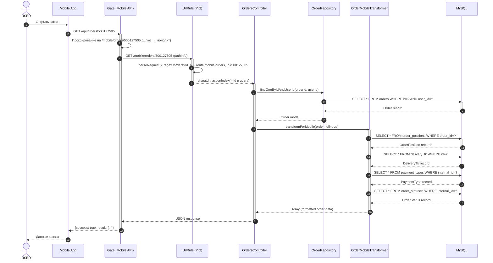
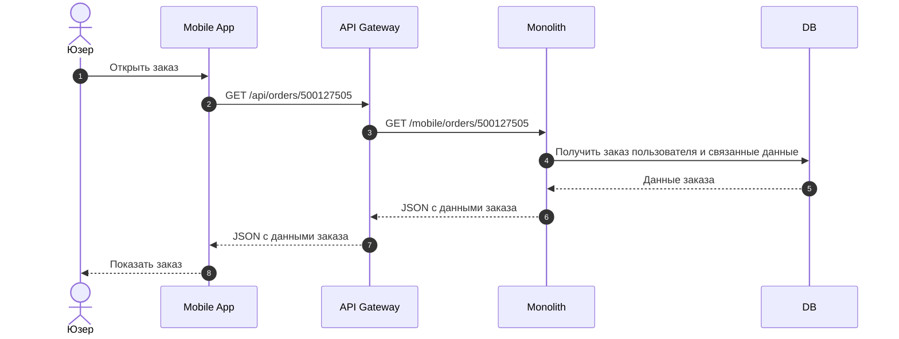

# Открытие заказа — Mobile API

# Название метода

**GET /api/orders/{id}** — Получение данных заказа

Обработчик: `src/Modules/Mobile/Controllers/OrdersController::actionIndex()` → `getOrders()`
Трансформер: `src/Modules/Order/Transformer\OrderMobileTransformer::transformForMobile($order, full=true)`

> **Проксирование (шлюз/API-gateway):** внешний запрос `GET /api/orders/{order_id}` проксируется на внутренний путь монолита `GET /mobile/orders/{order_id}`.
> Внутри монолита Yii2 UrlManager (правило `src/Modules/Mobile/Rules/UrlRule.php`, строка 87-89) разбирает pathInfo `mobile/orders/{id}` и возвращает маршрут (route) `mobile/orders` с параметром `id` — это **внутренняя маршрутизация Yii2, а не HTTP-вызов**.
> Далее маршрут `mobile/orders` диспатчится на `Mobile\OrdersController::actionIndex()`, который читает `id` из query-параметра (`Yii::$app->request->get('id')`).
> **Важно:** в swagger (`docs/mobileApi/openapi.yml`, строка 1653) просмотр заказа описан как `GET /mobile/orders/{orderId}` (`operationId: getOrderById`). Пути `/orders/{orderId}/...` существуют только для операций возврата (return-details, return-method-list).

---

# Используемые методы

| Система | Метод | Ссылка |
|---------|-------|--------|
| Mobile | `GET /api/orders/{id}` → проксируется на `GET /mobile/orders/{id}` | `src/Modules/Mobile/Controllers/OrdersController::actionIndex()` → `getOrders()` |
| Mobile (список) | `GET /mobile/orders` | `src/Modules/Mobile/Controllers/OrdersController::actionIndex()` — список заказов |

---

# Диаграмма взаимодействия



## Упрощённая диаграмма взаимодействия

Диаграмма показывает взаимодействие систем без детализации внутренней логики монолита.



---

# Входящие данные

## Источник данных

| Параметр | Обяз. | Тип источника | Метод-источник | Поле ответа | Описание |
|----------|-------|---------------|----------------|-------------|----------|
| `x-access-token` | + | Header | Конфигурация приложения | — | Ключ мобильного приложения |
| `x-session-token` | + | Header | `users_mobile_sessions` | — | Токен сессии (гостевая или авторизованная) |
| `id` | + | Path → Query | Часть URL (`/api/orders/{id}`), шлюз транслирует в query `id` | `result.id` | ID заказа |

### Примечание

- Внешний путь `GET /api/orders/{order_id}` проксируется шлюзом на `GET /mobile/orders/{order_id}`.
- Внутри монолита UrlRule транслирует pathInfo `mobile/orders/{id}` в маршрут `mobile/orders` с параметром `id` (query), а `Mobile\OrdersController::actionIndex()` читает его через `Yii::$app->request->get('id')`.
- Заказы типа `reservation` (резерв в магазине) исключаются из ответа.

---

# Описание входных параметров

| Параметр | Способ передачи | Тип | Обяз. | Описание | Пример |
|----------|-----------------|-----|-------|----------|--------|
| `id` | path (внешний) / query (внутренний) | integer | + | ID заказа | `500127505` |

---

# Пример запроса

```http
GET /api/orders/500127505 HTTP/1.1
Host: 12storeez.com
x-access-token: {app_key}
x-session-token: {session_token}
x-platform: ios
x-version: 5.0.0

# Шлюз проксирует на внутренний путь монолита:
# GET /mobile/orders/500127505  →  UrlRule: route mobile/orders (id=500127505)  →  actionIndex()
```

---

# Возвращаемые данные

## Описание параметров положительного ответа (full=true)

> **Примечание:** HTTP-ответ обёрнут в `{success, total, result: {...}}`.

### Блок `result.*`

| Параметр | Тип | Описание | Пример |
|----------|-----|----------|--------|
| `result.id` | integer | ID заказа | `12345` |
| `result.dolyame_id` | string\|null | ID заказа в Dolyame | `"dl_abc123"` |
| `result.date` | string | Дата создания (Y-m-d H:i:s) | `"2026-08-15 14:30:00"` |
| `result.status` | integer | Код статуса заказа | `14` |
| `result.status_message` | string | Клиентское название статуса | `"Передан в доставку"` |
| `result.expiration_date.start` | integer | Timestamp создания заказа (`created_at`) — **начало периода** | `1723733400` |
| `result.expiration_date.end` | integer\|null | Timestamp даты доставки (`delivery_date`) — **конец периода** | `1724000000` |
| `result.title` | string | Заголовок заказа (формируется по шаблону `Заказ №{id}`) | `"Заказ №12345"` |
| `result.is_click_and_collect` | boolean | Самовывоз из магазина | `false` |
| `result.giftcardsAmount` | float | Сумма использованных подарочных сертификатов | `5000.00` |
| `result.giftcards` | array | Данные использованных сертификатов | `[{id, num, sum}]` |

> **⚠️ `expiration_date` — это НЕ таймер оплаты.** Это период жизненного цикла заказа «от создания до доставки» (`start` = `created_at`, `end` = `delivery_date`), используется для отображения диапазона на карточке заказа.
>
> **Реальный дедлайн оплаты — `payment.pay_before`** (см. блок `payment`): `cms_orders.created_at + 2 часа` (`OrderDictionary::PAYMENT_TIME_BEFORE_CANCEL = 'PT2H'`). После этого времени заказ автоотменяется через `OrderHelper::createStatusTimer()` → `OrderStatusTimer::create()` (для статусов `WAITING_PAYMENT`, `PREORDER_NEW`, `CC_WAITING_FOR_PAYMENT`). `pay_before` возвращается только если заказ **не оплачен** и способ оплаты **не офлайн**.
>
> **⚠️ `expiration_date.end` = `cms_orders.delivery_date` — это ПЛАНОВАЯ дата доставки, НЕ фактическая.** Ставится при оформлении заказа (выбор клиента) или из 1С при переносе; при фактическом получении товара **не обновляется**. Поля «фактическая дата получения» в системе **не существует**.
>
> **⚠️ `cms_orders.end_date` ≠ `expiration_date.end` — это РАЗНЫЕ поля таблицы `cms_orders`:**
> - `expiration_date.end` = `cms_orders.delivery_date` — **плановая** дата доставки (для отображения периода на карточке);
> - `cms_orders.end_date` — **дата выполнения заказа** (фактическая, с подтверждением от 1С): ставится один раз при переходе в статус «выполнен» (`end_date = date('Y-m-d H:i:s')` в `OrderUpdateService`/`RcrmOrderService`).
>
> **⚠️ AS-IS: расчёт окна возврата идёт от `end_date + N дней`** (НЕ от `delivery_date`):
> `canBeReturned = (isCompleted || isReturned) && strtotime(end_date + "N days") > time()`, где `N = Parameter::valueOf('days_can_be_returned')` (в БД, в UI показывается как 14).
> - **Как прячется кнопка:** когда `end_date + N дней <= now` → `canBeReturned()` = `false` → на мобилке не формируется сообщение `can_be_returned` (кнопка «Оформить возврат» скрыта), на вебе `status.show_refund_button = false`.
> - Т.е. сообщение «14 дней после получения заказа» — фактически 14 дней от `end_date` (дата выполнения заказа), а не от фактического получения товара клиентом.
> - Нюанс (подтверждено разработчиком): для возврата **курьеркой** при выборе даты окно считается мягче — разрешают выбрать любую дату, пока не истекло 14 дней (намеренно не показывают «последний день»); для **ПВЗ** — точные расчёты от `cms_orders.end_date`.

### Блок `recipient`

| Параметр | Тип | Описание | Пример |
|----------|-----|----------|--------|
| `recipient.email` | string\|null | Email получателя | `"user@mail.ru"` |
| `recipient.first_name` | string\|null | Имя | `"Иван"` |
| `recipient.last_name` | string\|null | Фамилия | `"Иванов"` |
| `recipient.phone` | string\|null | Телефон | `"+79001234567"` |

### Блок `payment`

| Параметр | Тип | Описание | Пример |
|----------|-----|----------|--------|
| `payment.type_title` | string\|null | Платформенный заголовок типа оплаты | `"Карта"` |
| `payment.type_name` | string | Код типа оплаты | `"yookassa"` |
| `payment.type_id` | integer\|null | ID типа оплаты | `1` |
| `payment.send` | object | Параметры для отправки в платёжную систему (YooKassa) | `{amount: {value: "1500", currency: "RUB"}}` |
| `payment.total_cost` | integer | Сумма товаров до скидок | `2000` |
| `payment.cost_sum` | float | Итого с учётом скидок | `1500.00` |
| `payment.delivery_cost` | integer | Стоимость доставки | `300` |
| `payment.discount` | integer\|float | Общая скидка | `500` |
| `payment.discount_sale` | integer\|float | Скидка по акции | `400` |
| `payment.discount_bonus` | integer\|float | Скидка бонусами | `0` |
| `payment.discount_promo` | integer\|float | Скидка по промокоду | `100` |
| `payment.total_payable` | integer | К оплате (за вычетом сертификатов) | `1500` |
| `payment.is_payed` | boolean | Оплачен ли заказ | `true` |
| `payment.by_certificate` | float | Сумма сертификатов | `5000.00` |
| `payment.payment_system` | string\|null | Система оплаты | `"yookassa"` |
| `payment.payment_url` | string\|null | Ссылка на оплату | `"https://yookassa.ru/..."` |
| `payment.pay_before` | string\|false | **Дедлайн оплаты** (ISO 8601) = `created_at + 2 часа` (`PAYMENT_TIME_BEFORE_CANCEL = 'PT2H'`). После него заказ автоотменяется. Присутствует только если заказ не оплачен и способ оплаты не офлайн | `"2026-08-16T14:30:00+03:00"` |

### Блок `items[]` (позиции заказа)

| Параметр | Тип | Описание | Пример |
|----------|-----|----------|--------|
| `items[].id` | integer | ID позиции | `67890` |
| `items[].article` | string | Артикул товара | `"ART-12345"` |
| `items[].model_id` | integer | ID товара (products.id) | `555` |
| `items[].barcode` | integer | Штрихкод (product_sizes.id) | `111222` |
| `items[].title` | string | Название модели | `"Пламя"` |
| `items[].tags[]` | array | Теги товара | `[{id: 1, title: "New"}, ...]` |
| `items[].colors[0].id` | integer | ID товара | `555` |
| `items[].colors[0].color_id` | integer | ID цвета | `12` |
| `items[].colors[0].hash` | string | HEX-код цвета | `"#000000"` |
| `items[].colors[0].color` | string | Название цвета | `"Чёрный"` |
| `items[].colors[0].image` | string\|null | URL изображения цвета | `"https://..."` |
| `items[].colors[0].has_circle` | boolean | Есть ли кружок цвета | `true` |
| `items[].colors[0].circle_color` | string | Цвет кружка | `"#FFFFFF"` |
| `items[].discount_price` | float | Цена со скидкой | `1200.00` |
| `items[].price` | float | Цена до скидки | `1500.00` |
| `items[].preview` | string | URL превью изображения | `"https://..."` |
| `items[].preview_new[]` | array | Превью нового формата | `[{type, width, height, url}]` |
| `items[].selected_color_id` | integer | Выбранный цвет | `12` |
| `items[].selected_size_id` | string | Размер | `"M"` |
| `items[].count` | integer | Количество | `1` |
| `items[].is_present` | boolean | Подарок | `false` |
| `items[].can_be_returned` | boolean | Можно ли вернуть | `true` |
| `items[].ga.category` | string | Категория для GA | `"Одежда"` |
| `items[].item_id` | integer | FK → product_sizes.id | `111222` |
| `items[].is_cnc` | boolean | Click & Collect | `false` |
| `items[].can_be_marked` | boolean | Можно ли оценить | `true` |

### Блок `track_number`

| Параметр | Тип | Описание | Пример |
|----------|-----|----------|--------|
| `track_number.track_number` | string\|null | Трек-номер | `"777123456789"` |
| `track_number.url` | string\|null | Ссылка на отслеживание | `"https://..."` |

### Блок `summary` (только full=true)

| Параметр | Тип | Описание | Пример |
|----------|-----|----------|--------|
| `summary.total_cost` | string\|false | Сумма товаров | `"2 000 ₽"` |
| `summary.delivery_cost` | string\|false | Стоимость доставки | `"300 ₽"` |
| `summary.discount` | string\|false | Скидка | `"-500 ₽"` |
| `summary.discount_sale` | string\|false | Скидка по акции | `"-400 ₽"` |
| `summary.discount_bonus` | string\|false | Скидка бонусами | `"-100 ₽"` |
| `summary.discount_promo` | string\|false | Скидка промокодом | `"-0 ₽"` |
| `summary.total_payable` | string\|false | К оплате | `"1 800 ₽"` |
| `summary.by_certificate` | string\|false | Сертификатами | `"5 000 ₽"` |

### Блок `delivery` (только full=true)

Массив строк с информацией о доставке: тип ТК, дата, адрес, название ТК.

### Блок `bonuses` (только full=true)

| Параметр | Тип | Описание | Пример |
|----------|-----|----------|--------|
| `bonuses` | float | Начисленные бонусы | `150.00` |

### Блок `messages[]` (только full=true)

| Параметр | Тип | Описание | Пример |
|----------|-----|----------|--------|
| `messages[].status` | string | Тип сообщения | `"can_be_returned"` |
| `messages[].message` | string | Текст сообщения | `"Вы можете вернуть вещи..."` |
| `messages[].button` | string | Текст кнопки | `"Оформить возврат"` |

### Блок `return`

| Параметр | Тип | Описание | Пример |
|----------|-----|----------|--------|
| `return.is_bank_data_required` | boolean | Нужны ли банковские данные | `false` |

---

## Пример успешного ответа

```json
{
  "success": true,
  "total": 1,
  "result": {
    "id": 12345,
    "dolyame_id": null,
    "date": "2026-08-15 14:30:00",
    "status": 14,
    "status_message": "Передан в доставку",
    "expiration_date": {
      "start": 1723733400,
      "end": 1724000000
    },
    "title": "Заказ №12345",
    "items": [
      {
        "id": 67890,
        "article": "ART-12345",
        "model_id": 555,
        "barcode": 111222,
        "title": "Пламя",
        "tags": [{"id": 1, "title": "New"}],
        "colors": [{
          "id": 555,
          "color_id": 12,
          "hash": "#000000",
          "color": "Чёрный",
          "image": "https://cdn.12storeez.com/images/colors/black.jpg",
          "has_circle": true,
          "circle_color": "#FFFFFF"
        }],
        "discount_price": 1200.00,
        "price": 1500.00,
        "preview": "https://cdn.12storeez.com/images/products/555/mobile.jpg",
        "preview_new": [{
          "type": "mobile_order",
          "width": 200,
          "height": 267,
          "url": "https://cdn.12storeez.com/images/products/555/mobile.jpg"
        }],
        "selected_color_id": 12,
        "selected_size_id": "M",
        "count": 1,
        "is_present": false,
        "can_be_returned": true,
        "ga": {"category": "Платья"},
        "item_id": 111222,
        "is_cnc": false,
        "can_be_marked": false
      }
    ],
    "payment": {
      "type_title": "Карта",
      "type_name": "yookassa",
      "type_id": 1,
      "send": {"amount": {"value": "1500", "currency": "RUB"}},
      "total_cost": 2000,
      "cost_sum": 1500.00,
      "delivery_cost": 300,
      "discount": 500,
      "discount_sale": 400,
      "discount_bonus": 0,
      "discount_promo": 100,
      "total_payable": 1500,
      "is_payed": true,
      "by_certificate": 0,
      "payment_system": "yookassa",
      "payment_url": null
    },
    "track_number": {
      "track_number": "777123456789",
      "url": "https://tracking.dpd.ru/track?id=777123456789"
    },
    "recipient": {
      "email": "user@mail.ru",
      "first_name": "Иван",
      "last_name": "Иванов",
      "phone": "+79001234567"
    },
    "is_click_and_collect": false,
    "giftcardsAmount": 0,
    "giftcards": [],
    "delivery": [
      "Доставка курьером",
      "18 августа, 10:00 – 18:00",
      "г. Москва, ул. Пушкина, д. 10, кв. 5",
      "Транспортная компания: ДПД"
    ],
    "summary": {
      "total_cost": "2 000 ₽",
      "delivery_cost": "300 ₽",
      "discount": "-500 ₽",
      "discount_sale": "-400 ₽",
      "discount_bonus": "0 ₽",
      "discount_promo": "-100 ₽",
      "total_payable": "1 800 ₽",
      "by_certificate": "0 ₽"
    },
    "bonuses": 150,
    "messages": [
      {
        "status": "can_be_returned",
        "message": "Вы можете вернуть вещи в течение четырнадцати дней после получения заказа.",
        "button": "Оформить возврат"
      }
    ],
    "return": {
      "is_bank_data_required": false
    }
  }
}
```

## Пример ответа с ошибкой

```json
{
  "success": false,
  "result": {
    "error_code": 1001,
    "error_text": "Заказ не найден"
  }
}
```

---

# Маппинг с БД

## Таблица `orders` (физическое имя: `cms_orders`)

| Поле API | Тип | Поле БД | Тип БД | Описание |
|----------|-----|---------|--------|----------|
| `id` | integer | `id` | int(11) PK AUTO_INCREMENT | ID заказа |
| `dolyame_id` | string | `dolyame_id` | varchar(255) NULL | ID заказа в Dolyame |
| `date` | string | `created_at` | datetime | Дата создания заказа |
| `status` | integer | `status` | int(11) | FK → order_statuses.internal_id |
| `status_message` | string | — | — | FK → order_statuses.client_title |
| `title` | string | — | — | Вычисляется в трансформере: `Заказ №{id}` |
| `recipient.first_name` | string | `name` | varchar(255) NULL | Имя получателя |
| `recipient.last_name` | string | `surname` | varchar(255) NULL | Фамилия получателя |
| `recipient.phone` | string | `number` | varchar(255) NULL | Телефон получателя |
| `recipient.email` | string | `email` | varchar(255) NULL | Email получателя |
| `payment.type_id` | integer | `payment_method` | int(11) NULL | FK → payment_types.internal_id |
| `payment.is_payed` | boolean | `payment_status` | int(11) | FK → payment_statuses.internal_id |
| `payment.payment_url` | string | `payment_url` | varchar(512) NULL | Ссылка на оплату |
| `payment.payment_system` | string | `payment_method` | — | Вычисляется через PaymentSystemEnum |
| `track_number.track_number` | string | `track_number` | varchar(255) NULL | Трек-номер |
| `is_click_and_collect` | boolean | `is_click_and_collect` | tinyint(1) | Самовывоз |
| `giftcardsAmount` | float | — | — | Вычисляется через GiftcardsService |
| `payment.total_cost` | float | — | — | Вычисляется из order_positions |
| `payment.cost_sum` | float | `sum` | decimal(10,2) | Итоговая сумма |
| `payment.delivery_cost` | float | `delivery_price` | decimal(10,2) NULL | Стоимость доставки |
| `payment.total_payable` | float | — | — | sum - giftcardsAmount |
| `bonuses` | float | `given_bonus` | int(11) | Начисленные бонусы |
| `payment.send` | object | `payment_method` | — | Вычисляется из YooKassa-компонента |
| `payment.pay_before` | string | `created_at` | — | Вычисляется: `created_at + PT2H` (PAYMENT_TIME_BEFORE_CANCEL) |
| `expiration_date.start` | integer | `created_at` | datetime | Timestamp создания заказа |
| `expiration_date.end` | integer\|null | `delivery_date` | varchar(255) NULL | Timestamp даты доставки |
| `return.is_bank_data_required` | boolean | `payment_method` | — | Определяется через isCourierPayment() |
| `delivery.date` | string | `delivery_date` | varchar(255) NULL | Дата доставки |
| `delivery.time_from` | string | `delivery_time_from` | varchar(255) NULL | Время доставки с |
| `delivery.time_to` | string | `delivery_time_to` | varchar(255) NULL | Время доставки до |
| `delivery.track_number` | string | `track_number` | varchar(255) NULL | Трек-номер |
| `delivery.type` | string | `delivery_method` | int(11) | FK → delivery_tk.id |

## Таблица `order_positions` (физическое имя: `cms_order_positions`)

| Поле API | Тип | Поле БД | Тип БД | Описание |
|----------|-----|---------|--------|----------|
| `items[].id` | integer | `id` | int(11) PK AUTO_INCREMENT | ID позиции |
| `items[].article` | string | `article` | varchar(255) | Артикул товара |
| `items[].model_id` | integer | `model_id` | int(11) | FK → products.id |
| `items[].barcode` | integer | `barcode` | int(11) | Штрихкод (→ product_sizes.id) |
| `items[].title` | string | `model_title_ru` | varchar(255) | Денормализованное название модели |
| `items[].discount_price` | float | `price` | decimal(10,2) | Цена со скидкой |
| `items[].price` | float | `price_before_discount` | decimal(10,2) | Цена до скидки |
| `items[].selected_color_id` | integer | `color_id` | int(11) | FK → dictionary_colors.id |
| `items[].selected_size_id` | string | `size_title_ru` | varchar(255) | Денормализованный размер |
| `items[].count` | integer | `quantity` | int(11) | Количество |
| `items[].is_present` | boolean | `is_present` | tinyint(1) | Признак подарка |
| `items[].item_id` | integer | `item_id` | int(11) | FK → product_sizes.id |
| `items[].is_cnc` | boolean | `is_click_and_collect` | tinyint(1) | Click & Collect |
| `items[].colors[0].hash` | string | `color_hash` | varchar(10) | HEX-код цвета |
| `items[].colors[0].color` | string | `color_title_ru` | varchar(255) | Название цвета (RU) |
| `items[].colors[0].image` | string | `color_image` | varchar(512) NULL | URL изображения цвета |
| `items[].colors[0].has_circle` | boolean | `color_has_circle` | tinyint(1) | Есть ли кружок |
| `items[].preview` | string | `image_mobile_url` | varchar(512) | URL изображения (mobile) |
| `items[].preview_new[].url` | string | `image_mobile_url` | varchar(512) | URL изображения |
| `items[].can_be_returned` | boolean | `status` | — | Вычисляется OrderHelper |
| `items[].can_be_marked` | boolean | `status` | — | Вычисляется OrderHelper |
| `items[].ga.category` | string | — | — | Вычисляется Product::getMainCategoryTitleGa() |

## Таблица `order_statuses` (справочник)

| Поле API | Тип | Поле БД | Тип БД | Описание |
|----------|-----|---------|--------|----------|
| `status` (код) | integer | `internal_id` | int(11) | Числовой код статуса |
| `status_message` | string | `client_title` | varchar(255) | Клиентское название |

### Основные статусы

| `internal_id` | Код | Описание |
|----------------|-----|----------|
| 1 | RESERVED | Зарезервирован |
| 3 | WAITING_PROCESSING | Ожидает обработки |
| 4 | PREPARING_PACKAGE | Сборка |
| 7 | WAITING_PAYMENT | Ожидает оплаты |
| 11 | PACKED | Упакован |
| 14 | ITEM_SENT | Передан в доставку |
| 16 | AWAITING_PICKUP_IN_STORE | Ожидает в магазине |
| 17 | ORDER_COMPLETED | Заказ выполнен |
| 23 | ORDER_CANCELLED | Заказ отменён |

## Таблица `payment_statuses` (справочник)

| `internal_id` | Код | Описание |
|----------------|-----|----------|
| 1 | SUCCESS | Оплачен |
| 2 | NOT_PAID | Не оплачен |
| 3 | FAILURE | Ошибка оплаты |
| 4 | CREDIT_APPROVED | Кредит одобрен |

## Таблица `delivery_tk` (транспортные компании)

| Поле API | Тип | Поле БД | Тип БД | Описание |
|----------|-----|---------|--------|----------|
| `delivery.type` | string | `type` | varchar(255) | Тип ТК (courier, box, self, etc.) |

---

# Связанные задачи

| Задача | Описание изменений |
|--------|--------------------|
| | |

---

# Версии документа

| Версия | Дата изменения | Автор | Описание изменений |
|--------|----------------|-------|--------------------|
| 1.0 | 07.09.2026 | Системный аналитик | Первичное создание документа — маппинг эндпоинта открытия заказа (Mobile API) с таблицами БД |
| 1.1 | 07.09.2026 | Системный аналитик | Уточнён реальный маршрут: `GET /api/orders/{id}` |
| 1.2 | 07.09.2026 | Системный аналитик | Уточнено проксирование: `GET /api/orders/{id}` → `GET /mobile/orders/{id}` (шлюз) → route `mobile/orders` (id в query); проверен обработчик |
| 1.3 | 07.09.2026 | Системный аналитик | Исправлен внутренний путь монолита: `GET /mobile/orders/{id}` (по swagger `docs/mobileApi/openapi.yml`, строка 1653, `getOrderById`); пояснена внутренняя маршрутизация Yii2 (UrlRule → route `mobile/orders` + id в query) |
| 1.4 | 07.09.2026 | Системный аналитик | Зафиксировано: `expiration_date` — период «создание → доставка» (НЕ таймер оплаты); реальный дедлайн оплаты — `payment.pay_before` (`created_at + PT2H`, автоотмена через OrderStatusTimer); добавлен маппинг `expiration_date` и `pay_before`; файл перенесён в `requirements/mobile/` |
| 1.5 | 07.09.2026 | Системный аналитик | Зафиксировано: `delivery_date` — плановая дата доставки (НЕ фактическая); окно возврата считается от `end_date` (`end_date + days_can_be_returned > now`), а не от `delivery_date`; поля «фактическая дата получения» в системе нет |
| 1.6 | 07.09.2026 | Системный аналитик | AS-IS (подтверждено разработчиком): `end_date` ≠ `expiration_date.end` (разные поля `orders`); расчёт возврата — `end_date + N дней`; как скрывается кнопка возврата; нюанс курьерка vs ПВЗ |
