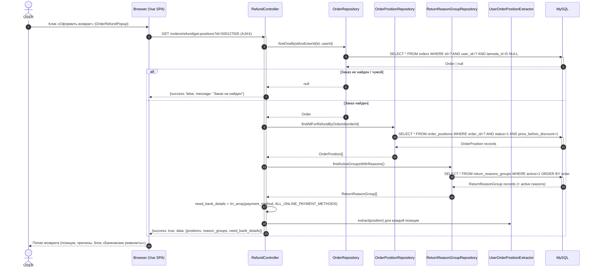

# Получение позиций для возврата — Web API

# Название метода

**GET /orders/refund/get-positions?id={id}** — Получение позиций заказа, доступных для возврата, групп причин возврата и признака необходимости банковских реквизитов

Обработчик: `modules/orders/controllers/RefundController::actionGetPositionsJson()`
Экстракторы:
- позиции — `modules/users/extractors/UserOrderPositionExtractor::extract()`
- группы причин — `modules/orders/extractors/ReturnReasonGroupExtractor::extract()`
- причины — `modules/orders/extractors/ReturnReasonExtractor::extract()`

> **Маршрутизация:** эндпоинт **не объявлен явно** в `config/url.php` — резолвится стандартным Yii2-сопоставлением `module/controller/action` (`enableStrictParsing = false`):
> `orders` (модуль, `config/modules.php`) → `refund` (контроллер `RefundController`) → `get-positions` (действие).
>
> **Важно про AJAX:** `AbstractRestController::runAction()` (`modules/common/controllers/AbstractRestController.php`, строки 53-90) добавляет суффикс `-json` к имени действия **только если** запрос помечен как AJAX (`X-Requested-With: XMLHttpRequest`). Тогда `get-positions` → `get-positions-json` → метод `actionGetPositionsJson()`. **Без AJAX-заголовка действие не резолвится.**
>
> **Зачем вызывается:** этот эндпоинт вызывается с веб-страницы заказа (`GET /profile/view/{id}`) при клике на кнопку «Оформить возврат» — см. `order-view_web.md`. Здесь же вычисляется `need_bank_details` — признак того, что клиенту нужно ввести банковские реквизиты для возврата.
>
> **До какого момента доступен:** кнопка «Оформить возврат» видна, пока `canBeReturned()` = `true`. **AS-IS формула:** `end_date + days_can_be_returned > time()` (`days_can_be_returned` — параметр из БД, в UI = 14). Когда `end_date + 14 дней <= now` → кнопка скрыта → этот эндпоинт не вызывается. Подробнее — `order-view_web.md` (блок `status.show_refund_button`) и `mobile/order-view_mobile.md` (заметка про расчёт окна возврата).

---

# Используемые методы

| Система | Метод | Ссылка |
|---------|-------|--------|
| Web | `GET /orders/refund/get-positions?id={id}` | `modules/orders/controllers/RefundController::actionGetPositionsJson()` |
| Web | `GET /profile/view/{id}` | `modules/users/controllers/ProfileController::actionView()` — страница заказа (источник вызова) |

---

# Диаграмма взаимодействия



---

# Входящие данные

## Источник данных

| Параметр | Обяз. | Тип источника | Метод-источник | Поле ответа | Описание |
|----------|-------|---------------|----------------|-------------|----------|
| Cookie `_identity` | + | Cookie | Yii2 auto-login (PHP-сессия + cookie) | — | Аутентификация (роль `@` — авторизованный пользователь) |
| `id` | + | Query | `Yii::$app->request->get('id')` | `data.positions` | ID заказа |
| `X-Requested-With: XMLHttpRequest` | + | Header | `AbstractRestController::runAction()` | — | Обязателен: без него действие `get-positions` не резолвится в `get-positions-json` |

### Примечание

- Доступ только авторизованным пользователям: `AccessControl` → `roles => ['@']` (`RefundController::behaviors()`).
- Дополнительная проверка владельца: `findOneByIdAndUserId($id, Yii::$app->user->id)` — заказ возвращается только если `id` и `user_id` совпадают **и** `lamoda_id IS NULL`.
- Метод ограничен **HTTP GET** (`VerbFilter`).
- В `FrontendController::initUser()` есть TODO про будущий JWT — сейчас используется стандартный Yii2 WebUser.

---

# Описание входных параметров

| Параметр | Способ передачи | Тип | Обяз. | Описание | Пример |
|----------|-----------------|-----|-------|----------|--------|
| `id` | query | integer | + | ID заказа | `500127505` |

---

# Пример запроса

```http
GET /orders/refund/get-positions?id=500127505 HTTP/1.1
Host: 12storeez.com
Cookie: _identity=...
X-Requested-With: XMLHttpRequest
```

---

# Возвращаемые данные

## Описание параметров положительного ответа

> **Примечание:** ответ обёрнут в стандартный `JsonResponse` (`modules/common/response/JsonResponse.php`): `{data, errorCode, errors, message, success}`. Все поля ниже описывают содержимое `data`.

### Корневой уровень (`data.*`)

| Параметр | Тип | Описание | Пример |
|----------|-----|----------|--------|
| `data.positions` | array | Позиции заказа, доступные для возврата (см. ниже) | `[{...}]` |
| `data.reason_groups` | array | Активные группы причин возврата (см. ниже) | `[{...}]` |
| `data.need_bank_details` | boolean | Нужно ли ввести банковские реквизиты для возврата | `true` |

### Блок `positions[]` (`UserOrderPositionExtractor`)

| Параметр | Тип | Описание | Пример |
|----------|-----|----------|--------|
| `positions[].id` | integer | ID позиции | `67890` |
| `positions[].title` | string | Название модели (model_title_ru) | `"Пламя"` |
| `positions[].article` | string | Артикул | `"ART-12345"` |
| `positions[].quantity` | integer | Количество | `1` |
| `positions[].size_title_ru` | string | Размер | `"M"` |
| `positions[].color.hash` | string | HEX-код цвета | `"#000000"` |
| `positions[].color.title` | string | Название цвета | `"Чёрный"` |
| `positions[].color.has_circle` | boolean | Есть ли кружок | `true` |
| `positions[].colorId` | integer | ID цвета | `12` |
| `positions[].colors[].color_id` | integer | ID цвета | `12` |
| `positions[].colors[].hash` | string | HEX-код | `"#000000"` |
| `positions[].colors[].label` | string | Название | `"Чёрный"` |
| `positions[].colors[].circle_color` | string | Цвет кружка | `"#FFFFFF"` |
| `positions[].url` | string | URL товара | `"https://12storeez.com/catalog/platya/plamya"` |
| `positions[].image_site_url` | string | URL изображения (ImageType::PRODUCT_PROFILE, 300x300) | `"https://cdn.12storeez.com/..."` |
| `positions[].is_click_and_collect` | boolean | Click & Collect | `false` |
| `positions[].price` | integer | Цена со скидкой | `1200` |
| `positions[].price_before_discount` | integer | Цена до скидки | `1500` |
| `positions[].is_returned` | boolean | Возвращена ли позиция (order_position_statuses.cancel_status) | `false` |
| `positions[].is_present` | boolean | Подарок | `false` |
| `positions[].sizes[].title` | string | Размер | `"M"` |
| `positions[].ecommerce` | array | Данные для dataLayer (GA) | `{...}` |

> **Фильтрация позиций** (`OrderPositionRepository::findAllForRefundByOrderId`): включаются только позиции с `status = 1` (STATUS_ADDED) **и** `price_before_discount > 1` (исключаются подарочные позиции, `Product::PRESENT_MAX_PRICE = 1`).

### Блок `reason_groups[]` (`ReturnReasonGroupExtractor`)

| Параметр | Тип | Описание | Пример |
|----------|-----|----------|--------|
| `reason_groups[].id` | integer | ID группы причин | `1` |
| `reason_groups[].title` | string | Локализованное название группы (return_reasons_content) | `"Не подошёл размер"` |
| `reason_groups[].items[]` | array | Причины возврата в группе (см. ниже) | `[{...}]` |

### Блок `reason_groups[].items[]` (`ReturnReasonExtractor`)

| Параметр | Тип | Описание | Пример |
|----------|-----|----------|--------|
| `items[].code` | string | Код причины | `"size_not_fit"` |
| `items[].title` | string | Локализованное название причины | `"Мал размер"` |

> **Источник групп** (`OrderReturnReasonGroupRepository::findActiveGroupsWithReasons`): только активные группы (`active = true`, сортировка по `order` ASC); внутри — только активные причины (`active = true`, сортировка по `_order` ASC).

### Блок `need_bank_details`

| Параметр | Тип | Описание | Пример |
|----------|-----|----------|--------|
| `need_bank_details` | boolean | `true`, если способ оплаты заказа **не входит** в `PaymentMethodEnum::ALL_ONLINE_PAYMENT_METHODS` | `true` |

> **Формула:** `need_bank_details = !in_array($order->getPaymentTypeId(), ALL_ONLINE_PAYMENT_METHODS, true)`.
>
> `ALL_ONLINE_PAYMENT_METHODS = {1 (ONLINE_SITE), 13 (TINKOFF_DOLYAME), 14 (ALPHA_PODELI), 16 (SBP), 17 (YANDEX_SPLIT), 19 (YANDEX_PAY), 20 (YANDEX_SBP), 21 (YANDEX_DIGITAL_RUBLE)}`.
>
> `need_bank_details = true` для **всех не-онлайн** способов: наличные/безнал курьеру (3, 5), наличные/безнал агенту (2, 4), сбербанк-онлайн (6), перевод на счёт (7), наличные (8), PayPal (9), click&collect (12), сертификат (15), резервная пост-оплата (18), а также `null` (не определён).
>
> **⚠️ Отличие от Mobile API:** на мобилке признак считается **уже** — `return.is_bank_data_required = isCourierPayment()` (только типы 3 и 5). На вебе — **шире** (все не-онлайн). Подробное сравнение — в `order-view_web.md` (раздел «Банковские реквизиты»).

---

## Пример успешного ответа

```json
{
  "data": {
    "positions": [
      {
        "id": 67890,
        "title": "Пламя",
        "article": "ART-12345",
        "quantity": 1,
        "size_title_ru": "M",
        "color": {
          "hash": "#000000",
          "title": "Чёрный",
          "has_circle": true
        },
        "colorId": 12,
        "colors": [{
          "color_id": 12,
          "hash": "#000000",
          "label": "Чёрный",
          "circle_color": "#FFFFFF"
        }],
        "url": "https://12storeez.com/catalog/platya/plamya",
        "image_site_url": "https://cdn.12storeez.com/images/products/555/site.jpg",
        "is_click_and_collect": false,
        "price": 1200,
        "price_before_discount": 1500,
        "is_returned": false,
        "is_present": false,
        "sizes": [{"title": "M"}],
        "ecommerce": {}
      }
    ],
    "reason_groups": [
      {
        "id": 1,
        "title": "Не подошёл размер",
        "items": [
          {"code": "size_not_fit", "title": "Мал размер"},
          {"code": "size_big", "title": "Велик размер"}
        ]
      },
      {
        "id": 2,
        "title": "Не понравился товар",
        "items": [
          {"code": "not_like", "title": "Не понравился"}
        ]
      }
    ],
    "need_bank_details": true
  },
  "errorCode": null,
  "errors": [],
  "message": "success",
  "success": true
}
```

## Пример ответа с ошибкой

```json
{
  "data": null,
  "errorCode": null,
  "errors": [],
  "message": "Заказ не найден",
  "success": false
}
```

---

# Маппинг с БД

## Таблица `orders` (физическое имя: `cms_orders`)

| Поле API | Тип | Поле БД | Тип БД | Описание |
|----------|-----|---------|--------|----------|
| `need_bank_details` | boolean | `payment_method` | int(11) NULL | Вычисляется: `!in_array(payment_method, ALL_ONLINE_PAYMENT_METHODS)` |

## Таблица `order_positions` (физическое имя: `cms_order_positions`)

| Поле API | Тип | Поле БД | Тип БД | Описание |
|----------|-----|---------|--------|----------|
| `positions[].id` | integer | `id` | int(11) PK AUTO_INCREMENT | ID позиции |
| `positions[].article` | string | `article` | varchar(255) | Артикул товара |
| `positions[].title` | string | `model_title_ru` | varchar(255) | Денормализованное название модели |
| `positions[].price` | integer | `price` | decimal(10,2) | Цена со скидкой |
| `positions[].price_before_discount` | integer | `price_before_discount` | decimal(10,2) | Цена до скидки |
| `positions[].colorId` | integer | `color_id` | int(11) | FK → dictionary_colors.id |
| `positions[].size_title_ru` | string | `size_title_ru` | varchar(255) | Денормализованный размер |
| `positions[].quantity` | integer | `quantity` | int(11) | Количество |
| `positions[].is_present` | boolean | `is_present` | tinyint(1) | Признак подарка |
| `positions[].is_click_and_collect` | boolean | `is_click_and_collect` | tinyint(1) | Click & Collect |
| `positions[].color.hash` | string | `color_hash` | varchar(10) | HEX-код цвета |
| `positions[].color.title` | string | `color_title_ru` | varchar(255) | Название цвета (RU) |
| `positions[].color.has_circle` | boolean | `color_has_circle` | tinyint(1) | Есть ли кружок |
| `positions[].image_site_url` | string | `image_site_url` | varchar(512) | URL изображения (site) |
| `positions[].sizes[].title` | string | `size_title_ru` | varchar(255) | Размер |
| `positions[].colors[].label` | string | `color_title_ru` | varchar(255) | Название цвета |
| `positions[].colors[].circle_color` | string | `color_hash` | — | Вычисляется ProductHelper::getCircleColor() |
| `positions[].url` | string | — | — | Вычисляется из slug → product → category |
| `positions[].is_returned` | boolean | `status` | — | Определяется через order_position_statuses.cancel_status |
| `positions[].ecommerce` | array | — | — | Вычисляется toDataLayerArray() |

## Таблица `return_reasons_groups` (группы причин возврата)

| Поле API | Тип | Поле БД | Тип БД | Описание |
|----------|-----|---------|--------|----------|
| `reason_groups[].id` | integer | `id` | int(11) PK | ID группы |
| `reason_groups[].title` | string | — | — | Локализованное название из return_reasons_content (LangModel) |
| — | — | `active` | tinyint(1) | Фильтр: только активные группы |
| — | — | `order` | int(11) | Сортировка групп (ASC) |

## Таблица `return_reasons` (причины возврата)

| Поле API | Тип | Поле БД | Тип БД | Описание |
|----------|-----|---------|--------|----------|
| `reason_groups[].items[].code` | string | `code` | varchar(255) | Код причины |
| `reason_groups[].items[].title` | string | — | — | Локализованное название из return_reasons_content (LangModel) |
| — | — | `group_id` | int(11) | FK → return_reasons_groups.id |
| — | — | `active` | tinyint(1) | Фильтр: только активные причины |
| — | — | `_order` | int(11) | Сортировка причин внутри группы (ASC) |

## Таблица `return_reasons_content` (локализация)

| Поле API | Тип | Поле БД | Тип БД | Описание |
|----------|-----|---------|--------|----------|
| `reason_groups[].title` | string | `title` | varchar(255) | Локализованное название группы |
| `reason_groups[].items[].title` | string | `title` | varchar(255) | Локализованное название причины |

## Таблица `order_position_statuses` (справочник статусов позиций)

| Поле API | Тип | Поле БД | Тип БД | Описание |
|----------|-----|---------|--------|----------|
| `positions[].is_returned` | boolean | `cancel_status` | tinyint(1) | Признак возврата позиции (relation по internal_id = status) |

---

# Связанные задачи

| Задача | Описание изменений |
|--------|--------------------|
| | |

---

# Версии документа

| Версия | Дата изменения | Автор | Описание изменений |
|--------|----------------|-------|--------------------|
| 1.0 | 07.09.2026 | Системный аналитик | Первичное создание документа — маппинг эндпоинта получения позиций для возврата (Web API) с таблицами БД; зафиксирована логика `need_bank_details` и отличие от Mobile API |
| 1.1 | 11.09.2026 | Системный аналитик | Файл перенесён в `requirements/reference/api/web/` — AS-IS API-контракты по каналам вынесены из бандлов процессов в сквозной справочник |