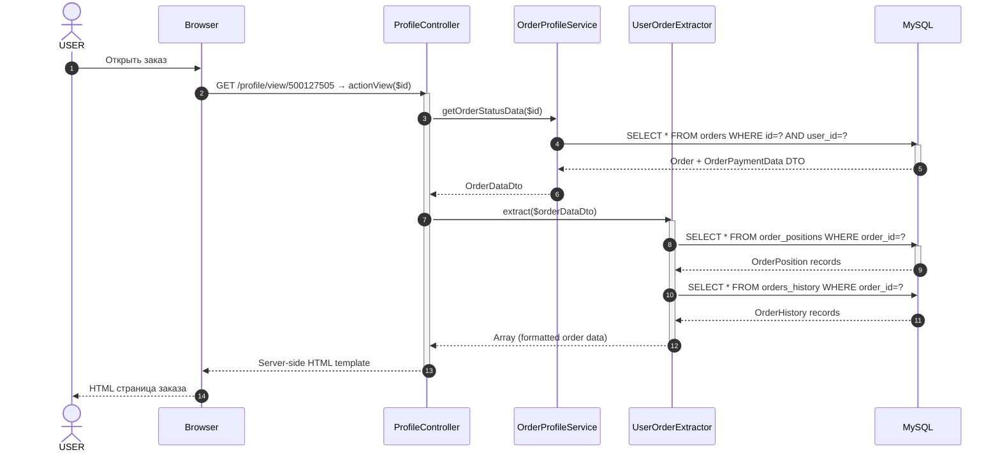
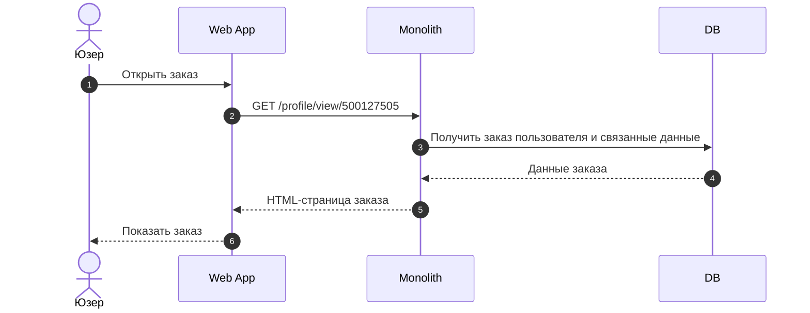

# Просмотр заказа — Web API

# Название метода

**GET /profile/view/{id}** — Просмотр заказа на сайте

Обработчик: `modules/users/controllers/ProfileController::actionView($id)`
Экстрактор: `modules/users/extractors/UserOrderExtractor::extract()`

> Маршрут определён в `config/url.php` строка 23: `/profile/<action>/<id:\d+>` → `users/profile/<action>`.
> Параметр `id` передаётся **частью URL**, а не query-параметром.
> Альтернативный способ: `/profile/view?hash={hash}` (без `id`, по хешу заказа).

---

# Используемые методы

| Система | Метод | Ссылка |
|---------|-------|--------|
| Web | `GET /profile/view/{id}` | `modules/users/controllers/ProfileController::actionView()` |
| Web | `GET /users/profile/orders` | `modules/users/controllers/ProfileController::actionOrders()` — список заказов |
| Web | `GET /users/profile/online-orders-json` | `modules/users/controllers/ProfileController::actionOnlineOrdersJson()` — JSON-список |
| Web | `GET /orders/refund/get-positions?id={id}` | `modules/orders/controllers/RefundController::actionGetPositionsJson()` — позиции для возврата (вызывается по клику «Оформить возврат»). **Разбор эндпоинта: [order-refund-get-positions_web.md](order-refund-get-positions_web.md)** |
| Web | `GET /api/orders/{order_id}/return-method-list` | `src\Modules\Api2\Controller\OrdersController::actionReturnMethodList()` — доступные способы возврата и даты (`available_dates_return`). **Разбор эндпоинта: [order-return-method-list_web.md](order-return-method-list_web.md)** |
| Web | `POST /api/orders/{order_id}/return-details` | `src\Modules\Api2\Controller\OrdersController::actionReturnDetails()` — сохранение выбранного способа и даты возврата |

---

# Диаграмма взаимодействия



## Упрощённая диаграмма взаимодействия

Диаграмма показывает прямое взаимодействие Web App с монолитом без детализации его внутренней логики.



---

# Входящие данные

## Источник данных

| Параметр | Обяз. | Тип источника | Метод-источник | Поле ответа | Описание |
|----------|-------|---------------|----------------|-------------|----------|
| Cookie `_identity` | + | Cookie | Yii2 auto-login (`config/web.php`: `enableAutoLogin => true`, `identityCookie.name = _identity`) | — | Cookie-аутентификация Yii2 (сессия пользователя) |
| `id` | + | Path | Часть URL (`/profile/view/{id}`) | `id` | ID заказа |
| `hash` | - | Query | Параметр URL | — | Альтернатива `id` — хеш для оплаты |

### Примечание

- Дополнительная проверка: `$order->user_id == Yii::$app->user->id` — доступ только к своим заказам.
- Ответ рендерится как server-side HTML-шаблон (`base` view), не JSON.

---

# Описание входных параметров

| Параметр | Способ передачи | Тип | Обяз. | Описание | Пример |
|----------|-----------------|-----|-------|----------|--------|
| `id` | path | integer | + | ID заказа (часть URL) | `500127505` |
| `hash` | query | string | - | Хеш заказа (альтернатива id) | `abc123def` |

---

# Пример запроса

```http
GET /profile/view/500127505 HTTP/1.1
Host: 12storeez.com
Cookie: _identity=...
```

---

# Возвращаемые данные

## Описание параметров положительного ответа

> **Примечание:** в отличие от Mobile API, ответ **не обёрнут** в `{success, result}` — экстрактор возвращает плоский массив из 10 корневых ключей. В view этот массив дополнительно сливается с `breadcrumbs`, `sidebar`, `title` (добавляются в `ProfileController::actionView()`).

### Корневой уровень (результат `UserOrderExtractor::extract()`)

| Параметр | Тип | Описание | Пример |
|----------|-----|----------|--------|
| `id` | integer | ID заказа | `12345` |
| `date` | string | Дата (d-m-Y) | `"15-08-2026"` |
| `status` | object | Блок статуса (см. ниже) | `{...}` |
| `positions` | array | Позиции заказа (см. ниже) | `[{...}]` |
| `recipient` | object | Блок получателя (см. ниже) | `{...}` |
| `delivery` | object | Блок доставки (см. ниже) | `{...}` |
| `payment` | object\|null | Блок оплаты (см. ниже). **Отсутствует**, если `type === NOT_DEFINED` | `{...}` |
| `cost` | object | Блок стоимости (см. ниже) | `{...}` |
| `payment_url` | string\|null | Ссылка на оплату | `"https://..."` |
| `payment_method` | integer | ID типа оплаты (FK → payment_types.internal_id) | `1` |

### Блок `status`

| Параметр | Тип | Описание | Пример |
|----------|-----|----------|--------|
| `status.show_payment_button` | boolean | Показать кнопку оплаты | `false` |
| `status.show_feedback_button` | boolean | Показать кнопку отзыва | `true` |
| `status.show_refund_button` | boolean | Показать кнопку возврата. **AS-IS:** вычисляется через `OrderHelper::canBeReturned()` = `(isCompleted \|\| isReturned) && strtotime(end_date + "N days") > time()`, где `N = days_can_be_returned` (в БД, в UI = 14). Когда `end_date + N <= now` → `false` (кнопка скрыта). НЕ зависит от `delivery_date` | `true` |
| `status.show_cancel_button` | boolean | Показать кнопку отмены | `false` |
| `status.client_title` | string | Клиентское название статуса | `"Передан в доставку"` |
| `status.payed` | boolean | Оплачен ли | `true` |
| `status.feedback` | boolean | Есть ли отзыв | `false` |
| `status.steps[]` | array | История статусов | `[{name: "Создан", date: "15 Aug"}, ...]` |
| `status.rate` | integer\|null | Оценка (если есть отзыв) | `5` |

### Блок `recipient`

| Параметр | Тип | Описание | Пример |
|----------|-----|----------|--------|
| `recipient.name` | string\|null | Имя | `"Иван"` |
| `recipient.surname` | string\|null | Фамилия | `"Иванов"` |
| `recipient.phone` | string\|null | Телефон | `"+79001234567"` |
| `recipient.email` | string\|null | Email | `"user@mail.ru"` |

### Блок `delivery`

| Параметр | Тип | Описание | Пример |
|----------|-----|----------|--------|
| `delivery.type` | string\|null | Тип доставки | `"Курьерская доставка"` |
| `delivery.address` | string\|null | Полный адрес | `"г. Москва, ул. Пушкина, д. 10, кв. 5"` |
| `delivery.date` | string\|null | Дата доставки | `"2026-08-18"` |
| `delivery.time` | string\|null | Время доставки (deprecated) | `"10:00-18:00"` |
| `delivery.time_from` | string\|null | Время с | `"10:00"` |
| `delivery.time_to` | string\|null | Время до | `"18:00"` |
| `delivery.track_link` | string\|null | Ссылка на трекинг | `"https://..."` |
| `delivery.track_number` | string\|null | Трек-номер | `"777123456789"` |

### Блок `payment`

| Параметр | Тип | Описание | Пример |
|----------|-----|----------|--------|
| `payment.type` | string | Название метода оплаты (из `getPaymentMethod()`, маппинг `paymentMethods`) | `"Карта"` |

### Блок `cost` (`OrderPaymentDataDto`)

| Параметр | Тип | Описание | Пример |
|----------|-----|----------|--------|
| `cost.total_cost` | float | Сумма товаров | `2000.00` |
| `cost.return_price` | float | Сумма возврата | `0` |
| `cost.delivery_cost` | float | Стоимость доставки | `300.00` |
| `cost.discount` | float | Скидка | `500.00` |
| `cost.total_payable` | float | К оплате | `1800.00` |
| `cost.bonuses` | integer | Начисленные бонусы | `150` |
| `cost.giftcardsAmount` | float | Сумма сертификатов | `0` |

### Блок `positions[]` (`UserOrderPositionExtractor`)

| Параметр | Тип | Описание | Пример |
|----------|-----|----------|--------|
| `positions[].id` | integer | ID позиции | `67890` |
| `positions[].title` | string | Название модели (model_title_ru) | `"Пламя"` |
| `positions[].article` | string | Артикул | `"ART-12345"` |
| `positions[].quantity` | integer | Количество | `1` |
| `positions[].size_title_ru` | string | Размер | `"M"` |
| `positions[].color.hash` | string | HEX-код цвета | `"#000000"` |
| `positions[].color.title` | string | Название цвета | `"Чёрный"` |
| `positions[].color.has_circle` | boolean | Есть ли кружок | `true` |
| `positions[].colorId` | integer | ID цвета | `12` |
| `positions[].colors[].color_id` | integer | ID цвета | `12` |
| `positions[].colors[].hash` | string | HEX-код | `"#000000"` |
| `positions[].colors[].label` | string | Название | `"Чёрный"` |
| `positions[].colors[].circle_color` | string | Цвет кружка | `"#FFFFFF"` |
| `positions[].url` | string | URL товара | `"https://12storeez.com/catalog/platya/plamya"` |
| `positions[].image_site_url` | string | URL изображения | `"https://cdn.12storeez.com/..."` |
| `positions[].is_click_and_collect` | boolean | Click & Collect | `false` |
| `positions[].price` | integer | Цена со скидкой | `1200` |
| `positions[].price_before_discount` | integer | Цена до скидки | `1500` |
| `positions[].is_returned` | boolean | Возвращена ли позиция | `false` |
| `positions[].is_present` | boolean | Подарок | `false` |
| `positions[].sizes[].title` | string | Размер | `"M"` |
| `positions[].ecommerce` | array | Данные для dataLayer (GA) | `{...}` |

---

## Пример успешного ответа

```json
{
  "id": 12345,
  "date": "15-08-2026",
  "status": {
    "show_payment_button": false,
    "show_feedback_button": true,
    "show_refund_button": true,
    "show_cancel_button": false,
    "client_title": "Передан в доставку",
    "payed": true,
    "feedback": false,
    "steps": [
      {"name": "Заказ создан", "date": "15 Aug"},
      {"name": "Оплачен", "date": "15 Aug"},
      {"name": "Передан в доставку", "date": "16 Aug"}
    ]
  },
  "positions": [
    {
      "id": 67890,
      "title": "Пламя",
      "article": "ART-12345",
      "quantity": 1,
      "size_title_ru": "M",
      "color": {
        "hash": "#000000",
        "title": "Чёрный",
        "has_circle": true
      },
      "colorId": 12,
      "colors": [{
        "color_id": 12,
        "hash": "#000000",
        "label": "Чёрный",
        "circle_color": "#FFFFFF"
      }],
      "url": "https://12storeez.com/catalog/platya/plamya",
      "image_site_url": "https://cdn.12storeez.com/images/products/555/site.jpg",
      "is_click_and_collect": false,
      "price": 1200,
      "price_before_discount": 1500,
      "is_returned": false,
      "is_present": false,
      "sizes": [{"title": "M"}],
      "ecommerce": {}
    }
  ],
  "recipient": {
    "name": "Иван",
    "surname": "Иванов",
    "phone": "+79001234567",
    "email": "user@mail.ru"
  },
  "delivery": {
    "type": "Курьерская доставка",
    "address": "г. Москва, ул. Пушкина, д. 10, кв. 5",
    "date": "2026-08-18",
    "time": null,
    "time_from": "10:00",
    "time_to": "18:00",
    "track_link": "https://tracking.dpd.ru/track?id=777123456789",
    "track_number": "777123456789"
  },
  "payment": {
    "type": "Карта"
  },
  "cost": {
    "total_cost": 2000.00,
    "return_price": 0,
    "delivery_cost": 300.00,
    "discount": 500.00,
    "total_payable": 1800.00,
    "bonuses": 150,
    "giftcardsAmount": 0
  },
  "payment_url": null,
  "payment_method": 1
}
```

## Пример ответа с ошибкой

```json
{
  "status": "error",
  "message": "Заказ не найден или нет доступа",
  "code": "ORDER_NOT_FOUND",
  "errors": []
}
```

---

# Банковские реквизиты (нужны ли при возврате)

> **Зафиксировано, чтобы не выяснять разную логику повторно.** На вебе и на мобилке признак «нужны ли банковские реквизиты для возврата» вычисляется **по-разному** и **в разных местах**.

## Web: `need_bank_details`

- **Где вычисляется:** НЕ на странице заказа (`extract()` его не возвращает), а **в момент открытия попапа возврата** — эндпоинт `GET /orders/refund/get-positions?id={id}` (см. [order-refund-get-positions_web.md](order-refund-get-positions_web.md)).
- **Формула:** `need_bank_details = !in_array(payment_method, ALL_ONLINE_PAYMENT_METHODS)` — `true` для **всех не-онлайн** способов оплаты (курьер наличные/безнал 3/5, агент 2/4, сбербанк-онлайн 6, перевод 7, наличные 8, PayPal 9, click&collect 12, сертификат 15, пост-оплата 18, `null`).
- **Как используется:** Vue-компонент `OrderRefundPopup` получает `needBankDetails` как prop → показывает блок «Банковские реквизиты» (`v-if="withBankDetails"`) и блокирует кнопку отправки, пока реквизиты не заполнены.

## Mobile: `return.is_bank_data_required`

- **Где вычисляется:** сразу в ответе заказа — `OrderMobileTransformer::transformForMobile()` → `return.is_bank_data_required`.
- **Формула:** `isCourierPayment()` — `true` **только** для типов 3 (`CASH_COURIER`) и 5 (`CASHLESS_COURIER`).

## Сравнение

| | Web (`need_bank_details`) | Mobile (`is_bank_data_required`) |
|---|---------------------------|----------------------------------|
| Когда приходит | При открытии попапа возврата | Сразу в ответе заказа |
| Условие | `!in_array(payment_method, ALL_ONLINE_PAYMENT_METHODS)` | `in_array(payment_method, [3, 5])` |
| Охват | **Все не-онлайн** способы | **Только** наличные/безнал курьеру |
| Пример: оплата курьеру наличными (3) | `true` | `true` |
| Пример: PayPal (9) | `true` | `false` |
| Пример: карта онлайн (1) | `false` | `false` |

> **Вывод:** веб-проверка **шире** мобильной. Если клиент платил курьеру (типы 3/5) — обе платформы запросят реквизиты. Если платил другим не-онлайн способом (агент, PayPal и т.д.) — реквизиты запросит **только веб**.

---

# Двухфазный процесс возврата

> **Зафиксировано, чтобы не путать два разных срока.** Оформление возврата состоит из двух независимых фаз с разными дедлайнами.

## Фаза 1: До создания заявки — «Можно вернуть изделия до <дата>»

Клиент вызывает `GET /api/orders/{order_id}/return-method-list` и видит для каждого способа массив `available_dates_return` — доступные даты для оформления возврата.

**Крайний срок создания заявки** определяется от `orders.end_date` (дата выполнения заказа с подтверждением 1С):

```text
deadline_create = orders.end_date + 14 календарных дней
```

| Способ | `available_dates_return` | Источник дат |
|--------|--------------------------|--------------|
| **Курьер** | Конфигурируемые последовательные даты от текущей даты | `return_details_config` (`return_delay`, `return_dates_count`, `return_time_limit`) |
| **СДЭК ПВЗ** | От завтра до `orders.end_date + 14 дней` (с особым правилом +3 дня на последний день) | `orders.end_date` |
| **5Post** | То же, что СДЭК | `orders.end_date` |
| **Магазин** | То же, что СДЭК | — |
| **Почта России** (только Калининград) | То же, что СДЭК | — |

> **Нюанс:** для СДЭК/5Post из-за специального правила `ADDITIONAL_DAYS_FOR_THE_LAST_DAY = 3` последний элемент массива может быть `orders.end_date + 17 дней`, а не `+14`. Использовать `max(available_dates_return)` как юридический срок **некорректно** — базовый срок = `orders.end_date + 14 дней`.

## Фаза 2: После создания заявки — «Вернуть до <дата>»

После `POST /api/orders/{order_id}/return-details` начинает действовать отдельный таймер — крайняя дата передачи товара в канал сдачи возврата.

| Способ | Крайняя дата передачи | Источник |
|--------|----------------------|----------|
| **Курьер** | Дата, выбранная клиентом при оформлении | `orders.return_date` (выбрана из `available_dates_return`) |
| **СДЭК ПВЗ** | `return_request.created_at + N_channel календарных дней` | Конфигурация (значение `N_channel` требует согласования) |
| **5Post** | `return_request.created_at + N_channel календарных дней` | Конфигурация (значение `N_channel` требует согласования) |
| **Магазин** | `return_request.created_at + N_channel календарных дней` | — |
| **Почта России** (только Калининград) | `return_request.created_at + N_channel календарных дней` | — |

> **Важно:** `orders.end_date` (дата выполнения заказа) используется **только** для Фазы 1 (срок создания заявки). Для Фазы 2 (срок передачи после создания заявки) используется дата создания возврата (`return_request.created_at`), а не `orders.end_date`.

> **Отсутствие отдельной сущности «заявка»:** в текущей реализации возврат сохраняется как поля на `orders` (через `OrderService::updateOrderReturnDetails`), отдельной таблицы `return_requests` с `created_at` нет. Дата создания возврата определяется по `orders.updated_at` при вызове `POST /return-details`.

---

# Маппинг с БД

## Таблица `orders` (физическое имя: `cms_orders`)

| Поле API | Тип | Поле БД | Тип БД | Описание |
|----------|-----|---------|--------|----------|
| `id` | integer | `id` | int(11) PK AUTO_INCREMENT | ID заказа |
| `date` | string | `created_at` | datetime | Дата создания заказа (форматируется в d-m-Y) |
| `status.client_title` | string | `status` | int(11) | FK → order_statuses.internal_id |
| `recipient.name` | string | `name` | varchar(255) NULL | Имя получателя |
| `recipient.surname` | string | `surname` | varchar(255) NULL | Фамилия получателя |
| `recipient.phone` | string | `number` | varchar(255) NULL | Телефон получателя |
| `recipient.email` | string | `email` | varchar(255) NULL | Email получателя |
| `payment.type` | string | — | — | Вычисляется через `getPaymentMethod()` (маппинг `paymentMethods` по `payment_method`) |
| `status.payed` | boolean | `payment_status` | int(11) | FK → payment_statuses.internal_id |
| `payment_url` | string | `payment_url` | varchar(512) NULL | Ссылка на оплату |
| `delivery.track_number` | string | `track_number` | varchar(255) NULL | Трек-номер |
| `cost.giftcardsAmount` | float | — | — | Вычисляется через GiftcardsService |
| `cost.total_cost` | float | — | — | Вычисляется из order_positions |
| `cost.total_payable` | float | `sum` | decimal(10,2) | Итоговая сумма |
| `cost.delivery_cost` | float | `delivery_price` | decimal(10,2) NULL | Стоимость доставки |
| `cost.bonuses` | integer | `given_bonus` | int(11) | Начисленные бонусы |
| `status.show_payment_button` | boolean | `status`, `payment_status` | — | Вычисляется canBePayed() |
| `status.show_feedback_button` | boolean | `status` | — | Вычисляется canBeMarked() |
| `status.show_refund_button` | boolean | `status` | — | Вычисляется canBeReturned() |
| `status.show_cancel_button` | boolean | `status` | — | Вычисляется canBeCancelled() |
| `status.feedback` | boolean | — | — | Проверяется связь orders → feedback |
| `status.steps[]` | array | — | — | Читается из orders_history |
| `payment_method` | integer | `payment_method` | int(11) NULL | FK → payment_types.internal_id |
| `delivery.date` | string | `delivery_date` | varchar(255) NULL | Дата доставки |
| `delivery.time_from` | string | `delivery_time_from` | varchar(255) NULL | Время доставки с |
| `delivery.time_to` | string | `delivery_time_to` | varchar(255) NULL | Время доставки до |
| `delivery.type` | string | `delivery_method` | int(11) | FK → delivery_tk.id |

## Таблица `order_positions` (физическое имя: `cms_order_positions`)

| Поле API | Тип | Поле БД | Тип БД | Описание |
|----------|-----|---------|--------|----------|
| `positions[].id` | integer | `id` | int(11) PK AUTO_INCREMENT | ID позиции |
| `positions[].article` | string | `article` | varchar(255) | Артикул товара |
| `positions[].title` | string | `model_title_ru` | varchar(255) | Денормализованное название модели |
| `positions[].price` | integer | `price` | decimal(10,2) | Цена со скидкой |
| `positions[].price_before_discount` | integer | `price_before_discount` | decimal(10,2) | Цена до скидки |
| `positions[].colorId` | integer | `color_id` | int(11) | FK → dictionary_colors.id |
| `positions[].size_title_ru` | string | `size_title_ru` | varchar(255) | Денормализованный размер |
| `positions[].quantity` | integer | `quantity` | int(11) | Количество |
| `positions[].is_present` | boolean | `is_present` | tinyint(1) | Признак подарка |
| `positions[].is_click_and_collect` | boolean | `is_click_and_collect` | tinyint(1) | Click & Collect |
| `positions[].color.hash` | string | `color_hash` | varchar(10) | HEX-код цвета |
| `positions[].color.title` | string | `color_title_ru` | varchar(255) | Название цвета (RU) |
| `positions[].color.has_circle` | boolean | `color_has_circle` | tinyint(1) | Есть ли кружок |
| `positions[].image_site_url` | string | `image_site_url` | varchar(512) | URL изображения (site) |
| `positions[].sizes[].title` | string | `size_title_ru` | varchar(255) | Размер |
| `positions[].colors[].label` | string | `color_title_ru` | varchar(255) | Название цвета |
| `positions[].colors[].circle_color` | string | `color_hash` | — | Вычисляется ProductHelper::getCircleColor() |
| `positions[].url` | string | — | — | Вычисляется из slug → product → category |
| `positions[].is_returned` | boolean | `status` | — | Определяется через cancel_status relation |
| `positions[].ecommerce` | array | — | — | Вычисляется toDataLayerArray() |

## Таблица `order_statuses` (справочник)

| Поле API | Тип | Поле БД | Тип БД | Описание |
|----------|-----|---------|--------|----------|
| `status.client_title` | string | `client_title` | varchar(255) | Клиентское название |

### Основные статусы

| `internal_id` | Код | Описание |
|----------------|-----|----------|
| 1 | RESERVED | Зарезервирован |
| 3 | WAITING_PROCESSING | Ожидает обработки |
| 4 | PREPARING_PACKAGE | Сборка |
| 7 | WAITING_PAYMENT | Ожидает оплаты |
| 11 | PACKED | Упакован |
| 14 | ITEM_SENT | Передан в доставку |
| 16 | AWAITING_PICKUP_IN_STORE | Ожидает в магазине |
| 17 | ORDER_COMPLETED | Заказ выполнен |
| 23 | ORDER_CANCELLED | Заказ отменён |

## Таблица `payment_statuses` (справочник)

| `internal_id` | Код | Описание |
|----------------|-----|----------|
| 1 | SUCCESS | Оплачен |
| 2 | NOT_PAID | Не оплачен |
| 3 | FAILURE | Ошибка оплаты |
| 4 | CREDIT_APPROVED | Кредит одобрен |

## Таблица `orders_history` (история изменений)

| Поле API | Тип | Поле БД | Тип БД | Описание |
|----------|-----|---------|--------|----------|
| `status.steps[].name` | string | `status` | — | FK → order_statuses.internal_id |
| `status.steps[].date` | string | `created_at` | datetime | Дата изменения статуса |

## Таблица `delivery_tk` (транспортные компании)

| Поле API | Тип | Поле БД | Тип БД | Описание |
|----------|-----|---------|--------|----------|
| `delivery.type` | string | `type` | varchar(255) | Тип ТК (courier, box, self, etc.) |

---

# Связанные задачи

| Задача | Описание изменений |
|--------|--------------------|
| | |

---

# Версии документа

| Версия | Дата изменения | Автор | Описание изменений |
|--------|----------------|-------|--------------------|
| 1.0 | 07.09.2026 | Системный аналитик | Первичное создание документа — маппинг эндпоинта просмотра заказа (Web API) с таблицами БД |
| 1.1 | 07.09.2026 | Системный аналитик | Уточнён реальный маршрут: `GET /profile/view/{id}` |
| 1.2 | 07.09.2026 | Системный аналитик | Сверка с кодом: аутентификация — cookie `_identity` (Yii2 auto-login), а не JWT Bearer; `payment.type` — string (название метода оплаты), а не integer |
| 1.3 | 07.09.2026 | Системный аналитик | Корневой уровень дополнен до 10 ключей по коду `UserOrderExtractor::extract()`; `payment_url`/`payment_method` перенесены из «Прочих полей» в корневой уровень; отражено условие удаления блока `payment` при `NOT_DEFINED`; исправлен `result.id` → `id` (ответ не обёрнут в `result`) |
| 1.4 | 07.09.2026 | Системный аналитик | Зафиксирована разная логика банковских реквизитов (web `need_bank_details` vs mobile `is_bank_data_required`); добавлена ссылка на разбор эндпоинта `GET /orders/refund/get-positions` (`order-refund-get-positions_web.md`); файл перенесён в `requirements/web/` |
| 1.5 | 07.09.2026 | Системный аналитик | AS-Israel: `status.show_refund_button` — зафиксирована формула (`end_date + N days`) и источник `days_can_be_returned` из БД |
